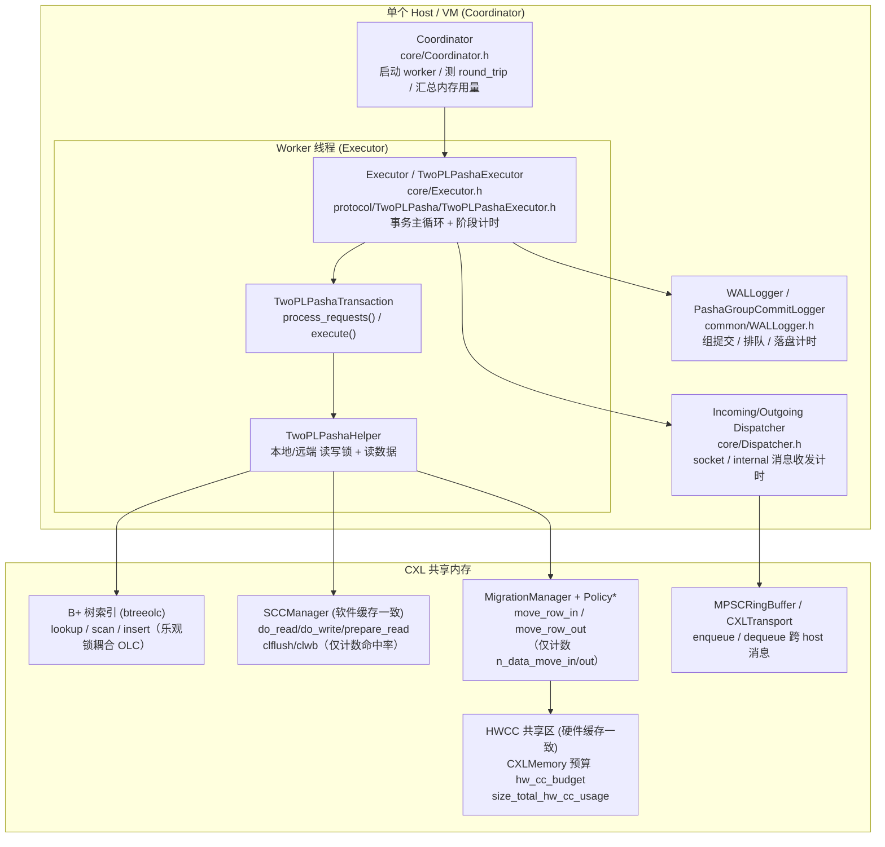
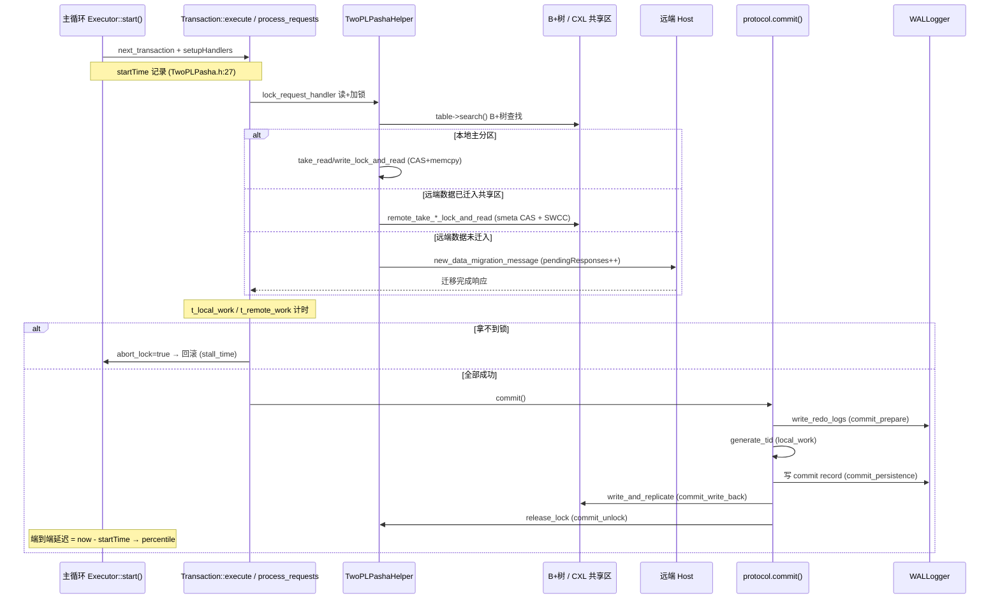
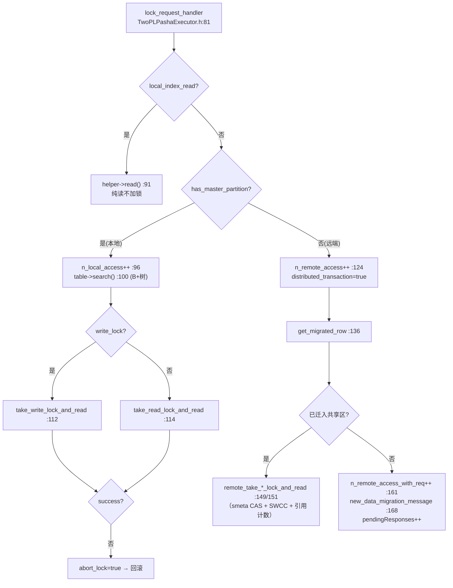

# Tigon 性能监控分析与细粒度插桩方案 SPEC

> 版本：v1.0　|　日期：2026-06-10　|　分析对象：Tigon（Pasha 架构，`TwoPLPasha` 协议）
>
> **关于参考文档的说明**：本文撰写前检索了仓库与完整 git 历史，用户提到的
> `CLAUDE.md`、`architecture.md`、`LOCK_SPEC.md`、`ATOMIC_SPEC.md` **均不存在**。
> 因此本文档完全基于**真实源码**与 `README.md` 撰写，所有结论均给出
> `文件:行号` 级别的代码出处，可逐条对照。

---

## 目录

1. [背景与目标](#1-背景与目标)
2. [系统架构与事务执行总览](#2-系统架构与事务执行总览)
3. [现状：源码已记录的性能数据全表](#3-现状源码已记录的性能数据全表)
4. [事务执行步骤拆解与调用栈](#4-事务执行步骤拆解与调用栈)
5. [细粒度监控建议（核心）](#5-细粒度监控建议核心)
6. [统一落地方案](#6-统一落地方案)
7. [附录：指标速查表与缩写表](#7-附录指标速查表与缩写表)

---

## 1. 背景与目标

Tigon 是一个基于 **CXL 共享内存** 的分布式事务内存数据库，采用 Pasha 架构，核心协议实现为
`TwoPLPasha`（两阶段封锁 + Pasha 数据迁移/缓存一致）。一条事务在多个 host（VM）之间通过
共享的、**硬件缓存一致（HWCC）**的 CXL 区域协同访问数据；对超出 HWCC 预算的数据，则通过
**软件缓存一致（SWCC）**机制维护一致性。

本 SPEC 解决两个问题：

- **现状盘点**：Tigon 为了"检测性能"，对哪些流程、记录了哪些数据、用什么机制记录、在哪里上报。
- **细粒度增强**：拆解事务执行的每一步，提出可新增的更细粒度监控点，覆盖：
  消息通信时延、数据迁移时延、抢本地锁时延、抢远端锁时延、访问 HWCC 时延、访问 SWCC 时延、
  B+ 树查找时延、锁抢不到回滚事务时延、commit 相关时延。

---

## 2. 系统架构与事务执行总览

### 2.1 组件关系图



### 2.2 事务生命周期数据流（一条事务的时间轴）



---

## 3. 现状：源码已记录的性能数据全表

Tigon 的性能采样基础设施是 `common/Percentile.h` 的 `Percentile<T>` 模板：

- `add()` 仅在全局 `warmed_up == true` 时，且按 `rand.uniform_dist(0,100) > 10` **采样约 10%** 的数据点（`Percentile.h:26-33`，注释写 2%，实际为 10%）。
- `nth(p)` 取最近排名分位数、`avg()` 取均值、`save_cdf()` 导出 CDF（`Percentile.h:57-100`）。

下表为**所有现存指标**的完整清单（采集点 / 上报点 / 机制）：

### 3.1 事务端到端与阶段拆解（`core/Executor.h`）

| 指标 | 含义 | 采集点 | 上报点 | 机制 |
|---|---|---|---|---|
| `percentile` | 事务端到端延迟（全部） | `Executor.h:165-168` | `onExit() Executor.h:231` | `Percentile` |
| `dist_latency` | 分布式事务端到端延迟 | `Executor.h:170` | `Executor.h:232` | `Percentile` |
| `local_latency` | 单分区事务端到端延迟 | `Executor.h:172` | `Executor.h:235` | `Percentile` |
| `commit_latency` | 从 startTime 到 commit 返回 | `Executor.h:148-151` | `Executor.h:238` | `Percentile` |
| `n_commit` | 提交计数 | `Executor.h:157` | Coordinator 汇总 | `atomic` |
| `n_abort_lock` | 因抢锁失败回滚计数 | `Executor.h:177,196` | 同上 | `atomic` |
| `n_abort_read_validation` | 读校验失败回滚 | `Executor.h:180,199` | 同上 | `atomic` |
| `n_abort_no_retry` | 不重试回滚 | `Executor.h:190` | 同上 | `atomic` |
| `n_network_size` | 网络流量字节数 | `Executor.h:152` | 同上 | `atomic` |
| `stall` | 回滚事务的停顿时间 | `Executor.h:140-143 set_stall_time` | `onExit() Executor.h:241,250` | `Percentile`(分 local/dist) |
| `local_work` | 本地工作（读/扫描/插删处理） | `TwoPLPashaTransaction.h:356` | `Executor.h:242,251` | `ScopedTimer→Percentile` |
| `remote_work` | 等待远端响应时间 | `TwoPLPashaTransaction.h:465` | `Executor.h:243,252` | `ScopedTimer→Percentile` |
| `commit_work` | commit 中的本地工作 | `Executor.h:136-138` | `Executor.h:244,253` | `ScopedTimer→Percentile` |
| `commit_prepare` | 写 redo log | `TwoPLPasha.h:351` | `Executor.h:245,254` | `ScopedTimer→Percentile` |
| `commit_persistence` | 写 commit record | `TwoPLPasha.h:371` | `Executor.h:246,255` | `ScopedTimer→Percentile` |
| `commit_write_back` | 写回 + 复制 | `TwoPLPasha.h:524` | `Executor.h:247,256` | `ScopedTimer→Percentile` |
| `commit_replication` | 复制时间 | `TwoPLPasha.h record_commit_replication_time` | `Executor.h:248,257` | `ScopedTimer→Percentile` |
| `commit_unlock` | 释放锁时间 | `TwoPLPasha.h:531` | `Executor.h:249,258` | `ScopedTimer→Percentile` |

> 阶段计时实现：`ScopedTimer`（`common/Time.h`），析构时把 us 回调给 `txn.record_*_time()`
> （定义于 `TwoPLPasha.h:56-143`），最后在 `record_txn_breakdown_stats()`（`Executor.h:406-429`）汇入 `Percentile`。

### 3.2 访问与迁移计数

| 指标 | 含义 | 位置 | 机制 |
|---|---|---|---|
| `n_local_access` | 本地主分区访问次数 | `TwoPLPashaExecutor.h:96` | `atomic` |
| `n_remote_access` | 远端分区访问次数 | `TwoPLPashaExecutor.h:124` | `atomic` |
| `n_remote_access_with_req` | 需发迁移请求的远端访问 | `TwoPLPashaExecutor.h:161` | `atomic` |
| `n_local_cxl_access` | 访问已迁入共享区的本地行 | `TwoPLPashaHelper.h:570` 等 | `atomic` |
| `n_data_move_in/out` | 迁入/迁出**次数** | `MigrationManager.h:87` | `atomic`（**无时延**） |
| `num_clflush/clwb` | SWCC 刷写指令次数 | `SCCManager.h:54,71` | `atomic`（**无时延**） |
| `num_cache_hit/miss` | SWCC 缓存命中/未命中 | `SCCManager.h:87-88` | `atomic`，`print_stats()` `SCCManager.h:38`（**无时延**） |

### 3.3 网络与调度（`core/Dispatcher.h`）

| 指标 | 含义 | 采集点 | 上报点 |
|---|---|---|---|
| `socket_message_recv_latency` | socket 收消息时延 | `Dispatcher.h:145` | `Dispatcher.h:154` |
| `internal_message_recv_latency` | 内部（同 host）收消息时延 | `Dispatcher.h:90` | `Dispatcher.h:157` |
| `socket_read_syscalls` | socket read 系统调用次数 | `Dispatcher.h:150` | `Dispatcher.h:158` |
| `message_send_latency` | 发送系统调用耗时 | `Dispatcher.h:303` | `Dispatcher.h:269` |
| `gen_to_sent_latency` | 消息生成→真正发出 | `Dispatcher.h:344` | `Dispatcher.h:272` |
| `gen_to_queue_latency` | 消息生成→入队 | （Outgoing） | `Dispatcher.h:274` |
| `sent_latency` / `network_msg_group_size` | 发送耗时 / 批大小 | `Dispatcher.h:345,347` | `Dispatcher.h:278,282` |

### 3.4 WAL / 组提交（`common/WALLogger.h`）

| 指标 | 含义 | 采集点 | 上报点 |
|---|---|---|---|
| `txn_latency`(组提交) | 事务从 start 到落盘 | `WALLogger.h:523` | `print_sync_stats() :549 "Group Commit Stats"` |
| `queuing_latency` | 日志缓冲排队时间 | `WALLogger.h:510` | `:555 "Queuing Stats"` |
| `disk_sync_latency` | 单次 fsync 耗时 | `WALLogger.h:514` | `:550 "Disk Sync Stats"` |
| `disk_sync_cnt/size` | 落盘次数/字节 | `WALLogger.h:515-516` | 同上 |
| `sync_time/grouping_time/sync_batch_size/sync_batch_bytes` | 旧版 GroupCommitLogger 统计 | `WALLogger.h:311-315` | `WALLogger.h:339-346` |
| `emulated_persist_latency` | 模拟持久化延迟（sleep） | `WALLogger.h:166-168` | 配置项 |

### 3.5 内存用量与往返（`core/Coordinator.h` / `common/CXLMemory.h`）

| 指标 | 含义 | 位置 |
|---|---|---|
| `total_size_{index,metadata,data,transport,misc}_usage` | 各类 CXL 内存用量 | `CXLMemory.h` 计数 → `Coordinator.h:610+` 打印 |
| `total_hw_cc_usage` | HWCC 区已用字节 | `size_total_hw_cc_usage`（`CXLMemory.h:68+`）→ `Coordinator.h:617` |
| `round_trip_latency` | host 间 ping 往返 | `Coordinator.h:124-155` |

**结论**：Tigon 已对**事务阶段、网络收发、WAL 组提交、内存用量**做了较完整的时延/计数监控；
但对 **数据迁移、SWCC 访问、HWCC 访问、锁获取、B+ 树查找** 这些**事务关键路径上的细粒度操作，目前只有计数、缺少时延分布**。这正是第 5 节增强的重点。

---

## 4. 事务执行步骤拆解与调用栈

### 4.1 顶层调用栈

```
Executor::start()                                   core/Executor.h:77
  └─ workload.next_transaction() + setupHandlers()  :126-128   ← startTime 起点
  └─ transaction->execute(id)                       :132
       └─ (workload) → process_requests()           TwoPLPashaTransaction.h:353
            ├─ lock_request_handler(...)             ← 读 + 加锁（步骤②③）
            │    └─ table->search()                  ← B+树查找（步骤④）
            │    └─ take_*_lock_and_read()           ← 本地锁（步骤⑤）
            │    └─ remote_take_*_lock_and_read()    ← 远端锁 + SWCC（步骤⑥⑦）
            │    └─ new_data_migration_message()     ← 触发迁移（步骤⑧）
            ├─ scan/insert/deleteRequestHandler      TwoPLPashaExecutor.h:177+
            └─ [等待远端] remote_request_handler()    :467-469
  └─ protocol.commit(*transaction, messages)        Executor.h:146
       ├─ write_redo_logs_for_commit (prepare)       TwoPLPasha.h:351-356
       ├─ generate_tid (local_work)                  :363-366
       ├─ 写 commit record (persistence)             :371-380
       ├─ write_and_replicate (write_back)           :524-527
       └─ release_lock (unlock)                       :531-533
  └─ 端到端延迟 / commit_latency / breakdown 统计     Executor.h:148-174
  └─ [失败] abort + n_abort_lock + stall_time        Executor.h:176-206
```

### 4.2 读 + 加锁的分支（`TwoPLPashaExecutor.h:81-174`）



### 4.3 锁实现的关键事实（`TwoPLPashaHelper.h`）

- **本地锁是非阻塞 try-once**：`take_read_lock_and_read`（`:526`）先 `lmeta->lock()`（pthread 自旋锁 `:82`），
  检查 `is_write_locked || read_lock_num==max`（`:546`）——拿不到立即 `success=false; goto out`（`:547-549`），**不自旋等待**。
- **远端锁**：`remote_take_read_lock_and_read`（`:625`）对 CXL 共享元数据 `smeta` 用
  `compare_exchange_strong`（`:123` 的 `lock()`）获取自旋锁，调用 `scc_manager->prepare_read`（`:636`）走 SWCC，
  再增加 reader 引用计数。
- **回滚不等待、立即 abort**：`process_requests` 在 `success==false` 时置 `abort_lock=true` 并
  `goto process_net_req_and_ret`（`TwoPLPashaTransaction.h:385-389`）→ 上层 `Executor.h:176` 记 `n_abort_lock` 并用
  `set_stall_time`（`Executor.h:143`）记录"从 startTime 到放弃"的停顿时间。

  > 因此**"锁抢不到回滚事务的时延"今天是被 `stall_time` 粗粒度覆盖的**，但它把"网络往返失败、读校验失败、抢锁失败"混在一起，无法区分。

### 4.4 数据迁移路径（`protocol/Pasha/`）

- 触发：远端数据未迁入时发 `new_data_migration_message`（`TwoPLPashaExecutor.h:168`）。
- 执行：`MigrationManager::move_row_in`（`MigrationManager.h:75`，纯虚，策略子类实现 `Policy*.h`）将行从私有分区
  拷入 HWCC 共享区；`move_row_out`（`:76`）换出；`delete_specific_row_and_move_out`（`:77`）。
- 换出时机：`when_to_move_out ∈ {OnDemand, Reactive}`（`MigrationManager.h:25-28`）；Reactive 在 commit 末尾
  发 move-out hint（`TwoPLPasha.h:540-545`）。
- **当前仅有 `n_data_move_in/out` 计数（`:87`），完全没有迁移时延。**

### 4.5 B+ 树查找路径

- `ITable::search`（`core/Table.h:434`）→ `btree.lookup(k, value)`（`Table.h:440`）→ `BPlusTree::lookup`
  （`common/btree_olc/BTreeOLC.h:3163`）→ `_lookup`（乐观锁耦合 OLC，读路径无锁、靠版本号重试）。
- 扫描：`btree.scanForUpdate`（`Table.h:514` → `BTreeOLC.h:2713`）。
- CXL 版索引在 `common/btree_olc_cxl/`，供共享区使用。
- **当前 B+ 树查找无任何计时**（仅可选 `model_cxl_search_overhead`，`TwoPLPashaExecutor.h:103`，是注入开销而非测量）。

### 4.6 跨 host 消息通信路径

```
flush_messages()                 Executor.h:347
  └─ cxl_transport->send(msg)    Executor.h:362
       └─ cxl_ringbuffers[dest].send()   CXLTransport.h:23-29
            └─ MPSCRingBuffer::enqueue()  MPSCRingBuffer.h:66
recv 侧:
  Dispatcher → cxl_transport->recv()      CXLTransport.h:33-35
       └─ MPSCRingBuffer::dequeue()        MPSCRingBuffer.h:101
            └─ while(is_ready!=1) spin      MPSCRingBuffer.h:121
  process_request() 派发到 messageHandlers  Executor.h:317-343
```

- socket / internal 两类消息在 `Dispatcher` 已有收发时延（见 3.3）。
- **但 CXL ring buffer 自身的 enqueue/dequeue 时延、以及"事务发出远端请求→收到响应"的端到端等待，目前只有粗粒度的 `remote_work`（整段等待）**，无单条消息粒度。

---

## 5. 细粒度监控建议（核心）

> 设计原则：**复用现有机制**——`ScopedTimer`（`common/Time.h`）做计时、`Percentile<T>` 做分位数采样、
> 计数用 `std::atomic<uint64_t>`，在 `onExit()` / `print_*_stats()` 统一打印。所有新增计时都受 `warmed_up`
> 采样开关约束，避免热路径开销。

下面对用户列出的每一类给出：**(a) 代码路径 → (b) 现状 → (c) 建议插桩点（精确到 file:line + 示例）→ (d) 开销/采样**。

### 5.1 消息通信时延

- **(a) 路径**：`Executor::flush_messages :347` → `CXLTransport::send :23` → `MPSCRingBuffer::enqueue :66`；
  接收 `CXLTransport::recv :33` → `dequeue :101`（`:121` 自旋）；派发 `Executor::process_request :317`。
- **(b) 现状**：仅 `Dispatcher` 的 socket/internal 收发时延（3.3），无 ring-buffer 级、无请求-响应配对时延。
- **(c) 建议**：
  1. **ring enqueue/dequeue 时延**：在 `CXLTransport::send/recv`（`CXLTransport.h:23/33`）包 `ScopedTimer`，
     汇入新增 `Percentile<uint64_t> cxl_send_lat / cxl_recv_lat`。
  2. **请求-响应往返**：在 `TwoPLPashaRWKey` 或 `txn` 上为每个 `pendingResponses` 记录发出时刻（`TwoPLPashaExecutor.h:168`），
     在对应响应 handler（`TwoPLPashaMessage.h` 中 `*_response` 处理）计算 `now - send_ts`，汇入 `Percentile cxl_req_rtt`。
  3. **dequeue 自旋等待**：在 `MPSCRingBuffer.h:121` 自旋前后取时间差，统计 `ring_spin_wait`。
- **(d)** 采样 10%；`steady_clock` 单次 ~20ns，热路径可接受。

### 5.2 数据迁移时延

- **(a) 路径**：`MigrationManager::move_row_in :75` / `move_row_out :76` / `delete_specific_row_and_move_out :77`；
  触发于 `TwoPLPashaExecutor.h:168`，换出于 `TwoPLPasha.h:540`。
- **(b) 现状**：仅 `n_data_move_in/out` 次数（`MigrationManager.h:87`），**零时延数据**。
- **(c) 建议**：
  1. 在 `MigrationManager` 增 `Percentile<uint64_t> move_in_lat, move_out_lat`，在 `move_row_in/move_row_out`
     实现体（各 `Policy*.h`，如 `PolicyClock.h`）首尾用 `ScopedTimer` 记录纯迁移（memcpy + 元数据）耗时。
  2. **迁移请求端到端时延**：从发出 `new_data_migration_message`（`TwoPLPashaExecutor.h:168`）到该行变为
     "已迁入"可用，记一条 `migration_req_rtt`（区别于纯本地 move_in，含网络与远端处理）。
  3. **换出竞争**：按 `migration_policy`（Clock/LRU/FIFO）分别统计 move-out 触发频率与耗时，定位抖动。
  4. 在 `onExit()`（或 `MigrationManager` 新增 `print_stats()`，对齐 `SCCManager::print_stats :38`）打印分位数。
- **(d)** 迁移本就是重操作，计时相对开销极小。

### 5.3 抢本地锁时延

- **(a) 路径**：`take_read_lock_and_read :526` / `take_write_lock_and_read :793`，含 `lmeta->lock()`（pthread 自旋 `:82`）+ tid 位运算 + `memcpy`（`:557`）。
- **(b) 现状**：无；只在失败时计入聚合的 `stall_time`。
- **(c) 建议**：
  1. 在两个函数入口/出口包 `ScopedTimer`，分 **成功/失败** 两路汇入
     `Percentile local_lock_acq_succ_lat / local_lock_acq_fail_lat`。失败路尤其有价值——它度量"无谓的加锁尝试"成本。
  2. 细分 `lmeta->lock()` 自旋本身的等待时间（latch 争用）vs. 逻辑判断+memcpy 时间，定位 latch 热点。
  3. 计数 `n_local_lock_fail`（与 `n_abort_lock` 区分：一次事务可能多次本地抢锁失败）。
- **(d)** 这是最热路径，建议**降低采样率到 1-2%** 或用 `rdtsc` 轻量计时。

### 5.4 抢远端锁时延

- **(a) 路径**：`remote_take_read_lock_and_read :625` / `remote_take_write_lock_and_read :892`，含 `smeta->lock()`
  （CXL 共享自旋锁，`compare_exchange_strong :123`）+ `scc_manager->prepare_read :636` + 引用计数。
- **(b) 现状**：无独立时延。
- **(c) 建议**：
  1. 包 `ScopedTimer`，分成功/失败汇入 `Percentile remote_lock_acq_succ/fail_lat`。
  2. **拆分 `smeta->lock()` 的 CAS 自旋等待**（跨 host 争用，跨 CXL 访问，远比本地 latch 贵）——
     在 `:123` 的 CAS 重试循环里累计自旋圈数/时间，统计 `remote_latch_spin`。
  3. 区分"远端锁命中（数据已迁入）"与"需触发迁移"两类延迟，配合 5.2。
- **(d)** 跨 CXL 访问较贵，计时相对开销小，但仍按 5% 采样。

### 5.5 访问 HWCC（硬件缓存一致区）时延

- **(a) 路径**：HWCC = CXL 上**硬件维护一致**的共享区，迁入的行驻留于此；容量受
  `hw_cc_budget`（`core/Macros.h:82`，默认 200MB；per-host 预算 `Executor.h:51`）约束，用量
  `size_total_hw_cc_usage`（`CXLMemory.h:68+`）。事务对 HWCC 行的访问发生在
  `remote_take_*_lock_and_read` 中对 `smeta`/`scc_data` 的读写（CXL 远端内存访问）。
- **(b) 现状**：仅有 **容量用量** `total_hw_cc_usage`（`Coordinator.h:617`），无**访问时延**，也无预算驱逐时延。
- **(c) 建议**：
  1. **HWCC 读/写访问时延**：在对 `smeta`/`scc_data->data` 的实际 CXL 访问（如 `TwoPLPashaHelper.h:636-645`）前后
     用 `rdtsc` 度量，汇入 `Percentile hwcc_read_lat / hwcc_write_lat`——这是"CXL 远端内存延迟"的直接体现。
  2. **预算压力指标**：当 HWCC 接近 `hw_cc_budget` 触发 move-out 时，记录"因预算不足导致的迁移失败
     `FAIL_OOM`"（`MigrationManager.h:16`）次数与等待时延 `hwcc_oom_stall`。
  3. 在 `Coordinator.h:617` 既有用量打印旁，增打印 HWCC 访问时延分位数。
- **(d)** 用 `rdtsc` 最轻量；CXL 访问本身是主要成本。

### 5.6 访问 SWCC（软件缓存一致）时延

- **(a) 路径**：`SCCManager::prepare_read :35` / `do_read :33` / `do_write :34` / `finish_write :36`，
  底层 `clflush :51` / `clwb :68`（`_mm_clflushopt`/`_mm_clwb` + `_mm_sfence`）。
  事务侧调用点：`TwoPLPashaHelper.h:566,584,636`（读）与写回路径。具体策略
  `SCCWriteThrough.h` / `SCCNonTemporal.h` / `TwoPLPashaSCC*.h`。
- **(b) 现状**：仅 `num_clflush/clwb/cache_hit/miss` 计数 + 命中率（`SCCManager::print_stats :38`），**无时延**。
- **(c) 建议**：
  1. 在 `do_read/do_write/prepare_read/finish_write` 包 `ScopedTimer`，汇入
     `Percentile scc_read_lat / scc_write_lat`；进一步**拆出 `clflush`/`clwb` 的纯刷写时延** `cacheline_flush_lat`
     （在 `SCCManager.h:51/68` 循环外计时）。
  2. 把"命中（无需刷写）"与"未命中（需刷写/重读）"两路时延分开，结合既有命中率定位 SWCC 协议开销。
  3. 按协议类型（WriteThrough vs NonTemporal）对比，支撑 README "Figure 8 不同 SWCC 协议对比"。
- **(d)** clflush/clwb 本身是微秒以下，计时按 5% 采样。

### 5.7 B+ 树查找时延

- **(a) 路径**：`ITable::search :434` → `btree.lookup :440` → `BPlusTree::lookup`（`BTreeOLC.h:3163`）；
  扫描 `scanForUpdate`（`Table.h:514`）。调用于 `TwoPLPashaExecutor.h:100`（本地）与远端 CXL 表 `scan :358`。
- **(b) 现状**：无测量（仅可选 `model_cxl_search_overhead :103` 注入固定开销）。
- **(c) 建议**：
  1. 在 `ITable::search`（`Table.h:434`）与 `scan`（`:495`）包 `ScopedTimer`，汇入
     `Percentile btree_lookup_lat / btree_scan_lat`；本地表 vs CXL 表（`btree_olc_cxl`）分开统计——
     后者走 CXL 远端内存，延迟显著更高。
  2. **OLC 乐观重试次数**：在 `_lookup` 的版本校验失败重试处累计 `btree_retry_cnt`，定位读写争用导致的重试放大。
  3. 按表（TPC-C 的 warehouse/stock 等）维度分桶，定位热点索引。
- **(d)** lookup 很热，建议 1-2% 采样或 `rdtsc`。

### 5.8 锁抢不到回滚事务的时延

- **(a) 路径**：抢锁失败 → `abort_lock=true`（`TwoPLPashaTransaction.h:386`）→ `goto` 跳出 →
  `Executor.h:176` 记 `n_abort_lock` → `protocol.abort`（`:194`）→ `set_stall_time`（`:143`）。
- **(b) 现状**：`stall_time` 把抢锁失败、读校验失败、远端失败**混在一起**，无法归因；`abort` 本身（清理读写集、
  释放已持锁、释放迁入行）的耗时未单独计量。
- **(c) 建议**：
  1. **回滚原因细分**：新增 `Percentile abort_lock_stall / abort_readvalid_stall`，在 `Executor.h:176-200`
     按 `abort_lock` / `abort_read_validation` 分别 `add(stall_time)`。
  2. **abort 清理时延**：在 `protocol.abort(*transaction)`（`Executor.h:194`）外包 `ScopedTimer`，统计
     `abort_cleanup_lat`——它包含释放本地/远端锁、`release_migrated_rows`、引用计数回收。
  3. **抢锁失败"早晚"**：记录失败发生在读集第几个 key（事务做了多少无用功才回滚），统计 `abort_progress`。
  4. **重试代价**：`n_abort_lock` 已有，建议再记同一逻辑事务的**重试次数分布** `retry_cnt`，评估活锁风险。
- **(d)** 回滚是冷路径，可全量计时。

### 5.9 commit 相关时延

- **(a) 路径**：`TwoPLPasha::commit :341`，五段已插桩（见 3.1）：prepare/local_work/persistence/write_back/unlock。
- **(b) 现状**：已有五段 + `commit_replication`，相对完善；但 **write_back 内部（实际写值 vs 复制 vs 远端写消息往返）未拆**，
  **persistence 与组提交落盘之间的等待**也未在事务侧体现。
- **(c) 建议**：
  1. **write_and_replicate 细拆**（`TwoPLPasha.h:550`）：分 `commit_write_local`（本地写值）、
     `commit_write_remote_rtt`（远端写消息往返）、`commit_replicate`（副本）三个子 `Percentile`。
  2. **commit record 到落盘的端到端**：把事务侧 `commit_persistence`（`:371` 仅写 buffer）与 WAL 侧
     `txn_latency`（`WALLogger.h:523` 落盘）打通，得到"提交可见延迟" `commit_visible_lat`（对组提交尤为关键）。
  3. **release_lock 细拆**（`TwoPLPasha.h:765`）：本地解锁 vs 远端解锁消息 vs `release_migrated_rows`（`:537`）分别计时。
  4. **generate_tid 争用**（`:365`）：若 TID 来自共享计数器，单列 `tid_gen_lat`。
- **(d)** commit 已有框架，按现有 `ScopedTimer + record_*` 模式扩展即可，开销可忽略。

### 5.10 建议新增插桩点总览

| 类别 | 新增指标 | 建议插桩位置 | 机制 |
|---|---|---|---|
| 消息通信 | `cxl_send/recv_lat`,`cxl_req_rtt`,`ring_spin_wait` | `CXLTransport.h:23/33`,`MPSCRingBuffer.h:121`,响应 handler | ScopedTimer/Percentile |
| 数据迁移 | `move_in/out_lat`,`migration_req_rtt`,OOM stall | `MigrationManager.h:75/76`,`Policy*.h`,`TwoPLPashaExecutor.h:168` | ScopedTimer/Percentile |
| 本地锁 | `local_lock_acq_succ/fail_lat`,`local_latch_spin` | `TwoPLPashaHelper.h:526/793`,`:82` | rdtsc/Percentile |
| 远端锁 | `remote_lock_acq_succ/fail_lat`,`remote_latch_spin` | `TwoPLPashaHelper.h:625/892`,`:123` | rdtsc/Percentile |
| HWCC | `hwcc_read/write_lat`,`hwcc_oom_stall` | `TwoPLPashaHelper.h:636-645`,`MigrationManager.h:16` | rdtsc/Percentile |
| SWCC | `scc_read/write_lat`,`cacheline_flush_lat` | `SCCManager.h:33/34/35/36/51/68` | ScopedTimer/Percentile |
| B+ 树 | `btree_lookup/scan_lat`,`btree_retry_cnt` | `Table.h:434/495`,`BTreeOLC.h:3163` | rdtsc/Percentile |
| 回滚 | `abort_lock/readvalid_stall`,`abort_cleanup_lat`,`retry_cnt` | `Executor.h:176-200/194` | ScopedTimer/Percentile |
| commit | `commit_write_local/remote_rtt/replicate`,`commit_visible_lat`,`tid_gen_lat` | `TwoPLPasha.h:550/365/765` | ScopedTimer/Percentile |

---

## 6. 统一落地方案

1. **统一计时原语**：沿用 `ScopedTimer`（`common/Time.h`）+ `Percentile<uint64_t>`；超热路径（本地/远端锁、btree lookup、HWCC 访问）改用 `rdtsc` 差值，避免 `steady_clock` 调用开销。
2. **指标归属**：
   - 事务级（abort、commit 细拆）→ 挂在 `TwoPLPashaTransaction`，按现有 `record_*_time/get_*_time` 模式（`TwoPLPasha.h:56-143`），在 `Executor::record_txn_breakdown_stats`（`Executor.h:406`）汇总。
   - 子系统级（迁移、SCC、HWCC、btree、ring）→ 挂在对应 manager/transport 上的 `Percentile` 成员，新增 `print_stats()`，在 `onExit()`/`Coordinator` 退出时打印（对齐 `SCCManager::print_stats :38`、`WALLogger::print_sync_stats :547`）。
3. **采样与开关**：全部受 `warmed_up`（`Percentile.h:28`）约束；为热路径提供独立采样率（如本地锁 1%）。
4. **命名规约**：时延 `*_lat`、计数 `n_*`/`num_*`、自旋 `*_spin`，与现有命名一致。
5. **零侵入开关**：用编译期宏（如 `TIGON_FINEGRAINED_PROF`）包裹新增插桩，默认关闭，benchmark 跑分不受影响；性能诊断时开启。
6. **可视化**：复用 `Percentile::save_cdf`（`Percentile.h:70`）导出各指标 CDF，配合 `scripts/plot` 出图。

---

## 7. 附录：指标速查表与缩写表

### 7.1 缩写

| 缩写 | 含义 |
|---|---|
| HWCC | Hardware Cache-Coherent region，CXL 上硬件维护一致的共享区 |
| SWCC | Software Cache-Coherence，软件（clflush/clwb）维护一致 |
| OLC | Optimistic Lock Coupling，B+ 树乐观锁耦合 |
| move-in/out | 行在私有分区与 HWCC 共享区之间的迁入/迁出 |
| master partition | 数据主副本所在分区/host |
| RWKey | 读写集元素（`TwoPLPashaRWKey`） |

### 7.2 现有 vs 建议（按事务步骤）

| 事务步骤 | 现有监控 | 建议新增 |
|---|---|---|
| 发起/读 | `local_work`,`n_local/remote_access` | — |
| B+树查找 | 无 | `btree_lookup/scan_lat`,`btree_retry_cnt` |
| 抢本地锁 | 无（失败混入 stall） | `local_lock_acq_*`,`local_latch_spin` |
| 抢远端锁 | 无 | `remote_lock_acq_*`,`remote_latch_spin` |
| 访问 HWCC | 仅容量用量 | `hwcc_read/write_lat`,`hwcc_oom_stall` |
| 访问 SWCC | 仅次数/命中率 | `scc_read/write_lat`,`cacheline_flush_lat` |
| 数据迁移 | 仅次数 | `move_in/out_lat`,`migration_req_rtt` |
| 消息通信 | socket/internal 收发时延 | `cxl_send/recv_lat`,`cxl_req_rtt`,`ring_spin_wait` |
| 等待远端 | `remote_work`(整段) | 单请求 RTT |
| 抢锁失败回滚 | `n_abort_lock`,`stall`(混合) | `abort_lock_stall`,`abort_cleanup_lat`,`retry_cnt` |
| commit | prepare/persist/write_back/unlock/replication | write_back 细拆、`commit_visible_lat`、`tid_gen_lat` |

---

*本文档所有 `文件:行号` 引用基于当前分支 `claude/lucid-euler-SKPMw` 的源码快照，可逐条核对。*
