# Tigon 架构文档（architecture.md）

> 本文面向需要理解 / 修改 Tigon 源码的工程师。正文中文，类名 / 函数 / 路径 / 字段保留英文，并尽量给出 `file:line` 与真实源码节选作为依据。
>
> 配套阅读：根目录 `README.md`（运行命令与参数语义）、`CLAUDE.md`（仓库导航速查）、论文《Tigon: A Distributed Database for a CXL Pod》(OSDI '25) 与《Pasha》(CIDR '25)。

---

## 目录

1. [概览](#1-概览)
2. [整体架构图](#2-整体架构图)
3. [核心类实体与接口交互](#3-核心类实体与接口交互)
4. [分层模块职责与接口](#4-分层模块职责与接口)
5. [核心数据流图谱](#5-核心数据流图谱)
   - [5.8 Phantom Detection 深挖](#58-phantom-detection-幻读防护深挖)
   - [5.11 Commit 深挖](#511-commit-提交流深挖)
   - [5.14 WALLogger 与 redo 落盘深挖](#514-wallogger-与-redo-日志落盘深挖)
6. [关键设计模式与动机](#6-关键设计模式与动机)
7. [技术债与坑点](#7-技术债与坑点)
8. [构建与运行速查](#8-构建与运行速查)
9. [术语表与参考](#9-术语表与参考)

---

## 1. 概览

**Tigon** 是一个面向 **CXL pod**（多台主机通过 CXL 1.1 内存模组共享一块缓存一致内存）的研究型分布式内存事务数据库，采用 **Pasha** 架构。其核心问题与思路：

- **场景**：一个「pod」由多台 host 组成，它们都能访问同一块 CXL 共享内存。CXL 1.1 提供**硬件缓存一致（HW cache-coherent）**，但**预算有限**（受 `HW_CC_BUDGET` 限制）。
- **核心思想**：把数据分两区管理——绝大多数数据留在各 host 的**本地 DRAM**（按 partition 归属某个 master host）；被跨 host 访问的「热点行」按需**迁入** CXL 共享区，由硬件维护一致；当 HW-cc 预算不足时，用**软件缓存一致（SCC）**兜底（显式 `clflush`/`clwb`），并按迁移策略把冷行**迁出**。
- **并发控制**：主协议 `TwoPLPasha`（即 **Tigon** 本体）= 两阶段封锁（2PL）+ Pasha 数据迁移 + SCC。仓库还实现了 `SundialPasha`（Sundial + Pasha）以及一大批基线协议用于对照。

**血缘**：本仓库基于 Xinjing Zhou 的 [lotus](https://github.com/DBOS-project/lotus) 代码库；CXL B+Tree 改自 btreeolc；CXL transport 的无锁 MPSC ringbuffer 改自 waitfree-mpsc-queue。代码风格继承自 lotus/star（`namespace star`，大量 header-only 模板）。

**协议矩阵**（由 `core/factory/WorkerFactory.h` 按 `context.protocol` 字符串实例化）：

| 协议名 | 说明 | 是否用 CXL |
|---|---|---|
| `TwoPLPasha` | **Tigon 本体**：2PL + 迁移 + SCC + 幻读防护 | 是 |
| `TwoPLPashaPhantom` | Tigon 关闭幻读防护 | 是 |
| `SundialPasha` | Sundial（乐观 MVCC + 缓存）+ Pasha | 是 |
| `Sundial` / `TwoPL` | 基线（无 CXL，分布式经网络） | 否 |
| `Silo`/`SiloGC`/`Star`/`Calvin`/`Aria`/`H-Store`/`TwoPLGC` | 其它对照/历史协议 | 否 |

**工作负载**：完整 TPC-C、YCSB、SmallBank、TATP（`benchmark/<bench>/`，入口 `bench_*.cpp`）。

---

## 2. 整体架构图

### 2.1 进程 / 线程拓扑（一个 pod）

每个 host 跑一个进程（`bench_*` 二进制）。所有进程把同一块 CXL 物理内存映射到**同一虚拟地址**，因此可用「偏移指针」互相引用对方建立的数据结构。

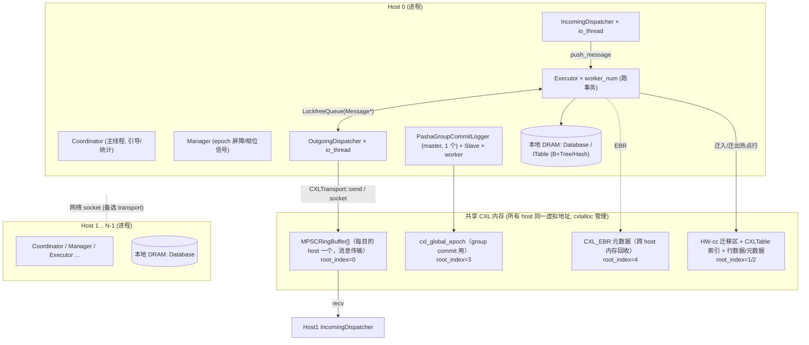

要点：
- **线程角色**：`Coordinator`(主线程引导+每秒统计) / `Manager`(全局相位屏障) / `Executor`(事务执行，`worker_num` 个) / `IncomingDispatcher`+`OutgoingDispatcher`(每 `io_thread_num` 一组，消息收发) / `PashaGroupCommitLogger`(落盘 master 线程，1 个)。
- **两条 transport**：`USE_CXL_TRANS=1` 走 CXL `MPSCRingBuffer`（共享内存，~百 ns）；否则走 TCP socket（~µs）。
- **数据归属**：partition 默认按 host 取模归属（`HashPartitioner`），master host 持有本地 DRAM 副本；远程访问触发迁入 CXL。

### 2.2 CXL 共享内存布局

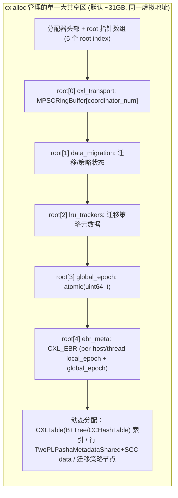

分类计量见 `common/CXLMemory.h`：`INDEX_ALLOCATION` / `METADATA_ALLOCATION` / `DATA_ALLOCATION` / `TRANSPORT_ALLOCATION` / `MISC_ALLOCATION`，对应 README 末尾输出的 `total_size_*_usage` 统计。

### 2.3 事务执行相位（宏观）

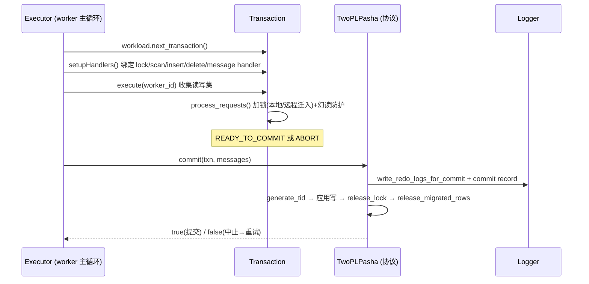

---

## 3. 核心类实体与接口交互

### 3.1 运行时与存储核心类图

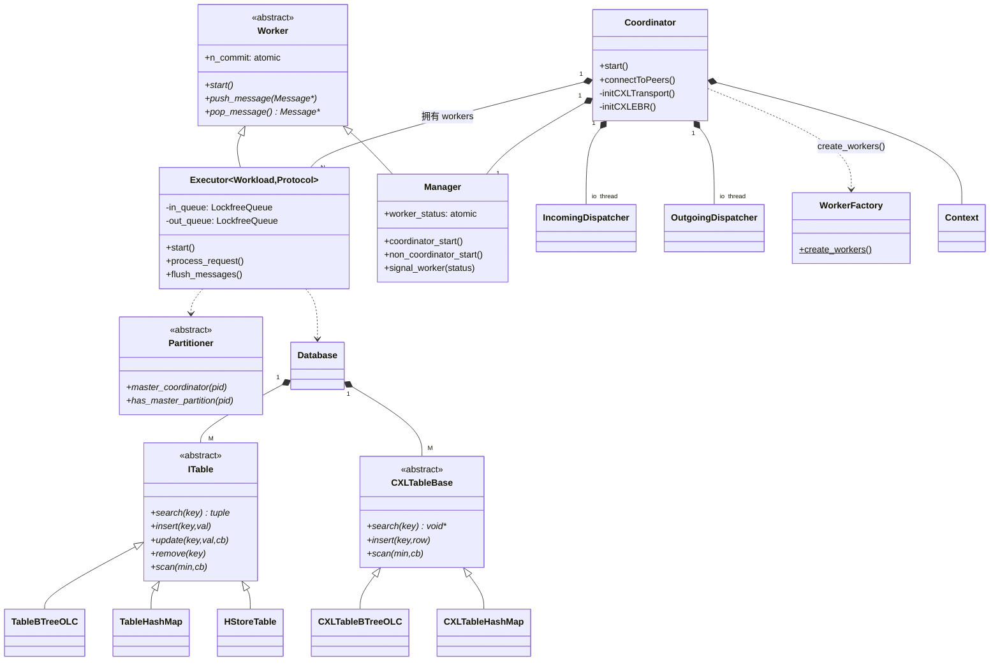

### 3.2 协议域类图（TwoPLPasha = Tigon）

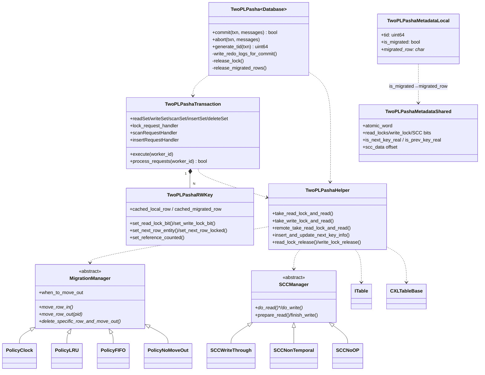

### 3.3 CXL 基础设施类图

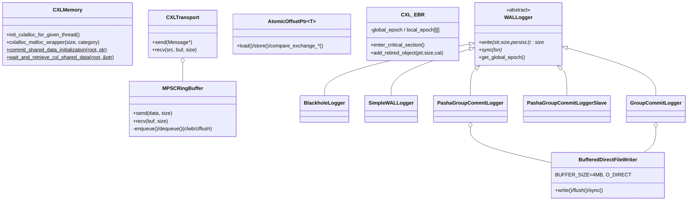

### 3.4 实体间接口交互（谁通过哪个接口调用谁）

| 调用方 → 被调方 | 接口（签名要点） | 传入 / 返回 |
|---|---|---|
| `Executor → Workload` | `next_transaction(context, partition_id, worker_id, granule_id)` | 返回 `unique_ptr<TransactionType>` |
| `Executor → Transaction` | `execute(worker_id)` | 返回 `TransactionResult`（READY_TO_COMMIT/ABORT...） |
| `Executor → Protocol` | `commit(txn, messages)` / `abort(txn, messages)` | 返回 `bool`（是否提交） |
| `Transaction → Protocol/Helper` | `lock_request_handler` / `scanRequestHandler` / `insertRequestHandler` / `remote_request_handler` | 由 `setupHandlers()` 绑定的 `std::function` |
| `Transaction/Helper → ITable` | `search/insert/remove/scan/search_and_update_next_key_info` | 行 `(meta*, data*)` 等 |
| `Helper → MigrationManager` | `move_row_in / move_row_out / delete_specific_row_and_move_out` | `migration_result`（SUCCESS/FAIL_OOM...） |
| `Helper → SCCManager` | `prepare_read / do_read / do_write / finish_write` | 维护缓存一致（clflush/clwb） |
| `Executor → Dispatcher` | 经 `out_queue` 推 `Message*`；`push_message` 收 | `Message` / `MessagePiece` |
| `Dispatcher → CXLTransport/Socket` | `send(Message*)` / `recv(src, buf, size)` | 字节流 |
| `* → CXLMemory` | `cxlalloc_malloc_wrapper(size, category)`、`commit/ wait_and_retrieve_cxl_shared_data` | CXL 指针 / 跨 host barrier |
| `Protocol → WALLogger` | `write(buf, size, persist, startTime)`、`get_global_epoch()` | LSN / epoch |

### 3.5 一次远程读-改-写事务的对象交互（桥接类图与数据流）

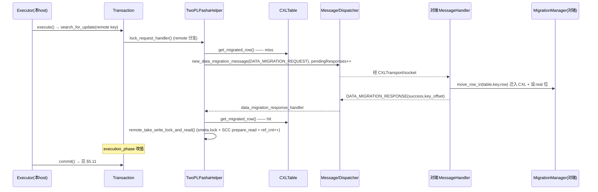

---

## 4. 分层模块职责与接口

### 4.1 运行时层（`core/`）

| 类 / 文件 | 职责 | 关键接口（`file:line`） |
|---|---|---|
| `Coordinator` (`core/Coordinator.h`) | 引导整个进程：初始化 CXL、建 logger、建 workers、连 peer、起线程、每秒统计 | `Coordinator(id,db,context)`；`start()` `:178`；`initCXLTransport()` `:410`；`initCXLEBR()` `:435` |
| `Worker` (`core/Worker.h`) | 所有可调度线程实体的抽象基类，持有统计原子量 | `start()` / `push_message()` / `pop_message()` `:16-80` |
| `Executor<Workload,Protocol>` (`core/Executor.h`) | 事务执行主循环；收发消息 | `start()` `:77`；`process_request()` `:317`；`flush_messages()` `:347` |
| `Manager` (`core/Manager.h`) | 全局相位屏障（START/STOP/CLEANUP），跨 host 信号 | `coordinator_start()` `:36`；`signal_worker()` `:110`；`wait_all_workers_start()` `:95` |
| `IncomingDispatcher`/`OutgoingDispatcher` (`core/Dispatcher.h`) | 网络/CXL 收发与消息批量合并、路由到 worker | `start()`；`groupOrDispatchMessages()` `:310`；`fetchMessageFromCoordinator()` `:167` |
| `WorkerFactory` (`core/factory/WorkerFactory.h`) | 按 `context.protocol` 模板实例化 Executor+Manager | `create_workers()` `:82` |
| `Partitioner` (`core/Partitioner.h`) | 分区归属与副本判定 | `master_coordinator()` / `has_master_partition()` / `is_backup()` `:15-71` |
| `Context` (`core/Context.h`) | 全量配置（协议/线程/CXL/迁移/日志开关） | 字段见 `:16-127`（`use_cxl_transport`/`hw_cc_budget`/`migration_policy`...） |

**引导顺序**（`Coordinator` ctor）：`cxl_memory.init` → `initCXLTransport()` → `initCXLEBR()` → 建 logger（见 §5.14.1）→ `WorkerFactory::create_workers()` → `connectToPeers()` → `start()`。

### 4.2 协议层（`protocol/`）

- `TwoPLPasha<Database>`（`protocol/TwoPLPasha/TwoPLPasha.h`）：提交/中止/TID 生成/redo 日志/放锁。
- `TwoPLPashaTransaction`（`TwoPLPashaTransaction.h`）：五大请求集（read/write/scan/insert/delete）+ `process_requests()`。
- `TwoPLPashaHelper`（`TwoPLPashaHelper.h`，全局单例 `twopl_pasha_global_helper`）：本地/远程加锁读、迁移、real 位维护。
- `TwoPLPashaRWKey`（`TwoPLPashaRWKey.h`）：单条读写键的 64bit 位域 + 缓存行指针 + 锁/引用标记。
- `TwoPLPashaMessage*`：跨 host 消息工厂与 handler（迁移/远程插删/扫描迁移）。
- `protocol/Pasha/`：共享基础设施——`MigrationManager` + 策略（`PolicyClock/LRU/FIFO/NoMoveOut/Eagerly`）、`SCCManager` + 机制（`SCCWriteThrough/NonTemporal/NoOP`），以及对应工厂。
- 两级行元数据：本地 `TwoPLPashaMetadataLocal`（自旋锁 + `is_migrated` + `migrated_row`），CXL `TwoPLPashaMetadataShared`（原子字：读计数/写锁/SCC 位/real 位/data offset）+ `TwoPLPashaSharedDataSCC`（`tid`/`flags`/`ref_cnt`/策略元数据/`data[]`）。

### 4.3 存储层（`core/Table.h`、`core/CXLTable.h`）

- `ITable`（`core/Table.h:23`）：统一表接口 `search/insert/update/remove/scan/search_and_update_next_key_info/...`；实现 `TableBTreeOLC`（有序，支持 scan，`:368`）、`TableHashMap`（无序，`:172`）、`HStoreTable`/`HStoreCOWTable`（`:787/955`）。
- `CXLTableBase`（`core/CXLTable.h:15`）：CXL 侧表 `search/insert/remove/scan`；实现 `CXLTableBTreeOLC`（用 `offset_ptr`，`:83`）、`CXLTableHashMap`（`:32`）。
- 行 = `{ MetaDataType meta(atomic<uint64_t>); ValueType data; }`；Schema 由 `DO_STRUCT` 宏从字段列表生成 key/value/KeyComparator/序列化。

### 4.4 CXL 基础设施层（`common/`、`dependencies/cxlalloc`）

| 组件 | 职责 | 关键点 |
|---|---|---|
| `cxlalloc`（`dependencies/cxlalloc/cxlalloc.h`） | 位置无关共享内存分配器 | `cxlalloc_malloc/free`、`pointer_to_offset/offset_to_pointer`、`get/set_root`；backend=ivshmem |
| `CXLMemory`（`common/CXLMemory.h`） | 分类计量 + 5 个 root index + 跨 host 初始化握手 | `commit_shared_data_initialization`/`wait_and_retrieve_cxl_shared_data` |
| `AtomicOffsetPtr<T>`（`atomic_offset_ptr.hpp`） | CXL 中可 CAS 的偏移指针 | 偏移相对 `this`，跨进程有效 |
| `MPSCRingBuffer`/`CXLTransport`（`MPSCRingBuffer.h`/`CXLTransport.*`） | 共享内存消息环 | `enqueue`/`dequeue` 配 `clwb`/`clflush`+`sfence` |
| `CXL_EBR`（`CXL_EBR.*`） | 4-epoch 跨 host 内存回收 | `enter_critical_section`/`add_retired_object` |
| `WALLogger` 家族（`WALLogger.h`） | redo 日志 + epoch group commit | 见 §5.14 |
| `CCHashTable`/`CCSet`、`btree_olc_cxl/BTreeOLC_CXL` | CXL 内崩溃一致索引 | 节点不释放，`offset_ptr` 链 |

### 4.5 Benchmark 层（`bench_*.cpp`、`benchmark/`）

- 入口 `main()`：`SETUP_CONTEXT(context)` 解析 flags → `Database db; db.initialize(context)` 建表/装数据 → `Coordinator c(FLAGS_id, db, context)` → `c.connectToPeers()` → `c.start()`。
- 每 benchmark 含 `Database/Workload/Transaction/Query/Schema/Storage/Context`。`Workload::next_transaction` 按分布造事务；`Transaction::execute` 是「读请求 → `process_requests` 加锁 → `execution_phase` 写」回调；`Query` 携带 partition/granule 信息与跨分区概率。

---

## 5. 核心数据流图谱

> 约定：每条流给「文字 + mermaid + 函数调用栈（缩进树 + `file:line`）」。其中 §5.8 / §5.11 / §5.14 为重点深挖。

### 5.1 系统引导 / 启动流

```
main (bench_tpcc.cpp:23)
└─ Coordinator::Coordinator(id, db, context)   core/Coordinator.h
   ├─ cxl_memory.init(context)
   ├─ initCXLTransport()                        :410  // host0 建 MPSCRingBuffer[] + commit；其余 wait_and_retrieve
   ├─ initCXLEBR()                              :435  // host0 建 CXL_EBR + commit
   ├─ <建 logger>                               :54-97（见 5.14.1）
   └─ WorkerFactory::create_workers(...)        factory/WorkerFactory.h:82
main
└─ c.connectToPeers()                           // 建立 TCP 连接（即使用 CXL transport 也需控制面）
└─ c.start()                                    core/Coordinator.h:178
   ├─ 起 IncomingDispatcher/OutgoingDispatcher 线程 :189
   ├─ 起 logger 线程 PashaGroupCommitLogger::start  :208-211
   ├─ 起 Executor/Manager 线程                   :218
   └─ 每秒收集统计；time_to_run 到点置 stopFlag、join
```

### 5.2 CXL 共享内存初始化握手

host0 负责建，其它 host 自旋等待，保证「先建后用」。

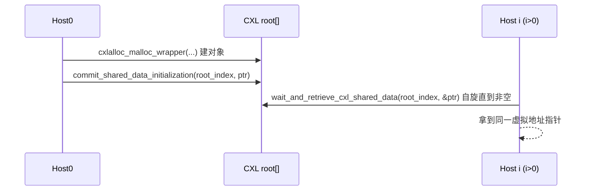

调用点：transport `Coordinator.h:410`、EBR `:435`、global_epoch `:66-73`、各 `Database` 的 CXLTable root（`benchmark/*/Database.h`）。

### 5.3 事务生成流

```
Executor::start (core/Executor.h:77) 主循环
└─ workload.next_transaction(context, partition_id, worker_id)   benchmark/*/Workload.h:21
   └─ 按随机分布 new NewOrder/Payment/...（设置 transaction_id, 随机种子）
└─ setupHandlers(*transaction)   // 绑定 lock/scan/insert/delete/message handler（TwoPLPashaExecutor.h）
└─ transaction->execute(worker_id)
```

### 5.4 本地读流

```
Transaction::search_for_read → add_to_read_set
Transaction::process_requests (TwoPLPashaTransaction.h:353)
└─ lock_request_handler(...)（TwoPLPashaExecutor.h，local 分支）
   └─ table->search(key)                         ITable
   └─ TwoPLPashaHelper::take_read_lock_and_read(row, dest, size, success, ...)
      └─ lmeta->lock(); 检查 is_valid & 无写锁 & 读计数<上限; 读计数++; memcpy; unlock
└─ readSet[i].set_read_lock_bit(); set_cached_local_row()
```

### 5.5 本地写流

```
Transaction::search_for_update（write_lock_request_bit）→ readSet
Transaction::process_requests
└─ lock_request_handler → take_write_lock_and_read
   └─ lmeta->lock(); 检查 is_valid & 读计数==0 & 无写锁; set WRITE_LOCK; 读出旧值; unlock
execution_phase: Transaction::update(...) 把新值写入 writeSet（提交期 apply，见 5.11.6）
```

### 5.6 远程读 + 数据迁入流（Pasha 核心）

```mermaid
sequenceDiagram
    participant A as Host A (访问方)
    participant B as Host B (master)
    A->>A: lock_request_handler (remote 分支)
    A->>A: get_migrated_row() → miss
    A->>B: DATA_MIGRATION_REQUEST (key, txn_id, key_offset), pendingResponses++
    B->>B: data_migration_request_handler → migration_manager.move_row_in(table,key,row)
    B-->>A: DATA_MIGRATION_RESPONSE (success, key_offset)
    A->>A: get_migrated_row() → hit; remote_take_read_lock_and_read()
    Note over A: smeta.lock + SCC prepare_read + ref_cnt++ + memcpy
```

OnDemand 模式下，对端在 `move_row_in` 失败（CXL 满）时触发 `move_row_out(partition_id)` 腾位。

### 5.7 数据迁出流

- **OnDemand**：`move_row_in` 失败 → 同 partition 内按策略 `move_row_out` 选 victim 迁出（要求 `ref_cnt==0`）。策略实现 `PolicyClock`(二次机会)/`PolicyLRU`(`get_next_victim`)/`PolicyFIFO`/`PolicyNoMoveOut`。
- **Reactive**：提交后对 `txn.remote_hosts_involved` 发 `DATA_MOVEOUT_HINT`（`TwoPLPasha.h:540-545`）→ 对端 `data_move_out_hint_handler` → `move_row_out`。

### 5.8 Phantom Detection（幻读防护）深挖

> 受 `context.enable_phantom_detection` 控制：协议名 `TwoPLPasha`=开启，`TwoPLPashaPhantom`=关闭。机制 = **next-key locking** + CXL 元数据上的 **prev/next "real" 位**。

#### 5.8.0 问题与原理

幻读：事务 T1 扫描区间 `[min,max]`，并发事务 T2 在区间内插入一行后提交，T1 重扫得到不同结果，破坏可串行化。Tigon 两件武器：

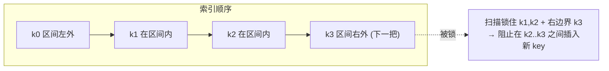

- **(a) next-key locking**：扫描不仅锁区间内每个 tuple，还锁住右边界**下一把** tuple（`next_row_entity`）。任何想插入到区间内的事务必须先拿到该边界 key 的锁，从而被阻塞。
- **(b) real 位**：迁入 CXL 的行用两 bit 标记其前驱/后继 key 是否**也真实存在**于 CXL 共享区。远程扫描只有在边界 key「real」时才能安全断定「相邻 key 间无可插空洞」；否则必须把整段迁入再扫。

#### 5.8.1 元数据位布局（`TwoPLPashaMetadataShared`）

源码：`protocol/TwoPLPasha/TwoPLPashaHelper.h:299-308`

```cpp
static constexpr int is_next_key_real_bit_index = 39;
static constexpr int is_prev_key_real_bit_index = 38;
// bit 39 - 38: is_next_key_real, is_prev_key_real
```

| 段 | 含义 | 访问函数 |
|---|---|---|
| latch | 自旋锁 | `lock()/unlock()` |
| SCC bits | per-host 缓存有效位 | `set/clear_scc_bit` |
| read_locks | 读锁计数 | 读锁路径 |
| write_lock | 写锁 | `set_write_locked` |
| is_data_modified | 迁入后是否被改 | `clear_is_data_modified_since_moved_in` |
| **is_prev_key_real (38)** | 前驱 key 是否 real | `get/set/clear_prev_key_real_bit` `:168-180` |
| **is_next_key_real (39)** | 后继 key 是否 real | `get/set/clear_next_key_real_bit` `:153-165` |
| scc_data offset | 指向 `TwoPLPashaSharedDataSCC` | `get_scc_data()` |

#### 5.8.2 请求集与 RWKey 字段（`TwoPLPashaRWKey.h`）

`SCAN_FOR_READ/UPDATE/INSERT/DELETE`(`:21`)、`set_scan_args()`(`:237`)、`next_row_entity`/`is_next_row_locked`/`require_lock_next_row`(`:247-274,362-364`)、`reference_counted`(`:289-297`)、`inserted_cxl_row`(`:301-308`)。scanSet/insertSet/deleteSet 分别承载扫描、插入、删除请求。

#### 5.8.3 处理顺序（`process_requests`）

```
Transaction::process_requests (TwoPLPashaTransaction.h:353)  // 倒序，命中 get_processed() 提前返回
├─ readSet:  lock_request_handler → set_read/write_lock_bit  (:359-392)
├─ scanSet:  scanRequestHandler → 成功则 set_next_row_entity + set_next_row_locked (:395-420)
│            migration_required 时不报错，等待迁移后重试
├─ insertSet:insertRequestHandler → require_lock_next_row 则锁下一行 (:422-443)
└─ deleteSet:deleteRequestHandler (:445-460)   // 假设“读后删”，写锁已在 read-for-update 拿到
失败置 abort_lock/abort_insert/abort_delete，goto process_net_req_and_ret 收尾
```

#### 5.8.4 本地扫描 next-key locking

源码：`TwoPLPashaExecutor.h:189-261` 的 `local_scan_processor`。对 `[min,max]` 内每 tuple 按 type 调 `read_lock`/`write_lock`；边界判定：

```cpp
if (is_last_tuple == true) locking_next_tuple = true;
else if (limit != 0 && scan_results.size() == limit) locking_next_tuple = true;
else if (table->compare_key(key, max_key) > 0) locking_next_tuple = true;
...
if (locking_next_tuple) { next_row_entity = cur_row; scan_success = true; return true; } // 锁住“下一把”后结束
```

```
scanRequestHandler(local)  TwoPLPashaExecutor.h:189
└─ table->scan(min_key, local_scan_processor)   :259
   └─ 对每行: read_lock/write_lock (按 SCAN_FOR_*)   :227-237
   └─ 边界行: 存 next_row_entity 并 return true     :246-251
```

#### 5.8.5 远程扫描 real 位校验（核心）

源码：`TwoPLPashaExecutor.h:262-394` 的 `remote_scan_processor`：

```cpp
smeta->lock();
if (compare_key(key,min_key)==0) {                 // 首 key==min：只看后继
    if (smeta->get_next_key_real_bit()==false) migration_required = true;
} else if (scan_results.size()==limit) {           // limit 末：只看前驱
    if (smeta->get_prev_key_real_bit()==false) migration_required = true;
} else {                                            // 中间 key：两者都要 real
    if (!smeta->get_next_key_real_bit() || !smeta->get_prev_key_real_bit()) migration_required = true;
}
smeta->unlock();
if (migration_required) { scan_success=false; return true; }   // 立刻停，去迁移
// 否则按 type: remote_read/write_lock_and_inc_ref_cnt
```

空结果也视为需迁移（`:362`）。

#### 5.8.6 触发区间迁移

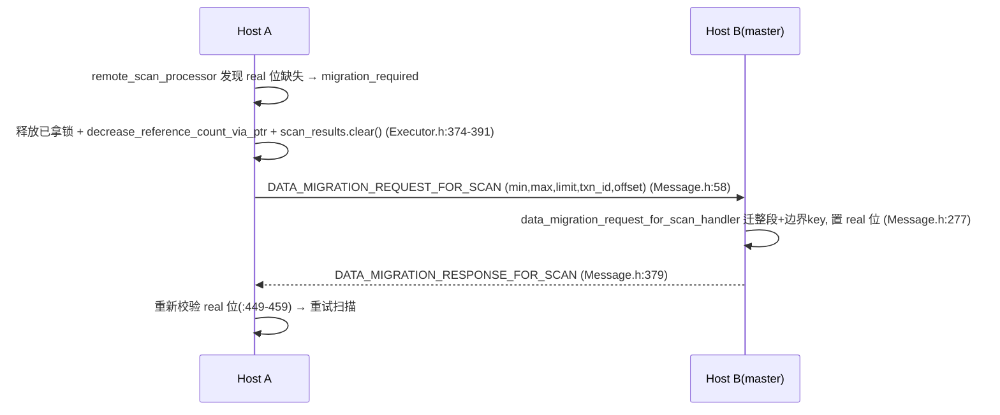

#### 5.8.7 插入维护 real 位

本地：`insertRequestHandler`(`Executor.h:408`) → `insert_and_update_next_key_info`(`TwoPLPashaHelper.h:1820`)：插入 placeholder，并把**新 key 前驱的 `next_key_real`、后继的 `prev_key_real` 清零**（`:1848-1953`）——因为新 key 现在插在二者之间，旧的「直接相邻」关系对已迁移副本不再成立。远程插入推迟到 commit（避免回滚，`Executor.h:416-419`）。

#### 5.8.8 提交期收尾

`TwoPLPasha::commit` 的 phantom 分支（`TwoPLPasha.h:383-445`）：

```
commit (phantom 分支)
├─ insertSet: search_and_update_next_key_info(key, key_info_updater)
│   └─ key_info_updater: prev_smeta->clear_next_key_real_bit() (:408)
│                        next_smeta->clear_prev_key_real_bit() (:421)
│   └─ modify_tuple_valid_bit(meta, true) 把 placeholder 置 valid (:434)
│   └─ 远程: new_remote_insert_message + sync_messages (:437-445)
└─ deleteSet(经 scanSet SCAN_FOR_DELETE): delete_specific_row_and_move_out / remote_modify_tuple_valid_bit + new_remote_delete_message
```

#### 5.8.9 放锁与释放

`release_lock` phantom 分支（`TwoPLPasha.h:817-949`）：释放 insert 的 next-row 锁、scanSet 各 tuple + next-row 锁（按 `SCAN_FOR_*` 分派 `read_lock_release`/`write_lock_release` 或其 `remote_*` 版本）。`release_migrated_rows`(`:992-1030`) 对 scan 结果与 next-row 逐一 `decrease_reference_count_via_ptr`。

#### 5.8.10 正确性与坑点

- **正确性**：区间内每行 + 右边界「下一把」均被加锁；远程时 real 位确保边界相邻关系在 CXL 中可见，从而任何落入区间的并发插入都必须先竞争已被持有的边界锁 → 谓词被串行化。
- **源码自陈限制**：
  - 未实现锁 ownership，**不支持单事务内重复/重叠查询**（`Executor.h:217-219`、`:319-321` 注释）。
  - 连续 insert **只锁最后一个 key**（`Transaction.h:318-322`）。
  - 假设**每个 scan 至少返回一行**（空结果即触发迁移，`Executor.h:360-364`）。

| 维度 | `TwoPLPasha`（开启） | `TwoPLPashaPhantom`（关闭） |
|---|---|---|
| next-key locking | 有 | 无 |
| real 位校验 / 区间迁移 | 有 | 无 |
| 可串行化下的幻读 | 防护 | 不防护（用于测幻读防护开销） |

### 5.9 插入流

```
Transaction::insert_row（require_lock_next_key?）→ insertSet
process_requests → insertRequestHandler
├─ local:  insert_and_update_next_key_info(table,key,value,...) 建 placeholder + 维护 real 位
└─ remote: 推迟到 commit（new_remote_insert_message）→ 对端 remote_insert_request_handler 建 placeholder+迁移
commit: modify_tuple_valid_bit 置 valid（见 5.8.8 / 5.11.4）
```

### 5.10 删除流

```
Transaction::delete_row → deleteSet（假设“读后删”，写锁已持有）
commit:
├─ local:  migration_manager->delete_specific_row_and_move_out(table,key,true)
└─ remote: remote_modify_tuple_valid_bit(false) + new_remote_delete_message → 对端 remote_delete handler
```

### 5.11 Commit（提交流）深挖

源码主体：`TwoPLPasha::commit`（`protocol/TwoPLPasha/TwoPLPasha.h:341-548`）。

#### 5.11.0 总览时序（含 `ScopedTimer` 计时点）

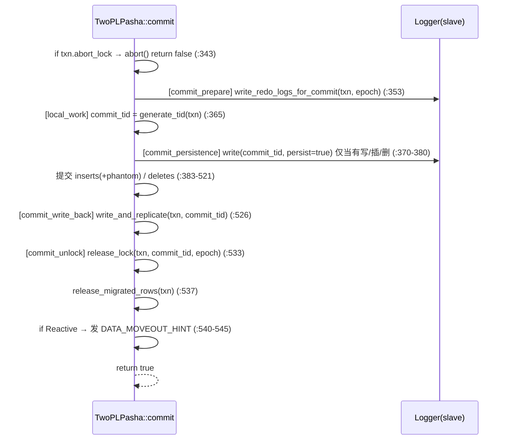

#### 5.11.1 Redo 日志（`write_redo_logs_for_commit` `:691`）

对 writeSet/insertSet/deleteSet 逐条序列化，`log_type` 0=update / 1=insert / 2=delete，版本号由 `generate_epoch_version`（`:681`，`epoch<<32` 拼接）生成：

```cpp
int log_type = 0; // update
uint64_t epoch_version = generate_epoch_version(tid, cur_global_epoch);
ss << log_type << tableId << partitionId << epoch_version
   << std::string((char*)key,key_size) << std::string((char*)value,value_size);
txn.get_logger()->write(output.c_str(), output.size(), /*persist=*/false, txn.startTime);  // :713
```

注意：redo 写 `persist=false`（只入 slave buffer，不落盘）。

#### 5.11.2 TID 生成（`generate_tid` `:39`）

```cpp
for (i in readSet) next_tid = max(next_tid, readSet[i].get_tid());
next_tid = max(next_tid, max_tid);  // worker 最近 TID
next_tid++; max_tid = next_tid;     // 单调，保证 > 任何读到/写过的 TID
```

#### 5.11.3 Commit record 持久化（`:370-380`）

仅当 `writeSet/insertSet/deleteSet` 非空时，写一条带 `commit_tid` 的提交记录，`persist=true`：

```cpp
ss << commit_tid << true;
auto lsn = txn.get_logger()->write(output.c_str(), output.size(), true, txn.startTime);
```

`persist=true` 在 slave 端只记延迟统计、不阻塞（落盘交给 master，见 §5.14）。

#### 5.11.4 插入提交 + phantom 维护（`:383-445`）

见 §5.8.8：`search_and_update_next_key_info` 清迁移邻居的 real 位 → `modify_tuple_valid_bit` 置 valid；远程 `new_remote_insert_message` + `sync_messages(txn)` 等待对端建好 placeholder 并迁移。

#### 5.11.5 删除提交（`:447-520`）

phantom 模式经 scanSet `SCAN_FOR_DELETE` → `delete_specific_row_and_move_out`(local) / `remote_modify_tuple_valid_bit`+`new_remote_delete_message`(remote)；非 phantom 模式直接 `table->remove(key)`。

#### 5.11.6 写回 `write_and_replicate`（`:550`）

遍历 readSet 中带 `write_lock_bit` 的 key：

```cpp
if (partitioner.has_master_partition(partitionId)) {
    twopl_pasha_global_helper->update(cached_row, value, value_size);          // 本地直写  (:634)
} else {
    twopl_pasha_global_helper->remote_update(migrated_row, value, value_size); // 迁移行：内含 SCC finish_write + clwb  (:641)
}
```

scan_for_update 同理。`model_cxl_search_overhead` 开关用于实验建模。**注意**：副本复制路径 `DCHECK(false)` —— replication 在本仓库未实现（`:578`）。

#### 5.11.7 放锁 `release_lock`（`:765`）

```
release_lock
├─ readSet[read_lock_bit]:  has_master? read_lock_release(meta) : remote_read_lock_release(migrated_row)  (:775-791)
├─ readSet[write_lock_bit]: write_lock_release(meta, value_size, epoch_version) / remote_write_lock_release (:793-814)
│      epoch_version = generate_epoch_version(tid, cur_global_epoch)  // 写回 MVCC 版本
└─ phantom: 释放 insert next-row 锁 + scanSet 各锁（按 SCAN_FOR_* 分派） (:817-949)
```

#### 5.11.8 释放迁移行 `release_migrated_rows`（`:955`）

对 `reference_counted` 的 read/insert/scan 行调 `release_migrated_row` / `decrease_reference_count_via_ptr`，把 `ref_cnt` 减回 0，使其可被迁出。

#### 5.11.9 Reactive 迁出收尾（`:540-545`）

`when_to_move_out==Reactive` 时对 `txn.remote_hosts_involved` 发 `new_data_move_out_hint_message`。

#### 5.11.10 提交期锁 / 引用计数状态机

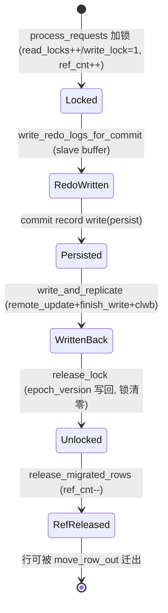

### 5.12 中止流

```
TwoPLPasha::abort (TwoPLPasha.h:67)
├─ phantom: 回滚已建的 placeholder 插入
├─ release_lock（释放已拿锁）
├─ release_migrated_rows（减 ref_cnt）
└─ Reactive: 发 DATA_MOVEOUT_HINT  (:333-338)
→ Executor 重试该事务
```

### 5.13 消息收发链路

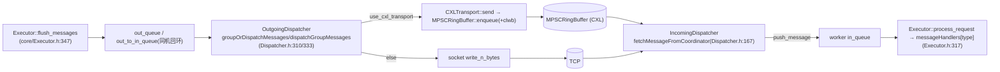

### 5.14 WALLogger 与 redo 日志落盘深挖

源码：`common/WALLogger.h`（全文）+ 装配 `core/Coordinator.h:54-97/208-211/397-401`。

#### 5.14.0 WALLogger 类族

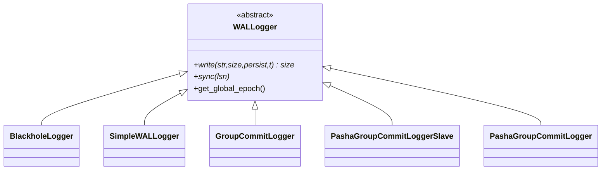

| 类（`WALLogger.h`） | 用途 | write 语义 | 用于 |
|---|---|---|---|
| `WALLogger` `:194` | 抽象基类（纯虚 `write/sync/close` + `get_global_epoch`/`print_sync_stats`） | — | — |
| `BlackholeLogger` `:223` | 丢弃日志（测无日志上限） | 直接 return 0 | `LOGGING_TYPE=BLACKHOLE` |
| `SimpleWALLogger` `:588` | 带锁同步直写 | `writer.write`，persist 则 `writer.sync` | 非 group 模式 |
| `GroupCommitLogger` `:254` | 单机后台线程版（LSN + `waiting_syncs`） | 累积 + 后台 `do_sync` | 历史/单机 |
| `PashaGroupCommitLoggerSlave` `:377` | **每 worker 一个**，按 epoch 切 buffer 入队 | 写本地 `LogBuffer`，不落盘 | `GROUP_WAL` |
| `PashaGroupCommitLogger` `:440` | **全局唯一 master 线程**，排空队列落盘 + 推进 epoch | `write`=`CHECK(0)`（不直接写） | `GROUP_WAL` |
| `BufferedDirectFileWriter` `:75` | 4MB `BUFFER_SIZE`、`posix_memalign`+`O_DIRECT`，`flush()` 内 `::write`+`fdatasync` | — | 各 logger 底层 |
| `DirectFileWriter` `:26` | `O_DIRECT` 直写（master 用） | `::write(roundUp(size,block))` / `fdatasync` | master |

#### 5.14.1 装配数据流（谁建谁，`Coordinator.h:63-86`）

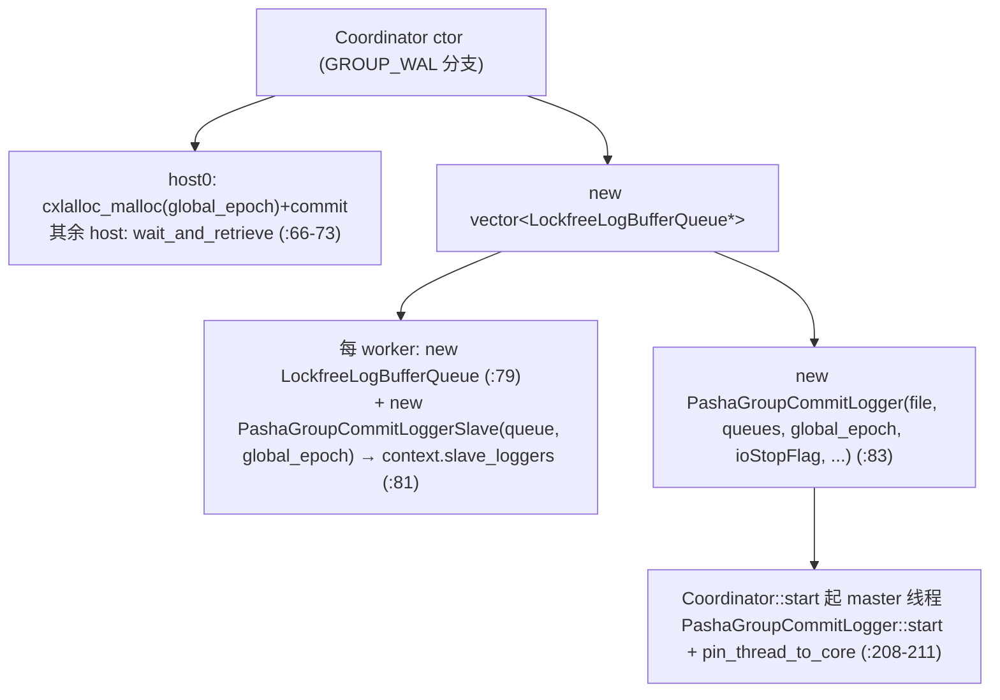

组件关系：**N 个 Executor → N 个 SlaveLogger → N 个 LockfreeLogBufferQueue →（被）1 个 master 排空 → 1 个磁盘文件**。

#### 5.14.2 数据结构

```cpp
struct LogBuffer {                                  // WALLogger.h:364
    static constexpr uint64_t max_buffer_size = 1024*1024*4; // 4MB
    char buffer[max_buffer_size];
    uint64_t size = 0;
    std::vector<uint64_t> txn_start_times;          // 延迟统计基准
};
static constexpr uint64_t max_log_buffer_queue_size = 128;             // :374
using LockfreeLogBufferQueue = LockfreeQueue<LogBuffer*, 128>;          // :375
```

队列传 `LogBuffer*` 指针（零拷贝交接），每 worker 一个 slave 生产、唯一 master 消费。

#### 5.14.3 生产端：commit 如何产生 redo 并入队

```
TwoPLPasha::commit (TwoPLPasha.h:341)
└─ write_redo_logs_for_commit (:691)
   └─ 逐条 ss << log_type<<tableId<<partitionId<<epoch_version<<key[+value]
   └─ txn.get_logger()->write(output, size, persist=false, startTime)
      └─ PashaGroupCommitLoggerSlave::write (WALLogger.h:393)
         ├─ cur_epoch = cxl_global_epoch->load()
         ├─ if (cur_log_buffer->size+size > 4MB || cur_epoch > last_epoch):
         │     log_buffer_queue.push(cur_log_buffer); cur_log_buffer = new LogBuffer  (:399-406)
         ├─ memcpy(&cur_log_buffer->buffer[size], str, size); size += size
         └─ if persist: txn_start_times.push_back(...)   // 仅记统计，不阻塞、不落盘
```

关键：slave 的 `sync()` 是 `CHECK(0)`（`:419-422`）——**落盘完全交给 master 按 epoch 推进**，这正是 epoch-based group commit 的核心。

#### 5.14.4 消费端：master 如何落盘

```
PashaGroupCommitLogger::start (WALLogger.h:464)   // 每 2µs 检查一次
└─ if (now - last_sync_time)/1000 >= group_commit_latency_us(EPOCH_LEN):
   ├─ cxl_global_epoch->fetch_add(1)              // 推进全局 epoch → 间接令所有 slave 下次 write 切 buffer 入队
   └─ do_sync() (:482)
      └─ for q in log_buffer_queues:
         └─ while !q.empty():
            ├─ LogBuffer* lb = q.front(); q.pop()
            ├─ file_writer.write(lb->buffer, lb->size); file_writer.sync()  // DirectFileWriter: ::write + fdatasync
            ├─ 统计 queuing_latency / disk_sync_latency / disk_sync_cnt / disk_sync_size
            ├─ committed_txn_cnt += lb->txn_start_times.size(); 算 txn_latency
            └─ delete lb
```

#### 5.14.5 一次 group commit 周期时序

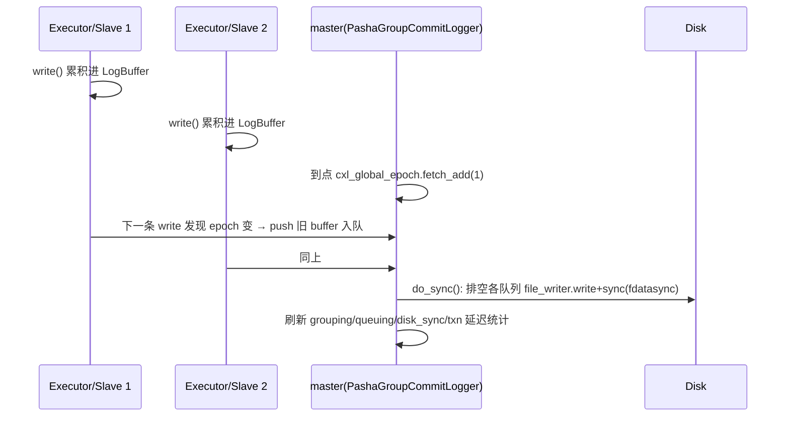

对应 README 输出的 `Group Commit Stats` / `Queuing Stats` / `Disk Sync Stats`（`print_sync_stats` `:547`）。

#### 5.14.6 持久性 / 一致性边界与坑点

| 项 | 说明 |
|---|---|
| 提交可见性边界 | 即 epoch 边界（master `fetch_add` + `do_sync`） |
| 崩溃丢失窗口 | 未入队/未落盘的 buffer 丢失，最多丢**一个 epoch 窗口**（`EPOCH_LEN`） |
| 接口不对称 | master 的 `write/sync` 与 slave 的 `sync` 均 `CHECK(0)`，误用即崩 |
| 仅 redo、无 undo | 依赖 2PL 提交前不暴露 + placeholder 机制 |
| 恢复重放 | 本仓库**只写不回放**（无 recovery 路径） |
| `emulated_persist_latency` | master 用 `DirectFileWriter`，要求其为 0（`CHECK`） |

### 5.15 EBR 内存回收流

```
CXL_EBR::enter_critical_section (CXL_EBR.cpp)
├─ 读 local_epoch / global_epoch
├─ 若本 epoch 对象数≥阈值 且 所有线程都已到当前 epoch → CAS global_epoch++
├─ 回收 epoch (global_epoch-2) 的 retired_objects → cxlalloc_free
add_retired_object(ptr,size,category)  // 延迟释放，入当前 epoch 列表
```

4-epoch 设计保证「若某线程在 epoch k，则 epoch k-2 的对象必无引用」。

### 5.16 SCC 读写一致性流

```
读: SCCManager::do_read / prepare_read
   └─ WriteThrough: 若本 host 有效位未置 → clflush(src) → 置位 → memcpy   // 缓存 miss
写: SCCManager::do_write / finish_write
   └─ WriteThrough: 清所有 host 有效位 → set 本 host 位 → memcpy → clwb(dst)
NonTemporal: 每次读必 clflush、每次写必 clwb（无元数据）
NoOP: 不做（假设硬件全一致）
```

调用点嵌入读写锁路径（`take_read_lock_and_read`/`remote_update` 等）。

### 5.17 Manager epoch 屏障流

```
Manager::coordinator_start (core/Manager.h:36)   // 仅 host0
├─ signal_worker(START); wait_all_workers_start()        // 屏障1
├─ while(!stopFlag) yield                                 // 主线程外部置停
├─ set_worker_status(STOP); wait_all_workers_finish()     // 屏障2
├─ broadcast_stop(); wait4_stop(n-1)                      // 屏障3
└─ set_worker_status(CLEANUP); wait_all_workers_finish(); wait4_ack()  // 屏障4/5
non_coordinator_start: 用 wait4_signal() 镜像（被动等信号）
```

### 5.18 B+Tree OLC 乐观索引访问流

```
BPlusTree::lookup/insert (common/btree_olc_cxl/BTreeOLC_CXL.h)
├─ readLockOrRestart(needRestart): 读版本号快照；若被锁 → needRestart=true, _mm_pause
├─ readUnlockOrRestart(start): 若版本号变化 → restart
└─ writeLockOrRestart: 自旋拿写锁（版本号 + 锁位编码在一个 atomic word）
```

---

## 6. 关键设计模式与动机

| 模式 / 手法 | 位置 | 为什么这么设计 |
|---|---|---|
| **工厂 + 模板特化** | `WorkerFactory` / `MigrationManagerFactory` / `SCCManagerFactory` | 编译期决定协议/策略，热点路径零虚函数开销；新增协议只需加一个分支 |
| **策略模式** | 迁移策略（Clock/LRU/FIFO/NoMoveOut）、SCC 机制（WriteThrough/NonTemporal/NoOP） | 运行时可配（README 参数），便于做敏感性实验（Figure 7/8） |
| **偏移指针 + host0-建-others-等** | `AtomicOffsetPtr`、`commit/wait_and_retrieve_cxl_shared_data` | 同一物理 CXL 映射到同一虚拟地址，用相对偏移即可跨进程互引；初始化只让 host0 建、其余自旋等，避免分布式协调 |
| **软硬件协同的两区一致性** | Pasha 迁移 + SCC | CXL 1.1 HW-cc **预算有限**：只把热点行放进 HW-cc 区享受硬件一致；超预算的用 SCC（显式 clflush/clwb）软件兜底，用 `move_row_out` 控制占用 |
| **本地 + 共享两级元数据** | `TwoPLPashaMetadataLocal` + `TwoPLPashaMetadataShared` | 本地分区直接走轻量自旋锁；只有被跨 host 访问的行才升级到 CXL 原子字 + `ref_cnt`，降低公共路径开销 |
| **Epoch 一处多用** | EBR 回收 / group commit / Manager 相位屏障 | 用单调 epoch 统一「安全点」语义：内存回收、提交可见性、阶段切换都以 epoch 为界 |
| **Lock-free 队列 + 批量合并 + CXL ringbuffer** | `LockfreeQueue`、`OutgoingDispatcher` 合并、`MPSCRingBuffer` | 减少线程间锁竞争与 syscall；CXL ringbuffer 以共享内存替代 TCP，把跨 host 延迟从 µs 降到百 ns |
| **next-key locking + real 位** | §5.8 | 在迁移架构下保证区间谓词可串行化：本地用下一把锁，远程用 real 位判断能否安全断言无空洞 |

---

## 7. 技术债与坑点（均有源码依据）

- **拼写 typo**：`protocol/Pasha/SCCManagerFacrtory.h`（Facrtory）；`emulation/host_setup/uncore_freq.py` 等。
- **复制（replication）未实现**：`TwoPLPashaMessage` 中 `REPLICATION_REQUEST/RESPONSE` 标 not supported；`write_and_replicate` 副本路径 `DCHECK(false)`（`TwoPLPasha.h:578`）。
- **恢复重放未实现**：WAL 只写不回放（§5.14.6）。
- **硬编码上限**：
  - EBR `max_coordinator_num=8`、`max_thread_num=5`（`common/CXL_EBR.h`）。
  - SCC 有效位 `MetaType=uint16_t` → 最多 **16 host**。
  - `TwoPLPashaRWKey` 64bit 位域：table_id 5bit / partition 20bit / granule 17bit，超出即溢出。
- **幻读防护的范围限制**（§5.8.10）：不支持单事务内重复/重叠查询；连续 insert 只锁最后一个 key；假设 scan 至少返回一行。
- **CXL B+Tree 内 EBR 实际被禁用**（`btree_olc_cxl/EBR_CXL.h` 仅统计不回收）；`CCHashTable` 节点**永不释放**（以内存换崩溃一致）。
- **忙等 / 自旋**：ringbuffer `send` 满时自旋、group-commit `sync` 等待、Manager 屏障 `yield`、OLC `readLockOrRestart` 重试——核数不足时易退化（README 要求每 VM 多核）。
- **配置约束**：`USE_OUTPUT_THREAD` 依赖 `USE_CXL_TRANS`；CXL transport 是单消费者（`check_context` 校验）；`emulated_persist_latency` 与 master `DirectFileWriter` 互斥。
- **强环境依赖**：需真实 CXL 1.1 硬件或双 socket 远程 NUMA 模拟 + 自带内核模块（`dependencies/kernel_module/cxl_ivpci.ko`）+ ivshmem VM；非该环境无法运行。
- **大量编译/运行开关**：`ENABLE_MIGRATION_OPTIMIZATION`/`MODEL_CXL_SEARCH`/`ENABLE_SCC` 等组合多，研究原型属性明显。

---

## 8. 构建与运行速查

- **构建**：仓库用 CMake（见 `CMakeLists.txt`），目标含 `bench_tpcc` / `bench_ycsb` / `bench_smallbank` / `bench_tatp`。VM 化构建与分发用 `./scripts/run.sh COMPILE_SYNC <vm_num>`。
- **一行示例**（TPC-C，Tigon）：
  ```bash
  ./scripts/run.sh TPCC TwoPLPasha 8 3 mixed 10 15 1 0 1 Clock OnDemand 200000000 1 WriteThrough None 30 10 GROUP_WAL 20000 0 0
  ```
  参数语义见 `README.md`「Test Tigon in Various Configurations」一节（`SYSTEM/HOST_NUM/WORKER_NUM/.../LOGGING_TYPE/EPOCH_LEN/...`）。
- **复现论文图表**：`./scripts/push_button.sh results/test1`（全量 ~7.5h），或 `run_tpcc.sh`/`run_ycsb.sh`/`run_hwcc_budget.sh`/`run_swcc.sh` + `parse/` + `plot/`。
- **环境搭建**：`./scripts/setup.sh HOST` → `./emulation/image/make_vm_img.sh` → `./emulation/start_vms.sh ...` → `./scripts/setup.sh VMS <n>`（见 README）。

---

## 9. 术语表与参考

| 术语 | 含义 |
|---|---|
| CXL pod | 多 host 共享一块 CXL 1.1 缓存一致内存的部署单元 |
| HW-cc / `HW_CC_BUDGET` | 硬件缓存一致区及其容量预算 |
| SCC | 软件缓存一致（WriteThrough/NonTemporal/NoOP） |
| migration / move-in / move-out | 行在本地 DRAM 与 CXL HW-cc 区之间迁入/迁出 |
| real 位 | 迁移行的前驱/后继 key 是否真实存在于 CXL，用于幻读防护 |
| epoch | 单调计数器，统一 EBR 回收 / group commit / 相位屏障的安全点 |
| granule | partition 内的细粒度加锁单元 |
| `ref_cnt` | 迁移行被多少远程访问引用，0 才可迁出 |

参考文献：
- Tigon: A Distributed Database for a CXL Pod, **OSDI '25** — https://yibo-huang.github.io/papers/tigon_osdi25.pdf
- Pasha: An Efficient, Scalable Database Architecture for CXL Pods, **CIDR '25**
- Sundial, **VLDB '18**；Lotus（DS2PL 基线），**VLDB '22**；Motor，**OSDI '24**

> 注：本文 `file:line` 基于撰写时的代码快照，若源码改动请以实际行号为准。
