# Tigon 事务提交（Commit）流程规格说明书 (SPEC)

> 适用协议：**TwoPLPasha**（即论文中的 **Tigon**，基于 Pasha 架构、运行在 CXL Pod 上的分布式两阶段锁数据库）
> 关联文件：
> - `protocol/TwoPLPasha/TwoPLPasha.h`（提交核心逻辑）
> - `protocol/TwoPLPasha/TwoPLPashaExecutor.h`（执行期取锁/读写）
> - `protocol/TwoPLPasha/TwoPLPashaTransaction.h`（事务状态与计时）
> - `core/Executor.h`（worker 主循环，驱动 `commit()`）
> - `core/group_commit/Executor.h` / `core/group_commit/Manager.h`（epoch 协调）
> - `common/WALLogger.h`（WAL / epoch-based group commit）
> - `core/Coordinator.h`（logger 线程与 CXL 全局 epoch 装配）

本文档自底向上拆解 Tigon 的一次事务从“执行结束（READY_TO_COMMIT）”到“持久化提交完成”的全部步骤，包含：架构图、时序图、数据流图、函数调用栈、关键数据结构表，以及逐行级别的代码细节。

---

## 0. 名词与缩写

| 缩写 | 含义 |
|------|------|
| 2PL | Two-Phase Locking，两阶段锁 |
| TID | Transaction ID / commit timestamp（提交时间戳，单调递增） |
| WAL | Write-Ahead Log，预写日志 |
| LSN | Log Sequence Number，日志序列号 |
| CXL | Compute Express Link，本系统用于跨主机共享内存 |
| SCC | Software Cache Coherence，软件缓存一致性（`WriteThrough` 等） |
| EBR | Epoch-Based Reclamation，基于 epoch 的内存回收 |
| smeta / lmeta | Shared metadata (CXL 共享行) / Local metadata（本地行） |
| master / slave logger | 主 logger（落盘）/ 从 logger（每 worker 一个，仅缓冲） |

---

## 1. 总体架构与提交的位置

Tigon 的每个主机（host）= 一个 VM，进程内有若干 **transaction worker 线程**（`TwoPLPashaExecutor`，继承自 `core::Executor`）。所有 worker 共享一段 CXL 内存（存放共享行 `smeta`、全局 epoch、日志环形队列等）。提交所产生的 redo 日志通过 **per-worker 从 logger** 写入 **lock-free 环形队列**，再由 **单个主 logger 线程** 在 epoch 边界统一落盘并 fsync。

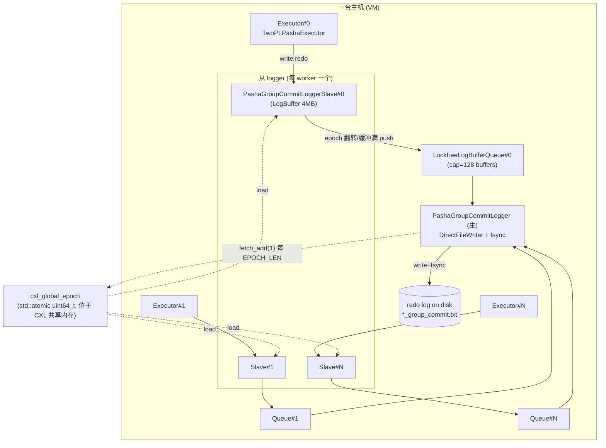

**关键点**：worker 在 `commit()` 中调用 `logger->write(...)` 只是把日志拷进当前 epoch 的 buffer；真正的 fsync 由主 logger 线程在 epoch 翻转时完成（**epoch-based group commit**）。提交对 worker 而言是**异步持久化**——它写完 redo 与 commit record 后即可释放锁返回，事务延迟由日志线程统计回填。

---

## 2. 顶层调用栈：worker 主循环如何驱动 commit

`TwoPLPashaExecutor` 复用 `core::Executor::start()` 主循环（`core/Executor.h:77`）。一次事务的生命周期如下：

```
core::Executor::start()                         core/Executor.h:77
└─ do { ... } while(status != STOP)             core/Executor.h:104-210
   ├─ process_request()                         core/Executor.h:111   // 处理远程消息
   ├─ workload.next_transaction(...)            core/Executor.h:126   // 生成事务
   ├─ global_ebr_meta->enter_critical_section() core/Executor.h:131   // 进入 EBR 临界区
   ├─ result = transaction->execute(id)         core/Executor.h:132   // 执行+取锁(2PL 增长阶段)
   └─ if result == READY_TO_COMMIT:
        ├─ commit = protocol.commit(txn, msgs)  core/Executor.h:146   // ★ 提交入口
        ├─ if commit:                           core/Executor.h:153
        │    ├─ db.global_total_commit.fetch_add(1)
        │    ├─ n_commit.fetch_add(1)
        │    └─ record_txn_breakdown_stats(txn) // 回填各阶段计时
        └─ else:                                core/Executor.h:175
             ├─ n_abort_lock / n_abort_read_validation.fetch_add(1)
             ├─ random.set_seed(last_seed)      // 复位随机种子, 保证重放同一事务
             └─ retry_transaction = true        // 下一轮重试
```

`protocol.commit(...)` 返回 `bool`：
- `true`  → 提交成功，统计 + EBR 退出临界区；
- `false` → 内部已调用 `abort()` 释放锁，worker 复位种子重试同一事务（`retry_transaction=true`）。

`result != READY_TO_COMMIT` 的两条分支（`core/Executor.h:188-206`）：
- `ABORT_NORETRY`：逻辑错误，调用 `protocol.abort()`，不重试；
- `ABORT`：冲突中止，`protocol.abort()` 后复位种子重试。

> 注：`core/group_commit/Executor.h` 是另一套（Silo 系 GC 协议用）双消息通道 + 提交队列 `q` 的执行器；**TwoPLPasha 走的是 `core::Executor`**（见 `protocol/TwoPLPasha/TwoPLPashaExecutor.h:20` 的继承关系）。两者主循环结构高度一致，差异见 §11。

---

## 3. `TwoPLPasha::commit()` — 提交核心七步

源码：`protocol/TwoPLPasha/TwoPLPasha.h:341-548`。Tigon 采用 **2PL**，执行期（§5）已持有所有读写锁，因此提交是“锁已就绪”状态下的写回 + 持久化 + 放锁。

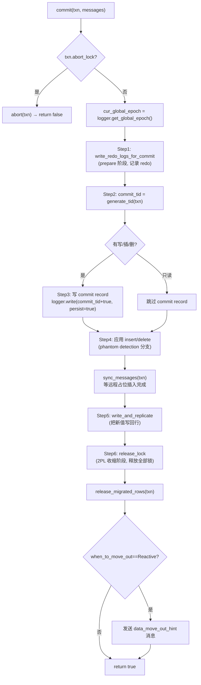

每一步都被 `ScopedTimer` 包裹，析构时把耗时回填到事务的细分计时器（见 §8）。下表给出每步的源码位置、计时桶与职责。

| Step | 代码位置 | 计时桶 (record_*) | 职责 |
|------|----------|-------------------|------|
| 0 | `TwoPLPasha.h:343-346` | — | `abort_lock` 早退：已被中止则 `abort()` 返回 false |
| 0' | `TwoPLPasha.h:348` | — | 读取当前全局 epoch `cur_global_epoch` |
| 1 | `TwoPLPasha.h:350-357` | `commit_prepare_time` | **redo 日志**：对 writeSet/insertSet/deleteSet 写 redo 记录（`persist=false`，仅入 buffer） |
| 2 | `TwoPLPasha.h:362-366` | `local_work_time` | **生成 commit TID**（`generate_tid`） |
| 3 | `TwoPLPasha.h:368-381` | `commit_persistence_time` | **commit record**：非只读事务写 `commit_tid<<true`，`persist=true` |
| 4 | `TwoPLPasha.h:383-521` | — | **提交 insert/delete**：置位 valid bit、删除行、远程占位（含 phantom 检测分支） |
| 5 | `TwoPLPasha.h:523-527` | `commit_write_back_time` | **写回 + 复制**（`write_and_replicate`） |
| 6 | `TwoPLPasha.h:529-534` | `commit_unlock_time` | **释放锁**（`release_lock`，2PL 收缩阶段） |
| 7 | `TwoPLPasha.h:536-545` | — | 释放迁移行引用计数 + 反应式数据迁出提示 |

### 3.1 Step 0' 调用栈

```
commit()                                         TwoPLPasha.h:341
└─ txn.get_logger()->get_global_epoch()          TwoPLPasha.h:348
   └─ PashaGroupCommitLoggerSlave::get_global_epoch()  → cxl_global_epoch->load()
```

`cur_global_epoch` 在整个提交期间冻结，用于生成 redo 中的 `epoch_version`（§4），保证恢复时按 epoch 切分一致快照。

### 3.2 Step 4：phantom detection 两种路径

`enable_phantom_detection == true`（`TwoPLPasha.h:383`）时：
1. **commit inserts**（`:386-441`）：
   - 本地分区：`search_and_update_next_key_info()` 更新前驱/后继键的 next-key 信息（B+Tree 防幻读），再 `modify_tuple_valid_bit(meta, true, true)` 把占位行置为有效。
   - 远程分区：发 `new_remote_insert_message`，`pendingResponses++`。
2. `sync_messages(txn)`（`:445`）：阻塞等待所有远程占位插入 + 迁移完成。
3. **commit deletes**（扫描 `scanSet` 中 `SCAN_FOR_DELETE`，`:447-480`）：本地 `delete_specific_row_and_move_out`；远程 `remote_modify_tuple_valid_bit(false)` + `new_remote_delete_message`。

`enable_phantom_detection == false`（`:481-521`）时走简化路径：本地置 valid bit / `table->remove(key)`，且 **不支持远程 insert/delete**（`DCHECK(0)`）。

---

## 4. Step 1 详解：redo 日志格式与 epoch-version

源码：`write_redo_logs_for_commit()` `TwoPLPasha.h:691-763`。对 writeSet / insertSet / deleteSet 各生成一条 redo 记录，序列化进当前 epoch 的 LogBuffer（`persist=false`）。

**记录布局（`std::ostringstream` 序列化）**：

| 字段 | update (log_type=0) | insert (log_type=1) | delete (log_type=2) |
|------|---------------------|---------------------|---------------------|
| log_type (int) | 0 | 1 | 2 |
| tableId | ✓ | ✓ | ✓ |
| partitionId | ✓ | ✓ | ✓ |
| epoch_version (uint64) | ✓ | ✓ | ✓ |
| key (key_size) | ✓ | ✓ | ✓ |
| value (value_size) | ✓ | ✓ | ✗（删除不记值） |

调用：`txn.get_logger()->write(output.c_str(), output.size(), false, txn.startTime)`（`:713/738/761`）。

### 4.1 `generate_epoch_version` — 把 epoch 编码进版本号

源码：`TwoPLPasha.h:681-689`

```cpp
uint64_t generate_epoch_version(uint64_t cur_epoch_version, uint64_t cur_global_epoch) {
    uint64_t epoch = cur_epoch_version >> 32;           // 高 32 位 = epoch
    if (cur_global_epoch > epoch) {
        return cur_global_epoch << 32;                  // 进入新 epoch，低 32 位清零
    } else {
        return cur_epoch_version + 1;                   // 同 epoch 内版本自增
    }
}
```

**版本号编码**：`[ 高32位 = epoch | 低32位 = epoch 内序号 ]`。这保证 redo 记录可按 epoch 边界恢复成一致快照——恢复时只重放“已完整持久化的 epoch”。

---

## 5. 前置阶段（执行期）：2PL 取锁如何形成 read/write set

提交前，`transaction->execute(id)` 通过 `lock_request_handler`（`TwoPLPashaExecutor.h:81`）取锁，填充 readSet/writeSet。提交逻辑依赖这些集合，故在此交代数据来源。

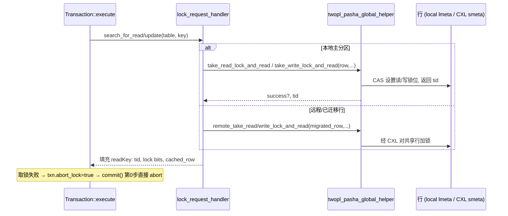

- 写锁：`take_write_lock_and_read`（`TwoPLPashaExecutor.h:112`）；读锁：`take_read_lock_and_read`（`:114`）。
- 远程行：`remote_take_write/read_lock_and_read`（`:149/151`），经 CXL 共享内存对 `smeta` 加锁。
- 每个 `readKey` 记录 `tid`（行当前版本）、`read_lock_bit`/`write_lock_bit`、`cached_local_row`/`cached_migrated_row`，供 commit 的写回与放锁阶段使用。

---

## 6. Step 2/5/6 详解

### 6.1 Step 2 `generate_tid` — 单调 commit 时间戳

源码：`TwoPLPasha.h:39-65`

```cpp
uint64_t generate_tid(TransactionType &txn) {
    uint64_t next_tid = 0;
    for (i in readSet) next_tid = max(next_tid, readSet[i].get_tid()); // 大于所读所写记录的 TID
    next_tid = max(next_tid, max_tid);                                 // 大于本 worker 上次 TID
    next_tid++;                                                        // 自增
    max_tid = next_tid;                                                // 记录
    return next_tid;
}
```

保证 commit_tid 严格大于事务读到的任何版本，且在本 worker 内单调。

### 6.2 Step 5 `write_and_replicate` — 写回新值

源码：`TwoPLPasha.h:550-679`。

1. **持久化标记计算**（`:563-614`）：倒序遍历 writeSet，为每个 coordinator 的“最后一次写”标记 `persist_commit_record[i]=true`。注：当前版本**复制未启用**（`:578 DCHECK(false)`），故该段在单机/无复制配置下不实际执行远程分支。
2. **应用写回**（`:616-644`）：遍历 readSet 中带 `write_lock_bit` 的 key：
   - 本地：`twopl_pasha_global_helper->update(cached_row, value, value_size)`；
   - 远程：`remote_update(migrated_row, ...)`（经 CXL + SCC 协议写回共享行）；
   - 若 `model_cxl_search_overhead==true` 先模拟 CXL 查找开销。
3. **scan-for-update 写回**（`:646-678`，仅 phantom detection 开启）：对 `scanSet` 中 `SCAN_FOR_UPDATE` 的每条扫描结果应用写回。

### 6.3 Step 6 `release_lock` — 2PL 收缩阶段

源码：`TwoPLPasha.h:765-...`。遍历 readSet 释放读锁与写锁；释放写锁时用 `generate_epoch_version(tid, cur_global_epoch)` **更新行版本号**：

| 锁类型 | 本地 | 远程 |
|--------|------|------|
| 读锁 | `read_lock_release(*meta)` (`:785`) | `remote_read_lock_release(migrated_row)` (`:789`) |
| 写锁 | `write_lock_release(*meta, value_size, epoch_version)` (`:805`) | `remote_write_lock_release(migrated_row, value_size, epoch_version)` (`:812`) |

phantom detection 开启时（`:817+`），额外释放 insertSet 的 next-key 写锁、scanSet 的范围读/写锁及 next-row 锁（`SCAN_FOR_READ/UPDATE/INSERT/DELETE` 分别对应读锁/写锁释放）。

**放锁写回版本号**这一步把 commit 的逻辑顺序固化进行物理版本，使后续读者看到的版本号 = 包含 epoch 的 `epoch_version`，与 redo 记录一致。

---

## 7. TID 与 epoch_version 全生命周期

本节专门拆解 **`tid`（行版本号）** 与 **`epoch_version`** 的 **格式 / 生成 / 修改 / 使用 / 提交流程 + 调用栈**——它们是 Tigon 把“2PL 锁”“MVCC 风格版本”“epoch group commit”三者缝合在一起的关键。

### 7.1 格式：版本字（TID）的位布局

Tigon 不为每行单独存版本号，而是把 **锁状态 + 版本号打包进同一个 64-bit 字**。该字有两处实体：本地行 `TwoPLPashaMetadataLocal::tid`（`TwoPLPashaHelper.h:92`）与 CXL 共享行 `TwoPLPashaSharedDataSCC::tid`（`:50`）。位布局常量见 `TwoPLPashaHelper.h:2021-2028`：

```
 bit: 63        62 .. 58        57 ............................ 0
     +--------+------------+-------------------------------------+
     | W-LOCK | READ count |            version / TID            |
     +--------+------------+-------------------------------------+
      WRITE_   READ_LOCK_    58 bit 版本值
      LOCK     BIT(5bit)
      (bit63)  58..62
```

| 常量 | 值 | 含义 |
|------|----|------|
| `WRITE_LOCK_BIT_OFFSET` / `_MASK` | 63 / `0x1` | 写锁位（bit 63） |
| `READ_LOCK_BIT_OFFSET` / `_MASK` | 58 / `0x1f` | 读者计数（bit 58–62，最多 31 个并发读者） |
| `LOCK_BIT_OFFSET` / `_MASK` | 58 / `0x3f` | 锁位整体（bit 58–63） |
| version | bit 0–57 | 58-bit 版本值 |

提取纯版本：`remove_lock_bit(value) = value & ~(0x3f<<58)`（`TwoPLPashaHelper.h:1158-1161`）。

CXL 共享行的**锁**不在 `tid` 字里，而在 `TwoPLPashaMetadataShared::atomic_word`（`:279-292`）：

```
 bit: 63    62 ........ 47   46 .. 42   41    40 ................ 0
     +------+--------------+----------+------+---------------------+
     | LATCH| per-host SCC | READ cnt | WLOCK|   SCC_DATA 偏移      |
     +------+--------------+----------+------+---------------------+
       63      47..62 16bit  42..46     41      0..36 (37bit CXL off)
```

即：共享行的“锁 / latch / SCC 位”在 `atomic_word`，而**版本号在 `scc_data->tid`**（同样按上面的 W-LOCK/READ/version 打包，但其锁位在共享场景下不用，仅版本有效）。

### 7.2 epoch_version 的二次切分

放锁写回时存入的不是普通自增版本，而是 `generate_epoch_version` 产生的 **epoch 版本**（`TwoPLPasha.h:681-689`）：

```cpp
uint64_t generate_epoch_version(uint64_t cur_epoch_version, uint64_t cur_global_epoch) {
    uint64_t epoch = cur_epoch_version >> 32;       // 旧版本高 32 位 = 旧 epoch
    if (cur_global_epoch > epoch)
        return cur_global_epoch << 32;              // 跨入新 epoch：seq 归零
    else
        return cur_epoch_version + 1;               // 同 epoch：序号 +1
}
```

于是 58-bit 版本被进一步切为：

```
 version(58bit) = [ 高位: epoch | 低 32 位: epoch 内序号 seq ]
```

约束：`write_lock_release(meta,size,new_value)` 中 `DCHECK(!is_read_locked(new_value) && !is_write_locked(new_value))`（`TwoPLPashaHelper.h:1066-1067`）要求 epoch_version **不得占用 bit 58–63**，故 `epoch<<32` 中 epoch 实际可用约 26 bit（bit 32–57）。这也解释了 README 启动日志里 `current global epoch 2226` 远小于 2^26。

### 7.3 生成：执行期从行里读出版本

行初始 `tid=0`（构造函数 `TwoPLPashaHelper.h:31/50/69/92`）。事务执行期取锁时读出当前版本：

`take_write_lock_and_read`（`:793-824`，读锁 `take_read_lock_and_read` `:526` 对称）：

```cpp
old_value = lmeta->tid;                 // 读打包字
tid       = remove_lock_bit(old_value); // 剥掉锁位 → 纯版本
if (is_read_locked(old_value) || is_write_locked(old_value)) { success=false; goto out; }
new_value = old_value + (WRITE_LOCK_BIT_MASK << WRITE_LOCK_BIT_OFFSET); // 置写锁位(bit63)
lmeta->tid = new_value;                 // 回写(带锁位)
// migrated 行: old_value=scc_data->tid; 走 SCC prepare_read/do_read
return tid;                             // 返回纯版本
```

返回的纯版本经 `lock_request_handler`（`TwoPLPashaExecutor.h:81-160`）存入 `readKey` → `RWKey::set_tid(tid)`（`TwoPLPashaRWKey.h:174`，字段 `:351`）。

### 7.4 使用：提交期消费版本

| 用途 | 代码 | 说明 |
|------|------|------|
| 生成 commit_tid | `generate_tid`（`TwoPLPasha.h:39-65`） | `next_tid = max(∀ readSet[i].get_tid(), max_tid) + 1`，保证大于所读所写版本且 worker 内单调 |
| 生成 redo 的 epoch_version | `write_redo_logs_for_commit`（`:691-763`） | 对每条 write/insert/delete：`ev = generate_epoch_version(writeKey.get_tid(), cur_global_epoch)`，序列化进 redo 记录第 4 字段 |
| 放锁写回 epoch_version | `release_lock`（`:765-815`） | 释放写锁时 `ev = generate_epoch_version(readKey.get_tid(), cur_global_epoch)` 作为新版本写回行 |

### 7.5 修改：把 epoch_version 写回行

`write_lock_release(meta, size, new_value)`（`TwoPLPashaHelper.h:1055-1084`）:

```cpp
if (lmeta->is_migrated == false) {            // 本地行
    DCHECK(is_write_locked(lmeta->tid));
    DCHECK(!is_read_locked(new_value) && !is_write_locked(new_value)); // ev 不含锁位
    lmeta->tid = new_value;                   // 原子写回新版本(同时清掉写锁位)
} else {                                       // 已迁移到 CXL 的行
    smeta->lock();
    smeta->clear_write_locked();              // 清 atomic_word 的写锁
    scc_data->tid = new_value;                // 写共享版本
    scc_manager->finish_write(smeta, coordinator_id, scc_data, ...); // 经 SCC 协议(WriteThrough)传播
    smeta->unlock();
}
```

远程行走 `remote_write_lock_release(row,size,new_value)`（`:1086`）。`finish_write` 是软件缓存一致性（SCC）的关键：把新版本与数据刷出，使其他主机的缓存可见。

### 7.6 提交流程中的三条调用栈

```
① 执行期生成版本
core::Executor::start (Executor.h:132) → transaction->execute
  → lock_request_handler (TwoPLPashaExecutor.h:81)
    → take_write_lock_and_read (Helper.h:793)
      → remove_lock_bit (Helper.h:1158)        // 得纯版本 tid
    → RWKey::set_tid (RWKey.h:174)              // 存入 read/write set

② 提交计算 commit_tid
protocol.commit (TwoPLPasha.h:341)
  → generate_tid (TwoPLPasha.h:39)             // max(readSet tid)+1

③ 提交写日志 + 放锁写回 epoch_version
protocol.commit (TwoPLPasha.h:341)
  ├─ write_redo_logs_for_commit (TwoPLPasha.h:691)
  │    → generate_epoch_version (TwoPLPasha.h:681)
  │    → logger->write(... epoch_version ...)   // 进 epoch LogBuffer
  └─ release_lock (TwoPLPasha.h:765)
       → generate_epoch_version (TwoPLPasha.h:681)
       → write_lock_release(meta,size,epoch_version) (Helper.h:1055)
            ├─(本地) lmeta->tid = epoch_version
            └─(迁移) scc_data->tid = epoch_version; scc_manager->finish_write
```

### 7.7 端到端时序图

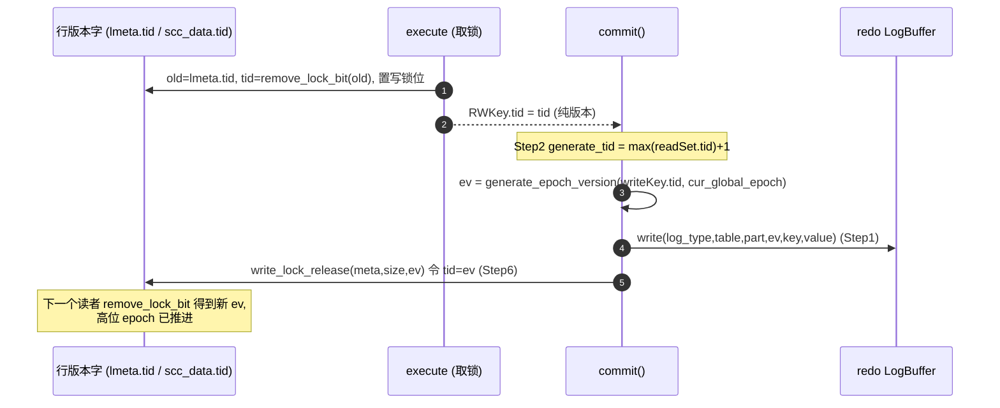

---

## 8. 提交延迟分解（计时埋点）

`TwoPLPashaTransaction` 维护多个 `_us` 计时器（`TwoPLPashaTransaction.h:46-132`），`commit()` 中每步用 `ScopedTimer` 自动回填，最终在 `Executor::onExit()`（`core/Executor.h:229+`）按本地/分布式事务分别打印平均值。

```mermaid
gantt
    title 一次 commit() 的耗时分解（计时桶）
    dateFormat X
    axisFormat %s
    section commit()
    prepare(redo写入)        :a1, 0, 2
    local_work(generate_tid) :a2, 2, 1
    persistence(commit rec)  :a3, 3, 2
    write_back(写回+复制)    :a4, 5, 3
    unlock(放锁)             :a5, 8, 2
```

| 计时桶 | 累加方法 | 取值方法 | 对应 commit step |
|--------|----------|----------|------------------|
| `commit_prepare_time_us` | `record_commit_prepare_time` (`:75`) | `get_commit_prepare_time` (`:80`) | Step1 redo |
| `commit_work_time_us` | `record_commit_work_time` (`:105`) | `get_commit_work_time` (`:110`) | commit 整体（外层 ScopedTimer，`Executor.h:138`） |
| `commit_persistence_time_us` | `record_commit_persistence_time` (`:65`) | `get_commit_persistence_time` (`:70`) | Step3 commit record |
| `commit_write_back_time_us` | `record_commit_write_back_time` (`:115`) | `get_commit_write_back_time` (`:120`) | Step5 |
| `commit_unlock_time_us` | `record_commit_unlock_time` (`:125`) | `get_commit_unlock_time` (`:130`) | Step6 |
| `commit_replication_time_us` | `record_commit_replication_time` (`:56`) | `get_commit_replication_time` (`:61`) | 复制（当前未启用） |

打印聚合：`core/Executor.h:244-258`，分别输出 `local_txn_*` 与 `dist_txn_*` 的平均值（commit_work / prepare / persistence / write_back / replication / release_lock）。

---

## 9. WALLogger 深度剖析：redo 日志如何经队列落盘

文件：`common/WALLogger.h`（744 行）+ `common/LockfreeQueue.h`。这是 commit 的“持久化后端”，决定 worker 在 commit 中写入的 **redo 记录 / commit record** 何时、以何种路径真正落到磁盘。本节给出文件写入层、无锁队列、主从 logger 的完整源码级剖析与端到端数据流。

### 9.1 组件全景与类层次

`WALLogger.h` 内定义了 **2 个文件写入器 + 1 个抽象基类 + 5 个 logger 实现**：

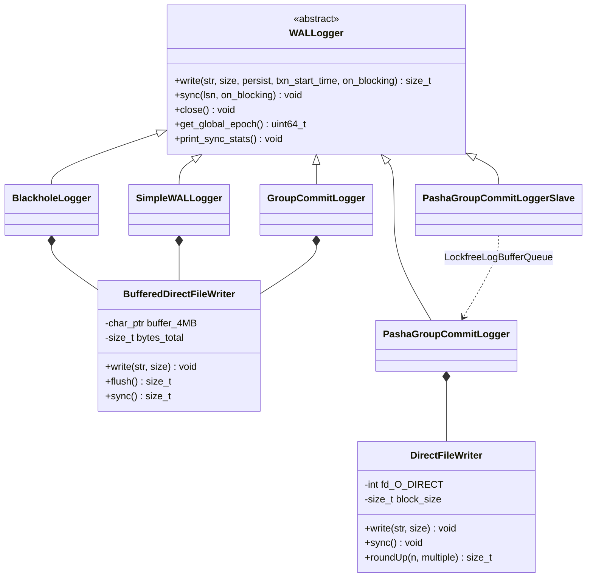

| 类 | 源码行 | 角色 | 写入器 | 触发落盘的条件 |
|----|--------|------|--------|----------------|
| `WALLogger` | `:194-221` | 抽象基类，纯虚 `write/sync/close` | — | — |
| `BlackholeLogger` | `:223-252` | `LOGGING_TYPE=BLACKHOLE` 时丢弃日志，`write` 直接 `return 0` | `BufferedDirectFileWriter` | 从不（基准对照） |
| `SimpleWALLogger` | `:588-627` | 非 group：每次 `persist` 即 `writer.sync()` | `BufferedDirectFileWriter` | 每个持久化写 |
| `GroupCommitLogger` | `:254-362` | **单机** count/latency 混合 group commit，后台 detach 线程 | `BufferedDirectFileWriter` | `waiting_syncs≥cnt` 或超时 |
| `PashaGroupCommitLoggerSlave` | `:377-438` | **每 worker 一个**，只 memcpy 进 `LogBuffer` 并按 epoch 入队 | 无（不落盘） | 从不（交给 master） |
| `PashaGroupCommitLogger` | `:440-586` | **每主机一个 master 线程**，drain 所有队列 + `write+fdatasync` | `DirectFileWriter` | 每 `EPOCH_LEN` |

> Tigon 默认（`LOGGING_TYPE=GROUP_WAL`）使用 **`PashaGroupCommitLoggerSlave`（生产者）+ `PashaGroupCommitLogger`（消费者）** 组合，经 `LockfreeLogBufferQueue` 连接。下文聚焦这条路径；`GroupCommitLogger` 为单机变体，附在 §9.10 对比。

### 9.2 文件写入层

#### DirectFileWriter（master 使用，`:26-73`）

```cpp
DirectFileWriter(const char *filename, std::size_t block_size, ...) {
    long flags = O_WRONLY | O_CREAT | O_TRUNC | O_DIRECT;     // :32 绕过 page cache
    fd = open(filename, flags, ...); CHECK(fd >= 0);
}
void write(const char *str, long size) {
    ::write(fd, str, roundUp(size, block_size));             // :43 写入按 block 对齐取整
}
void sync() { fdatasync(fd); }                               // :58-61 仅刷数据(不刷元数据)
```

要点：
- **`O_DIRECT`**：绕过 OS page cache 直写设备，避免双缓冲，但要求 **写入大小/偏移按 `block_size`（默认 4096）对齐**——故 `write` 用 `roundUp(size, block_size)`（`:46-56`）向上取整到块边界。
- `sync()` 用 `fdatasync`（只持久化数据块，不含 inode 时间戳等元数据），比 `fsync` 轻。

#### BufferedDirectFileWriter（单机 logger 使用，`:75-192`）

- 4MB 对齐缓冲：`posix_memalign(&buffer, block_size, BUFFER_SIZE=4MB)`（`:90, :184`）。
- `write`（`:98-124`）：先 memcpy 进缓冲；满 4MB 时 `flush()`。
- `flush`（`:138-159`）：`::write(fd, buffer, roundUp(bytes_total, block_size))` + `fdatasync(fd)`，返回刷出字节数。
- `sync`（`:161-174`）：= `flush()`（若设 `emulated_persist_latency` 则额外 sleep 模拟慢盘）。

### 9.3 无锁队列 LockfreeLogBufferQueue

源码 `common/LockfreeQueue.h:24-55` + `WALLogger.h:374-375`：

```cpp
// WALLogger.h:364-375
struct LogBuffer {
    static constexpr uint64_t max_buffer_size = 1024*1024*4;   // 4MB
    char buffer[max_buffer_size];                              // 定长 4MB 日志区
    uint64_t size = 0;                                         // 已写入字节
    std::vector<uint64_t> txn_start_times;                     // 本 buffer 内各持久化事务的起点(用于回算延迟)
};
static constexpr uint64_t max_log_buffer_queue_size = 128;
using LockfreeLogBufferQueue = LockfreeQueue<LogBuffer *, 128>;
```

`LockfreeQueue`（`LockfreeQueue.h:24`）继承 **`boost::lockfree::spsc_queue<LogBuffer*, capacity<128>>`**——**单生产者单消费者（SPSC）** 无锁环形队列：

| 端 | 谁 | 操作 |
|----|----|------|
| 生产者 (single producer) | 该 worker 的 `PashaGroupCommitLoggerSlave`（仅此一个 worker 线程写它） | `push(LogBuffer*)` |
| 消费者 (single consumer) | 唯一的 master logger 线程 | `front()/pop()` |

`push`（`LockfreeQueue.h:29-36`）满时自旋让出：

```cpp
void push(const T &value) {
    while (base_type::write_available() == 0) std::this_thread::yield(); // 队列满(128)则等
    bool ok = base_type::push(value); CHECK(ok);
}
```

注意队列里传递的是 **`LogBuffer*` 裸指针**（4MB 堆对象的所有权随指针转移）：slave `new LogBuffer` → push；master `pop` 后 `delete log_buffer`（`:532`）。SPSC + 指针传递 = **零拷贝跨线程移交 4MB 日志**。

### 9.4 装配：Coordinator 如何把三者连起来

源码 `core/Coordinator.h:55-95, 208-211`：

```
log_path != "" && wal_group_commit_time != 0:
├─ cxl_global_epoch (std::atomic<uint64_t>, 位于 CXL 共享内存)         (Coordinator.h:66-74)
│   ├─ coordinator_id==0: cxlalloc_malloc + commit_shared_data_initialization
│   └─ 其它 host:        wait_and_retrieve_cxl_shared_data 拿同一指针
├─ for i in [0, worker_num):                                          (Coordinator.h:78-82)
│     log_buffer_queues[i] = new LockfreeLogBufferQueue
│     slave_loggers[i]     = new PashaGroupCommitLoggerSlave(log_buffer_queues[i], cxl_global_epoch)
├─ master_logger = new PashaGroupCommitLogger(redo_filename, log_buffer_queues,
│                    cxl_global_epoch, ioStopFlag, group_commit_batch_size,
│                    wal_group_commit_time, emulated_persist_latency)  (Coordinator.h:83)
└─ logger_threads[0] = std::thread(&PashaGroupCommitLogger::start, master_logger)  (Coordinator.h:210)
   pin_thread_to_core(logger_threads[0])                              // 绑核，独占一个 CPU
```

绑定：每个 `TwoPLPashaExecutor` 在 `core/Executor.h:60-72` 取 `context.slave_loggers[id]` 作为自己的 `logger`，`txn.set_logger(logger)`；于是 **worker#i ↔ slave#i ↔ queue#i** 一一对应，master 持有全部 queue 的 vector。

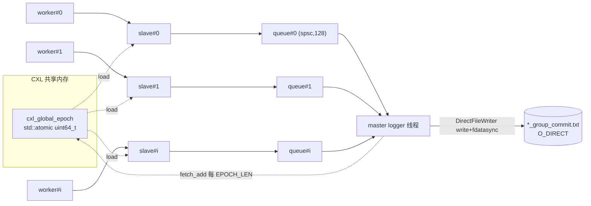

### 9.5 入口：commit() 如何调用 logger->write

承接 §3。commit 在两处调用 `logger->write`，二者都落到 **同一个 slave** 的 `cur_log_buffer`：

| 写入点 | commit 源码 | 内容 | persist |
|--------|-------------|------|---------|
| Step1 redo（每条 write/insert/delete） | `TwoPLPasha.h:713/738/761` | `log_type,tableId,partitionId,epoch_version,key[,value]` | `false` |
| Step3 commit record（非只读事务一次） | `TwoPLPasha.h:377` | `commit_tid << true` | `true` |

```
protocol.commit (TwoPLPasha.h:341)
├─ write_redo_logs_for_commit (:691)
│    └─ logger->write(redo_bytes, size, persist=false, txn.startTime)   // N 条
└─ [非只读] logger->write(commit_record, size, persist=true, txn.startTime)  // :377
        └─ PashaGroupCommitLoggerSlave::write (WALLogger.h:393)
```

`persist` 参数的作用：slave 仅在 `persist==true` 时把 `txn.startTime` 推进 `txn_start_times`（`:411-414`）——**只有写了 commit record 的事务才被计入“已提交并需统计延迟”**；只读事务（无 commit record）不计入 `committed_txn_cnt`。

### 9.6 生产者：slave 写入 + epoch 翻转入队（逐行）

`PashaGroupCommitLoggerSlave::write`（`WALLogger.h:393-417`，**verbatim**）：

```cpp
std::size_t write(const char *str, long size, bool persist,
                  std::chrono::steady_clock::time_point txn_start_time, ...) override {
    uint64_t cur_epoch = cxl_global_epoch->load();                       // :395 读全局 epoch
    CHECK(cur_log_buffer != nullptr);
    if (((cur_log_buffer->size + size) > LogBuffer::max_buffer_size)     // 缓冲将满 4MB
            || (cur_epoch > last_epoch)) {                               // 或 epoch 翻转
        if (cur_log_buffer->size > 0) {
            log_buffer_queue.push(cur_log_buffer);                       // :401 整段移交 master
            cur_log_buffer = new LogBuffer;                              // :402 换新 buffer
        }
        last_epoch = cur_epoch;                                          // :405 记下新 epoch
    }
    memcpy(&cur_log_buffer->buffer[cur_log_buffer->size], str, size);    // :408 仅 memcpy，无 syscall
    cur_log_buffer->size += size;
    if (persist == true) {                                              // :411 commit record 才记
        auto latency = duration_cast<microseconds>(steady_clock::now() - txn_start_time).count();
        cur_log_buffer->txn_start_times.push_back(Time::now() - latency); // 反推事务真实起点
    }
    return size;                                                        // 返回字节数(非 LSN)
}
```

关键语义：
- **一个 LogBuffer = 一个 epoch 内、该 worker 产生的全部日志**。push 的触发只有两种：① 缓冲满 4MB；② `cur_epoch > last_epoch`（master 推进了 epoch）。
- slave 的 `write` **没有任何 syscall/fsync**，只是 memcpy + 偶尔 push 指针，因此对事务关键路径几乎零开销。
- `sync()` 在 slave 中是 `CHECK(0)`（`:419-422`）——slave 永不自己同步。
- **边界**：若某 worker 在一个 epoch 内无新写入，它上个 epoch 的 buffer 要等到 **下一次 write** 才会被 push（不是 epoch 一到就主动 push）。这意味着空闲 worker 的尾部日志可能延迟到下次活动才落盘——是该实现的已知特性。

### 9.7 消费者：master start + do_sync drain（逐行）

master 线程入口 `PashaGroupCommitLogger::start`（`WALLogger.h:464-475`，**verbatim**）：

```cpp
void start() {
    LOG(INFO) << "logger thread started!";
    while (stopFlag.load() == false) {
        if ((Time::now() - last_sync_time) / 1000 >= group_commit_latency_us) {  // 每 EPOCH_LEN(us)
            this->cxl_global_epoch->fetch_add(1);    // :469 ★ 推进全局 epoch (令所有 slave 下次翻转)
            do_sync();                               // :470 drain 全部队列并落盘
            last_sync_time = Time::now();
        }
        std::this_thread::sleep_for(std::chrono::microseconds(2));   // :473 2µs 轮询
    }
}
```

`do_sync`（`WALLogger.h:482-535`，**verbatim 精简**）：

```cpp
void do_sync() {
    auto begin_time = steady_clock::now();        // 用于算排队时延
    uint64_t flushed_log_buffer_num = 0;
    for (auto i = 0; i < log_buffer_queues.size(); i++) {    // 遍历每个 worker 的队列
        auto *cur_q = log_buffer_queues[i];
        while (true) {
            if (cur_q->empty()) break;                       // 该队列排空
            LogBuffer *log_buffer = cur_q->front();          // :496 取队头
            cur_q->pop();                                    // :500 释放槽位
            // ---- 落盘 ----
            auto sync_start = steady_clock::now();
            file_writer.write(log_buffer->buffer, log_buffer->size);  // :504 DirectFileWriter O_DIRECT 写
            file_writer.sync();                                       // :505 fdatasync
            auto sync_end = steady_clock::now();
            // ---- 统计 ----
            queuing_latency.add(duration_us(sync_start - begin_time));   // :510 入队→开始落盘
            disk_sync_latency.add(duration_us(sync_end - sync_start));   // :514 纯 fdatasync 耗时
            disk_sync_cnt++; disk_sync_size += log_buffer->size;
            committed_txn_cnt += log_buffer->txn_start_times.size();     // :519 累加已提交事务数
            auto now = Time::now();
            for (auto st : log_buffer->txn_start_times)
                txn_latency.add((now - st) / 1000);                     // :521-524 端到端事务延迟
            if (++flushed_log_buffer_num >= max_log_buffer_queue_size * log_buffer_queues.size())
                begin_time = steady_clock::now();            // :528-530 VM 跨线程时钟漂移，周期刷新基准
            delete log_buffer;                               // :532 释放 4MB
        }
    }
}
```

要点：
- master 的 `write()` 本体是 `CHECK(0)`（`:477-480`）——master **只通过 `do_sync` 落盘**，不接受直接 write。
- **每个 LogBuffer 一次 `write+fdatasync`**：故 `disk_sync_cnt` ≈ 落盘的 buffer 数，`disk_sync_size` 为总字节。一个 epoch 通常对应 `worker_num` 个 buffer（每 worker 一个）。
- `begin_time` 周期性重置是为规避 VM 中不同 vCPU 的 `steady_clock` 漂移导致排队时延算成负数/异常。

### 9.8 端到端数据流图（redo → 磁盘）

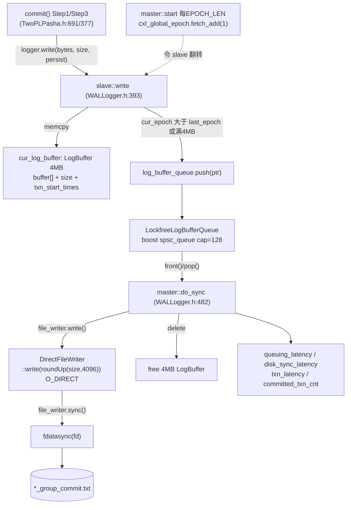

时序视角：

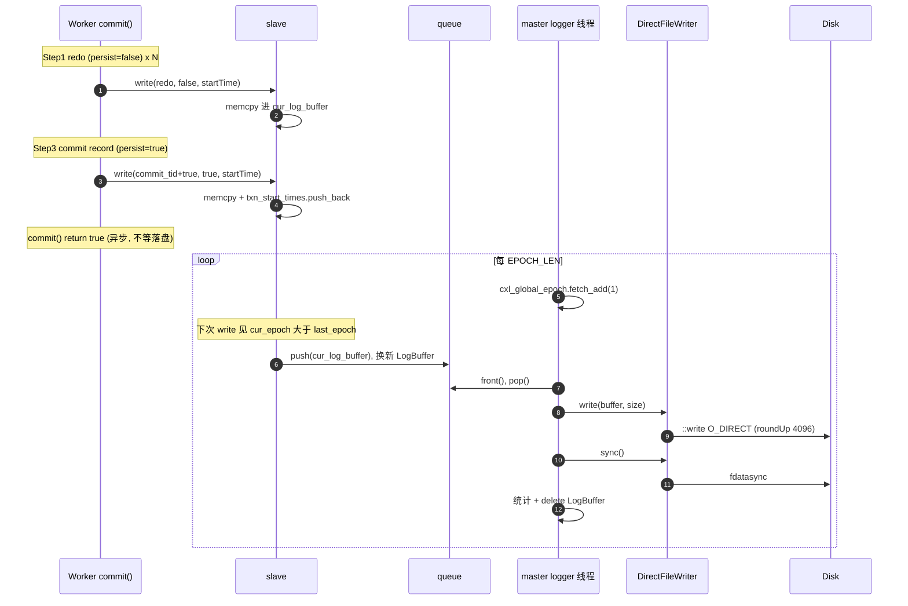

### 9.9 统计三段（与 README 输出对应）

`print_sync_stats`（`WALLogger.h:547-567`）输出三段，正是 README Hello-World 末尾的日志：

| 日志段 | 字段 | 计算式（源码行） | 含义 |
|--------|------|------------------|------|
| `Group Commit Stats` | `txn_latency` + `committed_txn_cnt` | `txn_latency.add((now - txn_start)/1000)`（`:521-523`）；`committed_txn_cnt += txn_start_times.size()`（`:519`） | **端到端事务延迟**：从 `txn.startTime` 到日志落盘 |
| `Queuing Stats` | `queuing_latency` | `add(sync_start - begin_time)`（`:509-510`） | buffer 在本轮 drain 中“轮到它落盘前”的排队时延 |
| `Disk Sync Stats` | `disk_sync_latency` + `disk_sync_cnt` + `disk_sync_size` + `current global epoch` | `add(sync_end - sync_start)`（`:513-516`）；epoch=`cxl_global_epoch->load()` | 纯 `write+fdatasync` 物理 I/O 耗时与总量 |

对照 README：
```
WALLogger.h:539 Group Commit Stats: ... 47239 us (avg) committed_txn_cnt 620218
WALLogger.h:545 Queuing Stats:      ... 25590 us (avg)
WALLogger.h:550 Disk Sync Stats:    ... 2040 us (avg) disk_sync_cnt 5098 disk_sync_size 1543621646 current global epoch 2226
```
可见：端到端延迟（~47ms）≫ 排队（~25ms）≫ 纯落盘（~2ms）——**绝大部分事务延迟花在等待本 epoch 凑批 + 排队**，而非磁盘本身，这正是 epoch group commit 用延迟换吞吐的体现。

### 9.10 单机变体 GroupCommitLogger（对比）

`GroupCommitLogger`（`:254-362`）是不依赖 CXL 的单机版，机制不同：
- 构造时起一个 **detach 后台线程**（`:267-274`）每 2µs 检查 `waiting_syncs ≥ group_commit_txn_cnt` 或超时 → `do_sync()`。
- `write`（`:281-296`）持 `mtx` 写入 `BufferedDirectFileWriter` 并推进 `write_lsn`；`persist` 时调 `sync(end_lsn)`。
- `sync`（`:322-330`）**自旋等待** `sync_lsn ≥ lsn`，期间调 `on_blocking()` 回调（让事务线程在等待时处理远程消息）。
- `do_sync`（`:298-320`）：满足批量/超时则 `writer.sync()`（fdatasync）并把 `sync_lsn` 推进到 `write_lsn`，记录 `sync_time/grouping_time/sync_batch_size/sync_batch_bytes`。

| 维度 | `GroupCommitLogger`（单机） | `PashaGroupCommitLogger*`（Tigon/CXL） |
|------|---------------------------|----------------------------------------|
| 并发模型 | 全局 `mtx` 串行 write | 每 worker SPSC 队列，无锁 |
| 批边界 | 计数阈值 OR 超时 | 全局 epoch（CXL 原子计数器） |
| 事务等待 | `sync()` 自旋 `sync_lsn` | 不等待（异步，commit 直接返回） |
| 落盘器 | `BufferedDirectFileWriter` | `DirectFileWriter` |
| 跨主机 | 否 | 是（共享 `cxl_global_epoch`，各 host 独立 master 落盘本机日志） |

### 9.11 关键不变量与边界条件

1. **SPSC 安全**：每个 `LockfreeLogBufferQueue` 恰好一个 slave 写、一个 master 读，满足 boost spsc 前提；多 worker 不共享队列。
2. **所有权移交**：`LogBuffer*` 经队列从 slave 转移到 master，master `delete`；slave push 后立即 `new` 新 buffer，无别名。
3. **持久化原子性**：commit record（`commit_tid<<true`）与其 redo 在同一 epoch 的 buffer 内，按写入顺序连续落盘；恢复时配合 `epoch_version`（§7.2）按 epoch 切一致点——**只重放“commit record 已落盘”的事务**。
4. **O_DIRECT 对齐**：`DirectFileWriter::write` 用 `roundUp(size, 4096)`，落盘字节为块对齐（故 `disk_sync_size` 含填充）。
5. **master 单线程**：所有 host-local 队列由唯一 master 线程顺序 drain，落盘到单文件，天然串行、无写写竞争。
6. **异步提交语义**：worker 写完 commit record 即返回成功（§3 return true）；真正持久化在之后的某个 epoch 完成——若崩溃发生在落盘前，该事务按未提交处理（其 redo 无对应已落盘 commit record）。

---

## 10. Phantom Detection（next-key locking 幻读避免）

Tigon 用 **next-key locking（下一键锁）** 在 2PL 之上避免 **幻读（phantom）**。本节给出问题、数据结构、执行期加锁、commit/abort 分支与 CXL 专属的 real-bit 机制，全部以源码为依据，符号名沿用源码。

### 10.1 问题：纯 2PL 为何挡不住幻读

纯 2PL 只锁“已存在的行”，无法阻止并发事务往 **范围空隙里插入新键**（或删除边界键），导致同一事务二次 `scan` 结果不同 → 破坏可串行化。

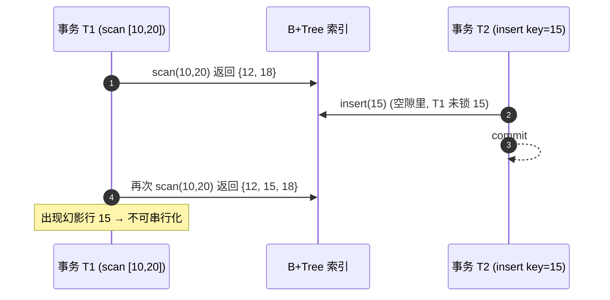

**解决（next-key locking）**：`scan` 不仅锁范围内的键，还锁 **紧邻右边界的“下一个键”（next tuple）**；任何 `insert` 必须先锁其插入位置的 next key，若该锁被 scanner 持有，则 insert 失败/中止——空隙被“下一键锁”守住，幻影无法产生。

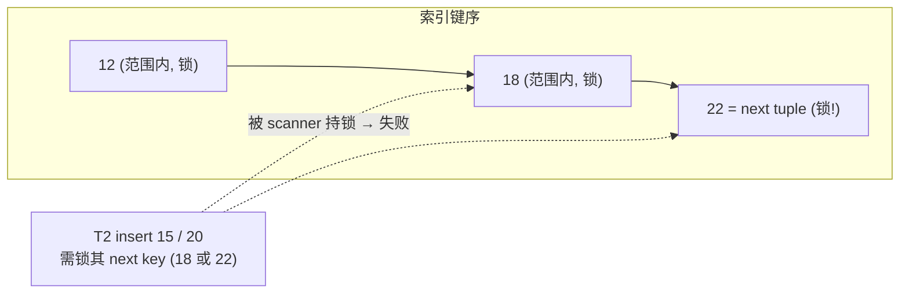

### 10.2 开关与协议变体

| 项 | 源码 | 说明 |
|----|------|------|
| `enable_phantom_detection` 默认 | `core/Context.h:117`（`= true`） | 完整 Tigon 默认开启 |
| 命令行 flag | `core/Macros.h:84`（`DEFINE_bool(..., "next-key locking")`） | `--enable_phantom_detection` |
| 变体 `TwoPLPashaPhantom` | `scripts/run.sh:213/224, 393/404`（`--enable_phantom_detection=false`） | README 称 "Tigon with phantom avoidance disabled" 基线 |
| `TwoPLPasha.h` 内分叉 | `:69`(abort) `:383`(commit ins/del) `:646`(write-back) `:817`(release_lock) `:992` | 5 处 `if (enable_phantom_detection == true)` |

### 10.3 数据结构（符号沿用源码）

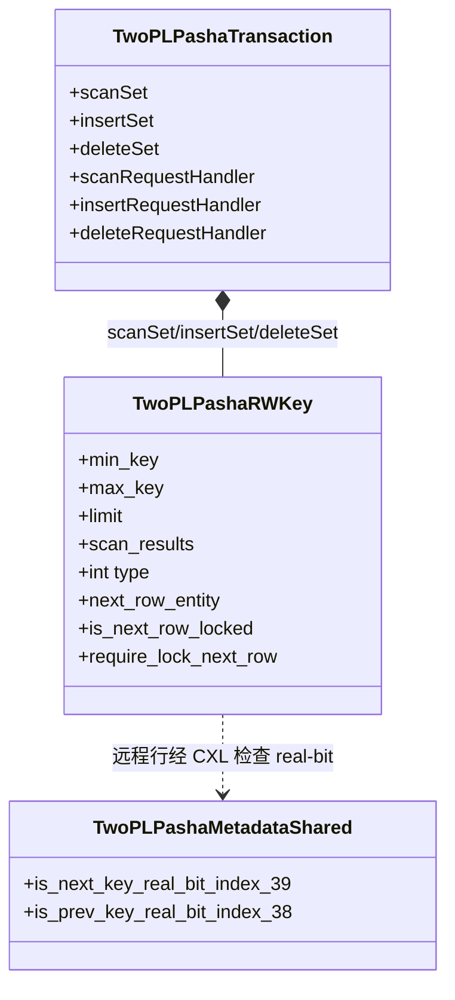

| 结构 | 位置 | 作用 |
|------|------|------|
| `scanSet` / `insertSet` / `deleteSet` | `TwoPLPashaTransaction.h:185-187`（clear）；push `:505/511/517` | 范围查询 / 插入 / 删除 三类请求集 |
| `enum { SCAN_FOR_READ, SCAN_FOR_UPDATE, SCAN_FOR_INSERT, SCAN_FOR_DELETE }` | `TwoPLPashaRWKey.h:21` | scan 意图，决定加读锁/写锁 |
| scan 参数 `min_key/max_key/limit/scan_results/type` | `RWKey.h:211-244`（`set_scan_args`/`get_scan_*`） | 范围与结果容器 |
| next-tuple：`next_row_entity` / `is_next_row_locked` / `require_lock_next_row` | `RWKey.h:247-275, 362-364` | next-key locking 目标行与状态位 |
| `ITable::row_entity` | `core/Table.h` | `(key, key_size, meta, data, value_size)` 五元组 |
| real-bit：`is_next_key_real_bit_index=39` / `is_prev_key_real_bit_index=38` | `TwoPLPashaHelper.h:299-300`；getter/setter `:153-180` | 迁移行对“前驱/后继键”的认知是否等于权威索引 |

### 10.4 事务 API → 执行期分派

应用层调用 `scan_for_read/update/insert/delete`（`TwoPLPashaTransaction.h:263-318`）、`insert_row`（`:324`）填充集合。`execute()` 的处理循环（`TwoPLPashaTransaction.h:394-460`）**倒序**遍历三集合并调用 handler：

```
transaction->execute(id)                               (core/Executor.h:132)
└─ process 循环 (TwoPLPashaTransaction.h:394-460)
   ├─ scanSet[i]  → scanRequestHandler(...)            (:404)
   │     success → set_next_row_entity + set_next_row_locked (:414-415)
   │     fail    → abort_lock = true                   (:409)
   │     migration_required → 不处理, 待迁移后整事务重试 (:416)
   ├─ insertSet[i]→ insertRequestHandler(...)          (:431)
   │     fail → abort_insert = true                    (:434)
   │     require_lock_next_row → set_next_row_*        (:438-440)
   └─ deleteSet[i]→ deleteRequestHandler(...)          (:453)
         fail → abort_delete = true                    (:455)
```

handler 类型签名见 `TwoPLPashaTransaction.h:534/536/538`。

### 10.5 scanRequestHandler：next-key 加锁核心（`Executor.h:177-395`）

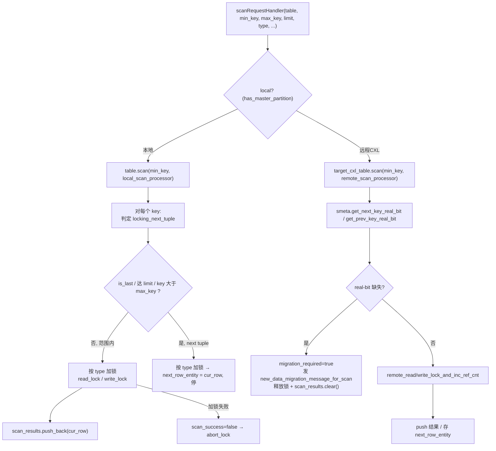

**本地分区**（`:189-261`）`local_scan_processor`：
- 判定 `locking_next_tuple`：`is_last_tuple` 或 达到 `limit` 或 `compare_key(key, max_key) > 0`（`:199-205`）——**第一个越过右边界的键即 next tuple**。
- 按 type 加锁：`read_lock`(READ) / `write_lock`(UPDATE/INSERT/DELETE)（`:227-237`）。
- 非 next-tuple → `scan_results.push_back(cur_row)` 继续（`:242-245`）；是 next-tuple → 存 `next_row_entity` 并停（`:246-251`）。
- 加锁失败 → `scan_success=false` 立即停（`:252-256`）。

**远程/CXL 分区**（`:262-394`）`remote_scan_processor`：
- 先查 `smeta->get_next_key_real_bit()/get_prev_key_real_bit()`，按位置（首键/末键/中间键）决定 `migration_required`（`:289-311`）。
- real → `remote_read/write_lock_and_inc_ref_cnt`（`:325-332`）。
- 需迁移 → 发 `new_data_migration_message_for_scan`、释放已得锁、`scan_results.clear()`（`:366-392`），迁移后整事务重试。

| scan type | 本地加锁 | 远程加锁 | commit 行为 |
|-----------|----------|----------|-------------|
| `SCAN_FOR_READ` | `read_lock` | `remote_read_lock_and_inc_ref_cnt` | 只读，无写回 |
| `SCAN_FOR_UPDATE` | `write_lock` | `remote_write_lock_*` | write-back（`:646-678`） |
| `SCAN_FOR_INSERT` | `write_lock` | `remote_write_lock_*` | 锁住 next key 防插入幻影 |
| `SCAN_FOR_DELETE` | `write_lock` | `remote_write_lock_*` | commit 删除（`:447-480`） |

### 10.6 insertRequestHandler + insert_and_update_next_key_info

```
insertRequestHandler (Executor.h:397-421)
├─ 本地: insert_and_update_next_key_info(table, key, value, require_lock_next_key, next_row_entity)  (:409)
│    └─ table->insert_and_process_adjacent_tuples(key, value, adjacent_tuples_processor, true)  (Helper.h:1899)
│         └─ adjacent_tuples_processor (Helper.h:1822-1896):
│              ├─ require_lock_next_key → write_lock(next_meta) 锁 next key  (:1836)
│              │     成功 → next_row_entity = next_row
│              ├─ prev 邻居已迁移 → prev_smeta->clear_next_key_real_bit()   (:1848/1876)
│              └─ next 邻居已迁移 → next_smeta->clear_prev_key_real_bit()   (:1861/1889)
└─ 远程: 推迟到 commit 阶段发送 (return true)  (:416-419)
```

要点：插入占位行后，因索引拓扑变化，**已迁移的前驱/后继邻居缓存的邻接关系失效**，必须清其 `next_key_real_bit`/`prev_key_real_bit`（`Helper.h:1848/1861/1876/1889`）。远程 insert 不在执行期做，推迟到 commit 以避免回滚复杂度。

### 10.7 deleteRequestHandler（`Executor.h:423-444`）

phantom 分支假设所有删除是 **"read and delete"**：写锁在读阶段已取，执行期 **不做实际删除**（仅占位），真正移除推迟到 commit。对比：非 phantom 分支（`:521-559`）在 handler 内直接 `search`+`write_lock`+标记，找不到行即 `abort_delete=true`。

### 10.8 commit 阶段的 phantom 分支（`TwoPLPasha.h:383-521`）

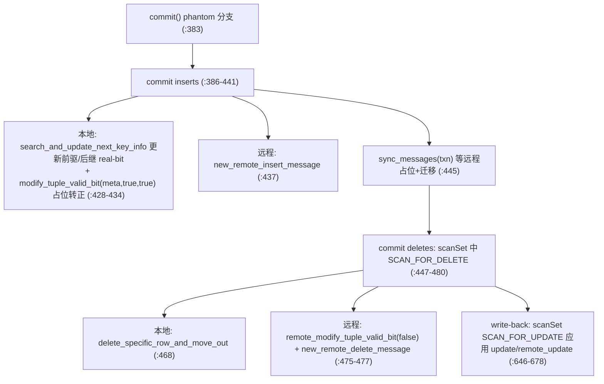

### 10.9 release_lock / abort 的 phantom 分支

| 路径 | 源码 | 动作 |
|------|------|------|
| `release_lock` | `:817-841` | 释放 insertSet 的 next-row 写锁 |
| `release_lock` | `:843+` | 按 `SCAN_FOR_*` 释放 scanSet 范围锁 + next-row 锁 |
| `abort` 回滚 insert | `:84-94` | `table->remove(placeholder)` + 释放 next-row 写锁 |
| `abort` 回滚 delete | `:257+` | 仅释放写锁（行未真正删） |
| `abort` 释放 read/scan 锁 | `:107-256` | 与 release_lock 对称 |

### 10.10 real-bit 的 CXL 语义（关键创新）

迁移到 CXL 的行用 `next_key_real_bit`(bit 39) / `prev_key_real_bit`(bit 38) 标记“它对相邻键的认知是否等于权威（master 本地 B+Tree）索引”：


- 写者（insert/delete）改变邻接关系时 **清掉邻居的对应 real-bit**（`Helper.h:1848/1861` 等）。
- 远程 scanner 看到 `real-bit == false` 必须先 **数据迁移**（`new_data_migration_message_for_scan`）拉取权威邻接，才能安全做 next-key locking（`Executor.h:289-311, 366-372`）。

这是经典 next-key locking 在 **CXL 共享内存 + 数据迁移** 下的扩展：本地行的邻接由 master 的 B+Tree 直接保证，迁移行则靠 real-bit 表达“缓存邻接是否可信”。

---

## 11. `core::Executor` vs `core/group_commit::Executor`

Tigon(TwoPLPasha) 使用 `core::Executor`；Silo-GC 系协议使用 `group_commit::Executor`。两者提交驱动对比：

| 维度 | `core::Executor`（TwoPLPasha 用） | `group_commit::Executor` |
|------|-----------------------------------|--------------------------|
| 消息通道 | 单一 `messages` | `sync_messages` + `async_messages` 双通道 |
| 提交后处理 | 立即统计；EBR 临界区 `enter/leave` | 入队 `q`，下个 epoch 起点统一算 `commit_latency` |
| WAL | `WALLogger* logger`（slave logger） | 由协议内部处理 |
| epoch | 由 WAL 主线程独立推进 | 由 `Manager` 用 `group_time` 显式划 epoch |
| 提交调用 | `protocol.commit(txn, messages)` (`:146`) | `protocol.commit(txn, sync, async)` (`:116`) |
| 中止重试 | `set_seed(last_seed); retry=true` | 同 |

`group_commit::Manager` 的 epoch 协调（`core/group_commit/Manager.h:23-46`）：`START → sleep(group_time) → STOP → 等所有 worker 完成 → CLEANUP(复制) → ack`，coordinator 与 non-coordinator 通过 `signal_worker / wait4_stop / broadcast_stop / send_ack` 做跨主机栅栏。worker 状态机见下。

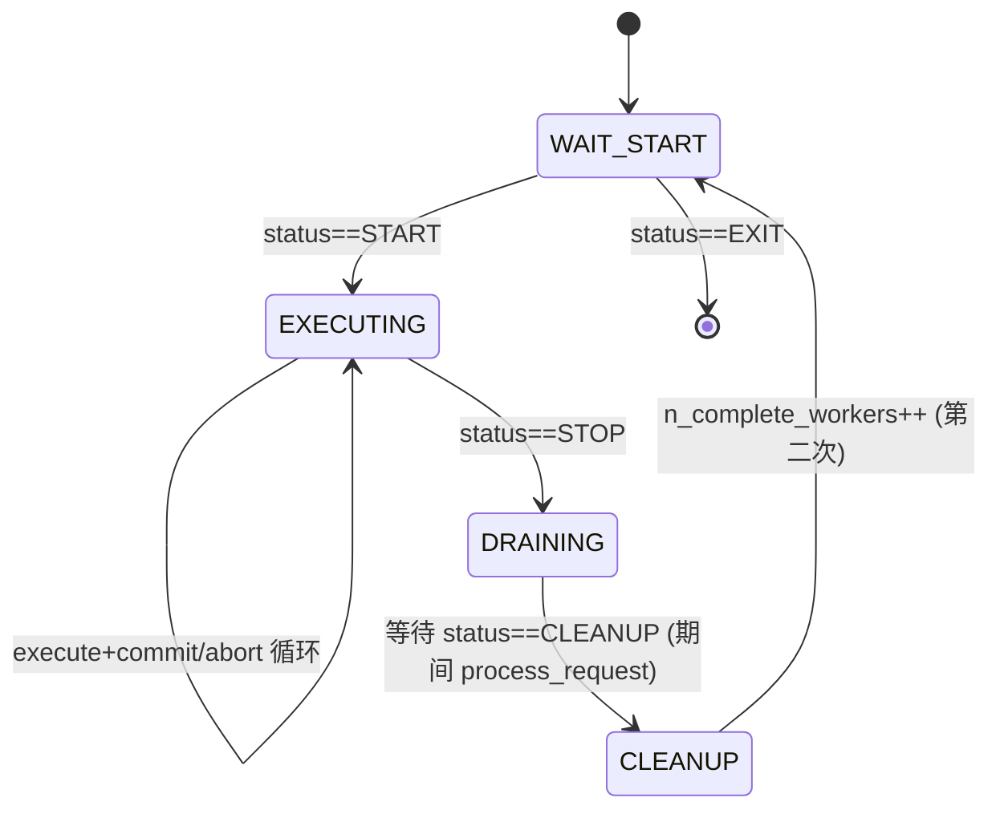

`ExecutorStatus`（`core/Defs.h`）中提交相关实际使用：`START / STOP / CLEANUP / EXIT`。

---

## 12. 中止（Abort）路径

`commit()` 第 0 步若 `txn.abort_lock` 为真，转 `abort()`（`TwoPLPasha.h:67-339`）。`abort()` 与 `release_lock` 对称地释放所有已持有锁，并回滚 insert/delete：

| 阶段 | phantom on (`:69-256`) | phantom off (`:257+`) |
|------|------------------------|------------------------|
| 回滚 insert | `table->remove(placeholder)` + 释放 next-row 写锁 | — |
| 回滚 delete | 仅释放写锁（行未真正删） | 释放写锁 |
| 释放 readSet 读锁 | `read_lock_release` / `remote_read_lock_release` | 同 |
| 释放 readSet 写锁 | `write_lock_release` / `remote_write_lock_release` | 同 |
| 释放 scanSet 范围锁 | 按 `SCAN_FOR_*` 类型分别释放 | — |
| 收尾 | `release_migrated_rows(txn)` | 同 |

abort 不写 commit record，redo buffer 中已写的 redo 记录因没有对应 commit record，恢复时不会被重放（epoch_version + commit record 双重保证）。worker 复位随机种子后重试同一事务逻辑。

---

## 13. 关键代码引用索引

| 功能 | 文件:行 |
|------|---------|
| worker 主循环 / 调用 commit | `core/Executor.h:104-210` (`:146`) |
| commit 七步 | `protocol/TwoPLPasha/TwoPLPasha.h:341-548` |
| generate_tid | `TwoPLPasha.h:39-65` |
| abort | `TwoPLPasha.h:67-339` |
| write_and_replicate | `TwoPLPasha.h:550-679` |
| generate_epoch_version | `TwoPLPasha.h:681-689` |
| write_redo_logs_for_commit | `TwoPLPasha.h:691-763` |
| release_lock | `TwoPLPasha.h:765+` |
| phantom 开关 | `core/Context.h:117`；`core/Macros.h:84`；变体 `scripts/run.sh:213/224` |
| scanSet/insertSet/deleteSet | `TwoPLPashaTransaction.h:185-187`；push `:505/511/517` |
| scan/insert/delete API | `TwoPLPashaTransaction.h:263-324` |
| 执行期分派循环 | `TwoPLPashaTransaction.h:394-460` |
| SCAN_FOR_* 枚举 + next-tuple 字段 | `TwoPLPashaRWKey.h:21`；`:247-275, 362-364` |
| scanRequestHandler | `TwoPLPashaExecutor.h:177-395`（远程 real-bit 检查 `:289-311`） |
| insertRequestHandler | `TwoPLPashaExecutor.h:397-421` |
| insert_and_update_next_key_info | `TwoPLPashaHelper.h:1820-1900` |
| real-bit 索引/读写 | `TwoPLPashaHelper.h:299-300`；`:153-180` |
| commit/abort phantom 分支 | `TwoPLPasha.h:383-521`（abort `:69-256`，release `:817+`） |
| TID/锁位布局常量 | `TwoPLPashaHelper.h:2021-2028`；共享行 `:279-292` |
| remove_lock_bit | `TwoPLPashaHelper.h:1158-1171` |
| take_read/write_lock_and_read | `TwoPLPashaHelper.h:526 / 793` |
| write_lock_release(带版本) | `TwoPLPashaHelper.h:1055-1084`；远程 `:1086` |
| RWKey get_tid/set_tid | `TwoPLPashaRWKey.h:169/174`（字段 `:351`） |
| 版本字实体 | `TwoPLPashaMetadataLocal::tid` `Helper.h:92`；`TwoPLPashaSharedDataSCC::tid` `:50` |
| 执行期取锁 | `TwoPLPashaExecutor.h:81-160, 220-340` |
| 计时桶定义 | `TwoPLPashaTransaction.h:46-135` |
| 计时聚合打印 | `core/Executor.h:229-260` |
| WAL 全部 logger | `common/WALLogger.h`（744 行） |
| WALLogger 抽象基类 | `WALLogger.h:194-221` |
| DirectFileWriter (O_DIRECT) | `WALLogger.h:26-73` |
| BufferedDirectFileWriter | `WALLogger.h:75-192`（4MB `:184`） |
| LogBuffer 结构 (4MB) | `WALLogger.h:364-372` |
| LockfreeLogBufferQueue | `WALLogger.h:374-375`；`common/LockfreeQueue.h:24-55`（boost spsc, cap 128） |
| slave write + epoch 翻转入队 | `WALLogger.h:393-417` |
| master start (推进 epoch) | `WALLogger.h:464-475` |
| master do_sync (drain+落盘) | `WALLogger.h:482-535` |
| WAL 统计打印三段 | `WALLogger.h:547-567` |
| GroupCommitLogger (单机) | `WALLogger.h:254-362` |
| logger 装配 + 主线程启动 | `core/Coordinator.h:55-95, 208-211` |
| epoch 协调 (GC 系) | `core/group_commit/Manager.h:23-76` |
| ExecutorStatus | `core/Defs.h` |

---

## 14. 一句话总结

> Tigon 的提交是 **“2PL 锁已就绪 → 写 redo（异步缓冲）→ 生成单调 TID → 写 commit record → 应用 insert/delete → 写回新值 → 按 epoch_version 放锁”** 的同步流水线；而**持久化是异步的**：worker 只把日志 memcpy 进 per-worker 的 epoch LogBuffer，由唯一的 master logger 线程在每个 `EPOCH_LEN` 推进 `cxl_global_epoch` 并把各 worker 当前 epoch 的 buffer 统一 `write+fsync` 落盘，从而以 **epoch-based group commit** 摊薄 fsync 开销，并通过 `epoch_version = (epoch<<32 | seq)` 实现按 epoch 的崩溃一致恢复。
