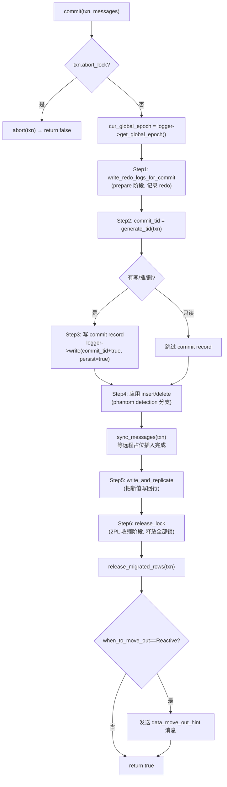
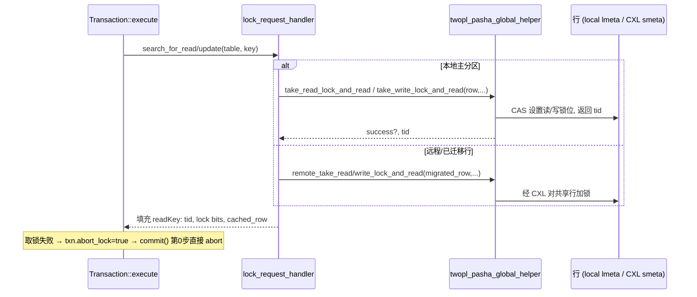
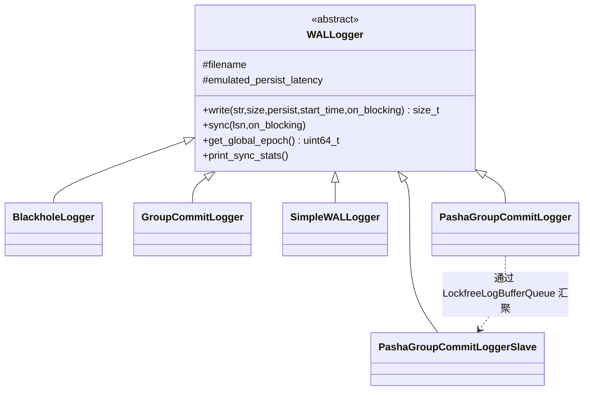
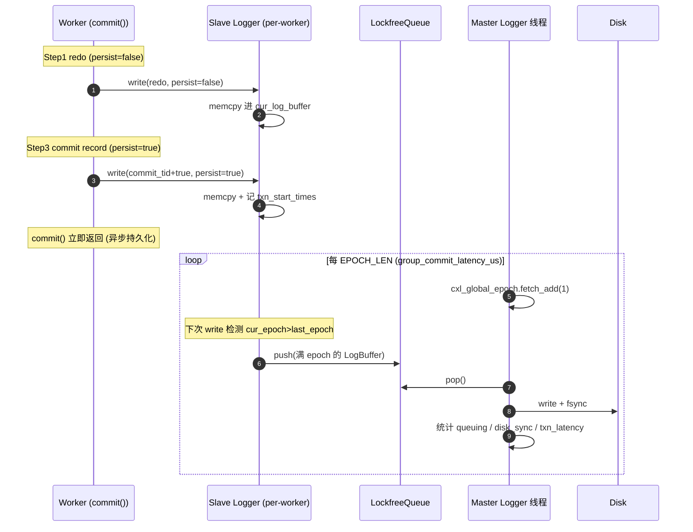
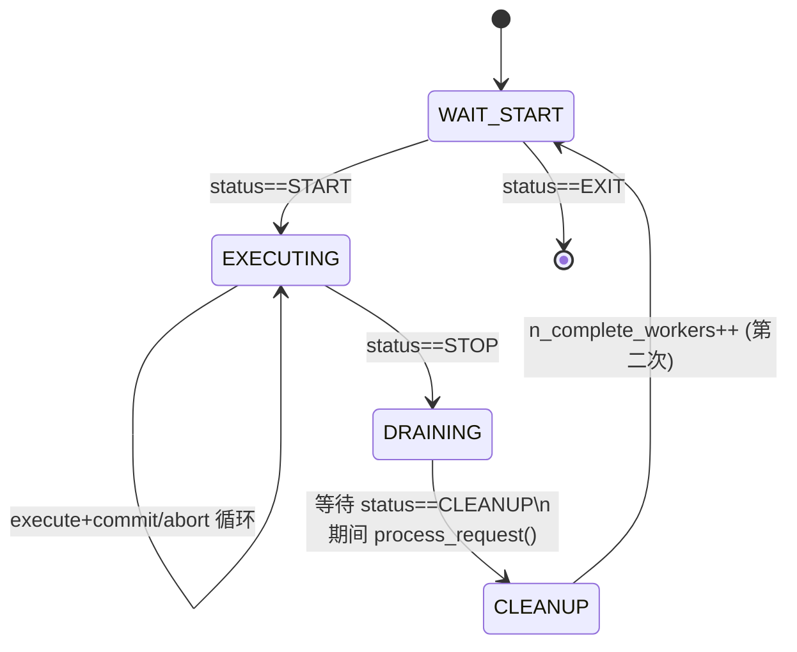

# Tigon 事务提交（Commit）流程规格说明书 (SPEC)

> 适用协议：**TwoPLPasha**（即论文中的 **Tigon**，基于 Pasha 架构、运行在 CXL Pod 上的分布式两阶段锁数据库）
> 关联文件：
> - `protocol/TwoPLPasha/TwoPLPasha.h`（提交核心逻辑）
> - `protocol/TwoPLPasha/TwoPLPashaExecutor.h`（执行期取锁/读写）
> - `protocol/TwoPLPasha/TwoPLPashaTransaction.h`（事务状态与计时）
> - `core/Executor.h`（worker 主循环，驱动 `commit()`）
> - `core/group_commit/Executor.h` / `core/group_commit/Manager.h`（epoch 协调）
> - `common/WALLogger.h`（WAL / epoch-based group commit）
> - `core/Coordinator.h`（logger 线程与 CXL 全局 epoch 装配）

本文档自底向上拆解 Tigon 的一次事务从“执行结束（READY_TO_COMMIT）”到“持久化提交完成”的全部步骤，包含：架构图、时序图、数据流图、函数调用栈、关键数据结构表，以及逐行级别的代码细节。

---

## 0. 名词与缩写

| 缩写 | 含义 |
|------|------|
| 2PL | Two-Phase Locking，两阶段锁 |
| TID | Transaction ID / commit timestamp（提交时间戳，单调递增） |
| WAL | Write-Ahead Log，预写日志 |
| LSN | Log Sequence Number，日志序列号 |
| CXL | Compute Express Link，本系统用于跨主机共享内存 |
| SCC | Software Cache Coherence，软件缓存一致性（`WriteThrough` 等） |
| EBR | Epoch-Based Reclamation，基于 epoch 的内存回收 |
| smeta / lmeta | Shared metadata (CXL 共享行) / Local metadata（本地行） |
| master / slave logger | 主 logger（落盘）/ 从 logger（每 worker 一个，仅缓冲） |

---

## 1. 总体架构与提交的位置

Tigon 的每个主机（host）= 一个 VM，进程内有若干 **transaction worker 线程**（`TwoPLPashaExecutor`，继承自 `core::Executor`）。所有 worker 共享一段 CXL 内存（存放共享行 `smeta`、全局 epoch、日志环形队列等）。提交所产生的 redo 日志通过 **per-worker 从 logger** 写入 **lock-free 环形队列**，再由 **单个主 logger 线程** 在 epoch 边界统一落盘并 fsync。

```mermaid
flowchart TB
    subgraph Host["一台主机 (VM)"]
        direction TB
        W0["Executor#0\nTwoPLPashaExecutor"]
        W1["Executor#1"]
        Wn["Executor#N"]
        subgraph SL["从 logger (每 worker 一个)"]
            S0["PashaGroupCommitLoggerSlave#0\n(LogBuffer 4MB)"]
            S1["Slave#1"]
            Sn["Slave#N"]
        end
        Q0["LockfreeLogBufferQueue#0\n(cap=128 buffers)"]
        Q1["Queue#1"]
        Qn["Queue#N"]
        ML["PashaGroupCommitLogger (主)\nDirectFileWriter + fsync"]
        DISK[("redo log on disk\n*_group_commit.txt")]
    end
    EPOCH["cxl_global_epoch\n(std::atomic<uint64_t>, 位于 CXL 共享内存)"]

    W0 -->|write redo| S0 -->|epoch 翻转/缓冲满 push| Q0 --> ML
    W1 --> S1 --> Q1 --> ML
    Wn --> Sn --> Qn --> ML
    ML -->|write+fsync| DISK
    ML -.->|fetch_add(1) 每 EPOCH_LEN| EPOCH
    EPOCH -.->|load| S0 & S1 & Sn
```

**关键点**：worker 在 `commit()` 中调用 `logger->write(...)` 只是把日志拷进当前 epoch 的 buffer；真正的 fsync 由主 logger 线程在 epoch 翻转时完成（**epoch-based group commit**）。提交对 worker 而言是**异步持久化**——它写完 redo 与 commit record 后即可释放锁返回，事务延迟由日志线程统计回填。

---

## 2. 顶层调用栈：worker 主循环如何驱动 commit

`TwoPLPashaExecutor` 复用 `core::Executor::start()` 主循环（`core/Executor.h:77`）。一次事务的生命周期如下：

```
core::Executor::start()                         core/Executor.h:77
└─ do { ... } while(status != STOP)             core/Executor.h:104-210
   ├─ process_request()                         core/Executor.h:111   // 处理远程消息
   ├─ workload.next_transaction(...)            core/Executor.h:126   // 生成事务
   ├─ global_ebr_meta->enter_critical_section() core/Executor.h:131   // 进入 EBR 临界区
   ├─ result = transaction->execute(id)         core/Executor.h:132   // 执行+取锁(2PL 增长阶段)
   └─ if result == READY_TO_COMMIT:
        ├─ commit = protocol.commit(txn, msgs)  core/Executor.h:146   // ★ 提交入口
        ├─ if commit:                           core/Executor.h:153
        │    ├─ db.global_total_commit.fetch_add(1)
        │    ├─ n_commit.fetch_add(1)
        │    └─ record_txn_breakdown_stats(txn) // 回填各阶段计时
        └─ else:                                core/Executor.h:175
             ├─ n_abort_lock / n_abort_read_validation.fetch_add(1)
             ├─ random.set_seed(last_seed)      // 复位随机种子, 保证重放同一事务
             └─ retry_transaction = true        // 下一轮重试
```

`protocol.commit(...)` 返回 `bool`：
- `true`  → 提交成功，统计 + EBR 退出临界区；
- `false` → 内部已调用 `abort()` 释放锁，worker 复位种子重试同一事务（`retry_transaction=true`）。

`result != READY_TO_COMMIT` 的两条分支（`core/Executor.h:188-206`）：
- `ABORT_NORETRY`：逻辑错误，调用 `protocol.abort()`，不重试；
- `ABORT`：冲突中止，`protocol.abort()` 后复位种子重试。

> 注：`core/group_commit/Executor.h` 是另一套（Silo 系 GC 协议用）双消息通道 + 提交队列 `q` 的执行器；**TwoPLPasha 走的是 `core::Executor`**（见 `protocol/TwoPLPasha/TwoPLPashaExecutor.h:20` 的继承关系）。两者主循环结构高度一致，差异见 §10。

---

## 3. `TwoPLPasha::commit()` — 提交核心七步

源码：`protocol/TwoPLPasha/TwoPLPasha.h:341-548`。Tigon 采用 **2PL**，执行期（§5）已持有所有读写锁，因此提交是“锁已就绪”状态下的写回 + 持久化 + 放锁。



每一步都被 `ScopedTimer` 包裹，析构时把耗时回填到事务的细分计时器（见 §8）。下表给出每步的源码位置、计时桶与职责。

| Step | 代码位置 | 计时桶 (record_*) | 职责 |
|------|----------|-------------------|------|
| 0 | `TwoPLPasha.h:343-346` | — | `abort_lock` 早退：已被中止则 `abort()` 返回 false |
| 0' | `TwoPLPasha.h:348` | — | 读取当前全局 epoch `cur_global_epoch` |
| 1 | `TwoPLPasha.h:350-357` | `commit_prepare_time` | **redo 日志**：对 writeSet/insertSet/deleteSet 写 redo 记录（`persist=false`，仅入 buffer） |
| 2 | `TwoPLPasha.h:362-366` | `local_work_time` | **生成 commit TID**（`generate_tid`） |
| 3 | `TwoPLPasha.h:368-381` | `commit_persistence_time` | **commit record**：非只读事务写 `commit_tid<<true`，`persist=true` |
| 4 | `TwoPLPasha.h:383-521` | — | **提交 insert/delete**：置位 valid bit、删除行、远程占位（含 phantom 检测分支） |
| 5 | `TwoPLPasha.h:523-527` | `commit_write_back_time` | **写回 + 复制**（`write_and_replicate`） |
| 6 | `TwoPLPasha.h:529-534` | `commit_unlock_time` | **释放锁**（`release_lock`，2PL 收缩阶段） |
| 7 | `TwoPLPasha.h:536-545` | — | 释放迁移行引用计数 + 反应式数据迁出提示 |

### 3.1 Step 0' 调用栈

```
commit()                                         TwoPLPasha.h:341
└─ txn.get_logger()->get_global_epoch()          TwoPLPasha.h:348
   └─ PashaGroupCommitLoggerSlave::get_global_epoch()  → cxl_global_epoch->load()
```

`cur_global_epoch` 在整个提交期间冻结，用于生成 redo 中的 `epoch_version`（§4），保证恢复时按 epoch 切分一致快照。

### 3.2 Step 4：phantom detection 两种路径

`enable_phantom_detection == true`（`TwoPLPasha.h:383`）时：
1. **commit inserts**（`:386-441`）：
   - 本地分区：`search_and_update_next_key_info()` 更新前驱/后继键的 next-key 信息（B+Tree 防幻读），再 `modify_tuple_valid_bit(meta, true, true)` 把占位行置为有效。
   - 远程分区：发 `new_remote_insert_message`，`pendingResponses++`。
2. `sync_messages(txn)`（`:445`）：阻塞等待所有远程占位插入 + 迁移完成。
3. **commit deletes**（扫描 `scanSet` 中 `SCAN_FOR_DELETE`，`:447-480`）：本地 `delete_specific_row_and_move_out`；远程 `remote_modify_tuple_valid_bit(false)` + `new_remote_delete_message`。

`enable_phantom_detection == false`（`:481-521`）时走简化路径：本地置 valid bit / `table->remove(key)`，且 **不支持远程 insert/delete**（`DCHECK(0)`）。

---

## 4. Step 1 详解：redo 日志格式与 epoch-version

源码：`write_redo_logs_for_commit()` `TwoPLPasha.h:691-763`。对 writeSet / insertSet / deleteSet 各生成一条 redo 记录，序列化进当前 epoch 的 LogBuffer（`persist=false`）。

**记录布局（`std::ostringstream` 序列化）**：

| 字段 | update (log_type=0) | insert (log_type=1) | delete (log_type=2) |
|------|---------------------|---------------------|---------------------|
| log_type (int) | 0 | 1 | 2 |
| tableId | ✓ | ✓ | ✓ |
| partitionId | ✓ | ✓ | ✓ |
| epoch_version (uint64) | ✓ | ✓ | ✓ |
| key (key_size) | ✓ | ✓ | ✓ |
| value (value_size) | ✓ | ✓ | ✗（删除不记值） |

调用：`txn.get_logger()->write(output.c_str(), output.size(), false, txn.startTime)`（`:713/738/761`）。

### 4.1 `generate_epoch_version` — 把 epoch 编码进版本号

源码：`TwoPLPasha.h:681-689`

```cpp
uint64_t generate_epoch_version(uint64_t cur_epoch_version, uint64_t cur_global_epoch) {
    uint64_t epoch = cur_epoch_version >> 32;           // 高 32 位 = epoch
    if (cur_global_epoch > epoch) {
        return cur_global_epoch << 32;                  // 进入新 epoch，低 32 位清零
    } else {
        return cur_epoch_version + 1;                   // 同 epoch 内版本自增
    }
}
```

**版本号编码**：`[ 高32位 = epoch | 低32位 = epoch 内序号 ]`。这保证 redo 记录可按 epoch 边界恢复成一致快照——恢复时只重放“已完整持久化的 epoch”。

---

## 5. 前置阶段（执行期）：2PL 取锁如何形成 read/write set

提交前，`transaction->execute(id)` 通过 `lock_request_handler`（`TwoPLPashaExecutor.h:81`）取锁，填充 readSet/writeSet。提交逻辑依赖这些集合，故在此交代数据来源。



- 写锁：`take_write_lock_and_read`（`TwoPLPashaExecutor.h:112`）；读锁：`take_read_lock_and_read`（`:114`）。
- 远程行：`remote_take_write/read_lock_and_read`（`:149/151`），经 CXL 共享内存对 `smeta` 加锁。
- 每个 `readKey` 记录 `tid`（行当前版本）、`read_lock_bit`/`write_lock_bit`、`cached_local_row`/`cached_migrated_row`，供 commit 的写回与放锁阶段使用。

---

## 6. Step 2/5/6 详解

### 6.1 Step 2 `generate_tid` — 单调 commit 时间戳

源码：`TwoPLPasha.h:39-65`

```cpp
uint64_t generate_tid(TransactionType &txn) {
    uint64_t next_tid = 0;
    for (i in readSet) next_tid = max(next_tid, readSet[i].get_tid()); // 大于所读所写记录的 TID
    next_tid = max(next_tid, max_tid);                                 // 大于本 worker 上次 TID
    next_tid++;                                                        // 自增
    max_tid = next_tid;                                                // 记录
    return next_tid;
}
```

保证 commit_tid 严格大于事务读到的任何版本，且在本 worker 内单调。

### 6.2 Step 5 `write_and_replicate` — 写回新值

源码：`TwoPLPasha.h:550-679`。

1. **持久化标记计算**（`:563-614`）：倒序遍历 writeSet，为每个 coordinator 的“最后一次写”标记 `persist_commit_record[i]=true`。注：当前版本**复制未启用**（`:578 DCHECK(false)`），故该段在单机/无复制配置下不实际执行远程分支。
2. **应用写回**（`:616-644`）：遍历 readSet 中带 `write_lock_bit` 的 key：
   - 本地：`twopl_pasha_global_helper->update(cached_row, value, value_size)`；
   - 远程：`remote_update(migrated_row, ...)`（经 CXL + SCC 协议写回共享行）；
   - 若 `model_cxl_search_overhead==true` 先模拟 CXL 查找开销。
3. **scan-for-update 写回**（`:646-678`，仅 phantom detection 开启）：对 `scanSet` 中 `SCAN_FOR_UPDATE` 的每条扫描结果应用写回。

### 6.3 Step 6 `release_lock` — 2PL 收缩阶段

源码：`TwoPLPasha.h:765-...`。遍历 readSet 释放读锁与写锁；释放写锁时用 `generate_epoch_version(tid, cur_global_epoch)` **更新行版本号**：

| 锁类型 | 本地 | 远程 |
|--------|------|------|
| 读锁 | `read_lock_release(*meta)` (`:785`) | `remote_read_lock_release(migrated_row)` (`:789`) |
| 写锁 | `write_lock_release(*meta, value_size, epoch_version)` (`:805`) | `remote_write_lock_release(migrated_row, value_size, epoch_version)` (`:812`) |

phantom detection 开启时（`:817+`），额外释放 insertSet 的 next-key 写锁、scanSet 的范围读/写锁及 next-row 锁（`SCAN_FOR_READ/UPDATE/INSERT/DELETE` 分别对应读锁/写锁释放）。

**放锁写回版本号**这一步把 commit 的逻辑顺序固化进行物理版本，使后续读者看到的版本号 = 包含 epoch 的 `epoch_version`，与 redo 记录一致。

---

## 7. TID 与 epoch_version 全生命周期

本节专门拆解 **`tid`（行版本号）** 与 **`epoch_version`** 的 **格式 / 生成 / 修改 / 使用 / 提交流程 + 调用栈**——它们是 Tigon 把“2PL 锁”“MVCC 风格版本”“epoch group commit”三者缝合在一起的关键。

### 7.1 格式：版本字（TID）的位布局

Tigon 不为每行单独存版本号，而是把 **锁状态 + 版本号打包进同一个 64-bit 字**。该字有两处实体：本地行 `TwoPLPashaMetadataLocal::tid`（`TwoPLPashaHelper.h:92`）与 CXL 共享行 `TwoPLPashaSharedDataSCC::tid`（`:50`）。位布局常量见 `TwoPLPashaHelper.h:2021-2028`：

```
 bit: 63        62 .. 58        57 ............................ 0
     +--------+------------+-------------------------------------+
     | W-LOCK | READ count |            version / TID            |
     +--------+------------+-------------------------------------+
      WRITE_   READ_LOCK_    58 bit 版本值
      LOCK     BIT(5bit)
      (bit63)  58..62
```

| 常量 | 值 | 含义 |
|------|----|------|
| `WRITE_LOCK_BIT_OFFSET` / `_MASK` | 63 / `0x1` | 写锁位（bit 63） |
| `READ_LOCK_BIT_OFFSET` / `_MASK` | 58 / `0x1f` | 读者计数（bit 58–62，最多 31 个并发读者） |
| `LOCK_BIT_OFFSET` / `_MASK` | 58 / `0x3f` | 锁位整体（bit 58–63） |
| version | bit 0–57 | 58-bit 版本值 |

提取纯版本：`remove_lock_bit(value) = value & ~(0x3f<<58)`（`TwoPLPashaHelper.h:1158-1161`）。

CXL 共享行的**锁**不在 `tid` 字里，而在 `TwoPLPashaMetadataShared::atomic_word`（`:279-292`）：

```
 bit: 63    62 ........ 47   46 .. 42   41    40 ................ 0
     +------+--------------+----------+------+---------------------+
     | LATCH| per-host SCC | READ cnt | WLOCK|   SCC_DATA 偏移      |
     +------+--------------+----------+------+---------------------+
       63      47..62 16bit  42..46     41      0..36 (37bit CXL off)
```

即：共享行的“锁 / latch / SCC 位”在 `atomic_word`，而**版本号在 `scc_data->tid`**（同样按上面的 W-LOCK/READ/version 打包，但其锁位在共享场景下不用，仅版本有效）。

### 7.2 epoch_version 的二次切分

放锁写回时存入的不是普通自增版本，而是 `generate_epoch_version` 产生的 **epoch 版本**（`TwoPLPasha.h:681-689`）：

```cpp
uint64_t generate_epoch_version(uint64_t cur_epoch_version, uint64_t cur_global_epoch) {
    uint64_t epoch = cur_epoch_version >> 32;       // 旧版本高 32 位 = 旧 epoch
    if (cur_global_epoch > epoch)
        return cur_global_epoch << 32;              // 跨入新 epoch：seq 归零
    else
        return cur_epoch_version + 1;               // 同 epoch：序号 +1
}
```

于是 58-bit 版本被进一步切为：

```
 version(58bit) = [ 高位: epoch | 低 32 位: epoch 内序号 seq ]
```

约束：`write_lock_release(meta,size,new_value)` 中 `DCHECK(!is_read_locked(new_value) && !is_write_locked(new_value))`（`TwoPLPashaHelper.h:1066-1067`）要求 epoch_version **不得占用 bit 58–63**，故 `epoch<<32` 中 epoch 实际可用约 26 bit（bit 32–57）。这也解释了 README 启动日志里 `current global epoch 2226` 远小于 2^26。

### 7.3 生成：执行期从行里读出版本

行初始 `tid=0`（构造函数 `TwoPLPashaHelper.h:31/50/69/92`）。事务执行期取锁时读出当前版本：

`take_write_lock_and_read`（`:793-824`，读锁 `take_read_lock_and_read` `:526` 对称）：

```cpp
old_value = lmeta->tid;                 // 读打包字
tid       = remove_lock_bit(old_value); // 剥掉锁位 → 纯版本
if (is_read_locked(old_value) || is_write_locked(old_value)) { success=false; goto out; }
new_value = old_value + (WRITE_LOCK_BIT_MASK << WRITE_LOCK_BIT_OFFSET); // 置写锁位(bit63)
lmeta->tid = new_value;                 // 回写(带锁位)
// migrated 行: old_value=scc_data->tid; 走 SCC prepare_read/do_read
return tid;                             // 返回纯版本
```

返回的纯版本经 `lock_request_handler`（`TwoPLPashaExecutor.h:81-160`）存入 `readKey` → `RWKey::set_tid(tid)`（`TwoPLPashaRWKey.h:174`，字段 `:351`）。

### 7.4 使用：提交期消费版本

| 用途 | 代码 | 说明 |
|------|------|------|
| 生成 commit_tid | `generate_tid`（`TwoPLPasha.h:39-65`） | `next_tid = max(∀ readSet[i].get_tid(), max_tid) + 1`，保证大于所读所写版本且 worker 内单调 |
| 生成 redo 的 epoch_version | `write_redo_logs_for_commit`（`:691-763`） | 对每条 write/insert/delete：`ev = generate_epoch_version(writeKey.get_tid(), cur_global_epoch)`，序列化进 redo 记录第 4 字段 |
| 放锁写回 epoch_version | `release_lock`（`:765-815`） | 释放写锁时 `ev = generate_epoch_version(readKey.get_tid(), cur_global_epoch)` 作为新版本写回行 |

### 7.5 修改：把 epoch_version 写回行

`write_lock_release(meta, size, new_value)`（`TwoPLPashaHelper.h:1055-1084`）:

```cpp
if (lmeta->is_migrated == false) {            // 本地行
    DCHECK(is_write_locked(lmeta->tid));
    DCHECK(!is_read_locked(new_value) && !is_write_locked(new_value)); // ev 不含锁位
    lmeta->tid = new_value;                   // 原子写回新版本(同时清掉写锁位)
} else {                                       // 已迁移到 CXL 的行
    smeta->lock();
    smeta->clear_write_locked();              // 清 atomic_word 的写锁
    scc_data->tid = new_value;                // 写共享版本
    scc_manager->finish_write(smeta, coordinator_id, scc_data, ...); // 经 SCC 协议(WriteThrough)传播
    smeta->unlock();
}
```

远程行走 `remote_write_lock_release(row,size,new_value)`（`:1086`）。`finish_write` 是软件缓存一致性（SCC）的关键：把新版本与数据刷出，使其他主机的缓存可见。

### 7.6 提交流程中的三条调用栈

```
① 执行期生成版本
core::Executor::start (Executor.h:132) → transaction->execute
  → lock_request_handler (TwoPLPashaExecutor.h:81)
    → take_write_lock_and_read (Helper.h:793)
      → remove_lock_bit (Helper.h:1158)        // 得纯版本 tid
    → RWKey::set_tid (RWKey.h:174)              // 存入 read/write set

② 提交计算 commit_tid
protocol.commit (TwoPLPasha.h:341)
  → generate_tid (TwoPLPasha.h:39)             // max(readSet tid)+1

③ 提交写日志 + 放锁写回 epoch_version
protocol.commit (TwoPLPasha.h:341)
  ├─ write_redo_logs_for_commit (TwoPLPasha.h:691)
  │    → generate_epoch_version (TwoPLPasha.h:681)
  │    → logger->write(... epoch_version ...)   // 进 epoch LogBuffer
  └─ release_lock (TwoPLPasha.h:765)
       → generate_epoch_version (TwoPLPasha.h:681)
       → write_lock_release(meta,size,epoch_version) (Helper.h:1055)
            ├─(本地) lmeta->tid = epoch_version
            └─(迁移) scc_data->tid = epoch_version; scc_manager->finish_write
```

### 7.7 端到端时序图

```mermaid
sequenceDiagram
    autonumber
    participant Row as 行版本字 (lmeta/scc_data->tid)
    participant Ex as execute (取锁)
    participant Cm as commit()
    participant Log as redo LogBuffer

    Ex->>Row: old=lmeta->tid; tid=remove_lock_bit(old); 置写锁位
    Ex-->>Cm: RWKey.tid = tid (纯版本)
    Note over Cm: Step2 generate_tid = max(readSet.tid)+1
    Cm->>Cm: ev = generate_epoch_version(writeKey.tid, cur_global_epoch)
    Cm->>Log: write(log_type,table,part,ev,key,value)  (Step1)
    Cm->>Row: write_lock_release(meta,size,ev) → tid=ev (Step6)
    Note over Row: 下一个读者 remove_lock_bit 得到新 ev,<br/>高位 epoch 已推进
```

---

## 8. 提交延迟分解（计时埋点）

`TwoPLPashaTransaction` 维护多个 `_us` 计时器（`TwoPLPashaTransaction.h:46-132`），`commit()` 中每步用 `ScopedTimer` 自动回填，最终在 `Executor::onExit()`（`core/Executor.h:229+`）按本地/分布式事务分别打印平均值。

```mermaid
gantt
    title 一次 commit() 的耗时分解（计时桶）
    dateFormat X
    axisFormat %s
    section commit()
    prepare(redo写入)        :a1, 0, 2
    local_work(generate_tid) :a2, 2, 1
    persistence(commit rec)  :a3, 3, 2
    write_back(写回+复制)    :a4, 5, 3
    unlock(放锁)             :a5, 8, 2
```



| 计时桶 | 累加方法 | 取值方法 | 对应 commit step |
|--------|----------|----------|------------------|
| `commit_prepare_time_us` | `record_commit_prepare_time` (`:75`) | `get_commit_prepare_time` (`:80`) | Step1 redo |
| `commit_work_time_us` | `record_commit_work_time` (`:105`) | `get_commit_work_time` (`:110`) | commit 整体（外层 ScopedTimer，`Executor.h:138`） |
| `commit_persistence_time_us` | `record_commit_persistence_time` (`:65`) | `get_commit_persistence_time` (`:70`) | Step3 commit record |
| `commit_write_back_time_us` | `record_commit_write_back_time` (`:115`) | `get_commit_write_back_time` (`:120`) | Step5 |
| `commit_unlock_time_us` | `record_commit_unlock_time` (`:125`) | `get_commit_unlock_time` (`:130`) | Step6 |
| `commit_replication_time_us` | `record_commit_replication_time` (`:56`) | `get_commit_replication_time` (`:61`) | 复制（当前未启用） |

打印聚合：`core/Executor.h:244-258`，分别输出 `local_txn_*` 与 `dist_txn_*` 的平均值（commit_work / prepare / persistence / write_back / replication / release_lock）。

---

## 9. WAL 与 epoch-based group commit（持久化子系统）

文件：`common/WALLogger.h`。这是 commit 的“持久化后端”，决定了 worker 写入的 redo / commit record 何时真正落盘。

### 8.1 Logger 类层次



| 类 | 角色 | 是否落盘 |
|----|------|----------|
| `BlackholeLogger` | 丢弃（`LOGGING_TYPE=BLACKHOLE` 或 checkpoint 模式） | 否 |
| `SimpleWALLogger` | 每事务同步 fsync（非 group） | 是（同步） |
| `GroupCommitLogger` | 单机 count/latency 混合 group commit | 是（批量） |
| `PashaGroupCommitLoggerSlave` | **每 worker 一个**，仅缓冲 + 入队 | 否（交给 master） |
| `PashaGroupCommitLogger` | **每主机一个 master 线程**，drain 队列 + fsync | 是（epoch 边界） |

`LOGGING_TYPE=GROUP_WAL` 时使用 **Slave + Master 组合**（Tigon 默认）。

### 8.2 装配（Coordinator）

源码：`core/Coordinator.h:55-95, 208-211`

```
context.log_path != "" && wal_group_commit_time != 0
└─ coordinator_id==0: 在 CXL 分配 cxl_global_epoch, commit_shared_data_initialization
   else            : wait_and_retrieve_cxl_shared_data 获取同一指针   (Coordinator.h:66-74)
└─ for i in worker_num:                                               (Coordinator.h:78-82)
     log_buffer_queues[i] = new LockfreeLogBufferQueue
     slave_loggers[i]     = new PashaGroupCommitLoggerSlave(queue, cxl_global_epoch)
└─ master_logger = new PashaGroupCommitLogger(redo_filename, log_buffer_queues,
                       cxl_global_epoch, ioStopFlag, group_commit_batch_size,
                       wal_group_commit_time, emulated_persist_latency)   (Coordinator.h:83)
└─ logger_threads[0] = thread(&PashaGroupCommitLogger::start, master_logger) (Coordinator.h:210)
   pin_thread_to_core(logger_threads[0])
```

每个 `TwoPLPashaExecutor` 通过 `context.slave_loggers[id]` 拿到自己的从 logger（`core/Executor.h:60-72`），`txn.set_logger()` 绑定。

### 8.3 数据结构

```cpp
struct LogBuffer {                                  // WALLogger.h
    static constexpr uint64_t max_buffer_size = 4MB;
    char buffer[max_buffer_size];
    uint64_t size = 0;
    std::vector<uint64_t> txn_start_times;          // 用于回算事务延迟
};
constexpr uint64_t max_log_buffer_queue_size = 128; // 每队列容量 128 个 buffer
using LockfreeLogBufferQueue = LockfreeQueue<LogBuffer*, 128>; // SPSC 无锁队列
```

### 8.4 从 logger 写入（worker 线程，无锁 SPSC）

`PashaGroupCommitLoggerSlave::write()`：

```cpp
uint64_t cur_epoch = cxl_global_epoch->load();
if ((cur_log_buffer->size + size > 4MB) || (cur_epoch > last_epoch)) {  // 缓冲满 或 epoch 翻转
    if (cur_log_buffer->size > 0) {
        log_buffer_queue.push(cur_log_buffer);     // 把整段 epoch buffer 推给 master
        cur_log_buffer = new LogBuffer;
    }
    last_epoch = cur_epoch;
}
memcpy(&cur_log_buffer->buffer[cur_log_buffer->size], str, size);  // 仅 memcpy，无 fsync
cur_log_buffer->size += size;
if (persist) cur_log_buffer->txn_start_times.push_back(Time::now() - latency); // 记录 txn 起点
return size;
```

> `sync()` 在 slave 中是 `CHECK(0)`（不直接 sync）；持久化完全交给 master。

### 8.5 主 logger 线程（epoch 推进 + 落盘）

`PashaGroupCommitLogger::start()`：

```cpp
while (!stopFlag.load()) {
    if ((Time::now() - last_sync_time)/1000 >= group_commit_latency_us) { // 每 EPOCH_LEN
        cxl_global_epoch->fetch_add(1);   // ★ 推进全局 epoch（所有 slave 下次 write 即翻转）
        do_sync();                        // drain 所有队列并落盘
        last_sync_time = Time::now();
    }
    std::this_thread::sleep_for(2us);     // 2µs 轮询
}
```

`do_sync()`：遍历所有 `log_buffer_queues`，对每个非空 buffer：

```cpp
file_writer.write(log_buffer->buffer, log_buffer->size);
file_writer.sync();                       // ★ 真正 fsync（DirectFileWriter）
// 统计：queuing_latency / disk_sync_latency / disk_sync_cnt / disk_sync_size
committed_txn_cnt += log_buffer->txn_start_times.size();
for (st in txn_start_times) txn_latency.add((Time::now()-st)/1000); // 回算端到端延迟
delete log_buffer;
```

### 8.6 端到端持久化时序图



这正是 README 启动日志中三段统计的来源：

```
WALLogger.h ... Group Commit Stats: ... committed_txn_cnt 620218   // txn_latency 端到端
WALLogger.h ... Queuing Stats: ...                                 // queuing_latency 入队到落盘前等待
WALLogger.h ... Disk Sync Stats: ... disk_sync_cnt 5098 ... current global epoch 2226  // fsync 本身
```

---

## 10. `core::Executor` vs `core/group_commit::Executor`

Tigon(TwoPLPasha) 使用 `core::Executor`；Silo-GC 系协议使用 `group_commit::Executor`。两者提交驱动对比：

| 维度 | `core::Executor`（TwoPLPasha 用） | `group_commit::Executor` |
|------|-----------------------------------|--------------------------|
| 消息通道 | 单一 `messages` | `sync_messages` + `async_messages` 双通道 |
| 提交后处理 | 立即统计；EBR 临界区 `enter/leave` | 入队 `q`，下个 epoch 起点统一算 `commit_latency` |
| WAL | `WALLogger* logger`（slave logger） | 由协议内部处理 |
| epoch | 由 WAL 主线程独立推进 | 由 `Manager` 用 `group_time` 显式划 epoch |
| 提交调用 | `protocol.commit(txn, messages)` (`:146`) | `protocol.commit(txn, sync, async)` (`:116`) |
| 中止重试 | `set_seed(last_seed); retry=true` | 同 |

`group_commit::Manager` 的 epoch 协调（`core/group_commit/Manager.h:23-46`）：`START → sleep(group_time) → STOP → 等所有 worker 完成 → CLEANUP(复制) → ack`，coordinator 与 non-coordinator 通过 `signal_worker / wait4_stop / broadcast_stop / send_ack` 做跨主机栅栏。worker 状态机见下。



`ExecutorStatus`（`core/Defs.h`）中提交相关实际使用：`START / STOP / CLEANUP / EXIT`。

---

## 11. 中止（Abort）路径

`commit()` 第 0 步若 `txn.abort_lock` 为真，转 `abort()`（`TwoPLPasha.h:67-339`）。`abort()` 与 `release_lock` 对称地释放所有已持有锁，并回滚 insert/delete：

| 阶段 | phantom on (`:69-256`) | phantom off (`:257+`) |
|------|------------------------|------------------------|
| 回滚 insert | `table->remove(placeholder)` + 释放 next-row 写锁 | — |
| 回滚 delete | 仅释放写锁（行未真正删） | 释放写锁 |
| 释放 readSet 读锁 | `read_lock_release` / `remote_read_lock_release` | 同 |
| 释放 readSet 写锁 | `write_lock_release` / `remote_write_lock_release` | 同 |
| 释放 scanSet 范围锁 | 按 `SCAN_FOR_*` 类型分别释放 | — |
| 收尾 | `release_migrated_rows(txn)` | 同 |

abort 不写 commit record，redo buffer 中已写的 redo 记录因没有对应 commit record，恢复时不会被重放（epoch_version + commit record 双重保证）。worker 复位随机种子后重试同一事务逻辑。

---

## 12. 关键代码引用索引

| 功能 | 文件:行 |
|------|---------|
| worker 主循环 / 调用 commit | `core/Executor.h:104-210` (`:146`) |
| commit 七步 | `protocol/TwoPLPasha/TwoPLPasha.h:341-548` |
| generate_tid | `TwoPLPasha.h:39-65` |
| abort | `TwoPLPasha.h:67-339` |
| write_and_replicate | `TwoPLPasha.h:550-679` |
| generate_epoch_version | `TwoPLPasha.h:681-689` |
| write_redo_logs_for_commit | `TwoPLPasha.h:691-763` |
| release_lock | `TwoPLPasha.h:765+` |
| TID/锁位布局常量 | `TwoPLPashaHelper.h:2021-2028`；共享行 `:279-292` |
| remove_lock_bit | `TwoPLPashaHelper.h:1158-1171` |
| take_read/write_lock_and_read | `TwoPLPashaHelper.h:526 / 793` |
| write_lock_release(带版本) | `TwoPLPashaHelper.h:1055-1084`；远程 `:1086` |
| RWKey get_tid/set_tid | `TwoPLPashaRWKey.h:169/174`（字段 `:351`） |
| 版本字实体 | `TwoPLPashaMetadataLocal::tid` `Helper.h:92`；`TwoPLPashaSharedDataSCC::tid` `:50` |
| 执行期取锁 | `TwoPLPashaExecutor.h:81-160, 220-340` |
| 计时桶定义 | `TwoPLPashaTransaction.h:46-135` |
| 计时聚合打印 | `core/Executor.h:229-260` |
| WAL 全部 logger | `common/WALLogger.h` |
| logger 装配 + 主线程启动 | `core/Coordinator.h:55-95, 208-211` |
| epoch 协调 (GC 系) | `core/group_commit/Manager.h:23-76` |
| ExecutorStatus | `core/Defs.h` |

---

## 13. 一句话总结

> Tigon 的提交是 **“2PL 锁已就绪 → 写 redo（异步缓冲）→ 生成单调 TID → 写 commit record → 应用 insert/delete → 写回新值 → 按 epoch_version 放锁”** 的同步流水线；而**持久化是异步的**：worker 只把日志 memcpy 进 per-worker 的 epoch LogBuffer，由唯一的 master logger 线程在每个 `EPOCH_LEN` 推进 `cxl_global_epoch` 并把各 worker 当前 epoch 的 buffer 统一 `write+fsync` 落盘，从而以 **epoch-based group commit** 摊薄 fsync 开销，并通过 `epoch_version = (epoch<<32 | seq)` 实现按 epoch 的崩溃一致恢复。
