# Tigon 性能检测数据记录全景分析

> 本文档剖析 Tigon 源码中**为性能检测（performance measurement）所记录的数据**：按
> "记录原语 ⇒ 各子系统/流程记录了什么 ⇒ 汇总与上报 ⇒ 调用栈 ⇒ 时序图" 组织，
> 所有结论均与真实代码逐行对应（`file:line`）。
>
> 适用代码版本：`main`（`core/`, `common/`, `protocol/TwoPLPasha`, `protocol/Pasha` 等）。

---

## 目录

- [0. 记录原语：两类容器](#0-记录原语两类容器)
  - [0.2 分布采样器 `Percentile<T>` 详解](#02-分布采样器-percentilet延迟--分布类)
- [1. 记录点全景表](#1-记录点全景表流程--指标--变量--代码位置)
- [2. 数据流总图](#2-数据流总图记录--聚合--上报)
- [3. 事务内部 9 段时间拆解](#3-事务内部-9-段时间拆解)
  - [3.1 `ScopedTimer` 实现原理详解](#31-scopedtimer-实现原理详解)
- [4. Pasha 数据访问分类与迁移计数](#4-pasha-数据访问分类与迁移计数)
- [5. CXL 内存占用（6 类）](#5-cxl-内存占用6-类--硬件一致性预算)
- [6. 软件缓存一致性命中率（SCC）](#6-软件缓存一致性命中率scc)
- [7. 详细时序图](#7-详细时序图)
  - [7.1 事务执行与延迟拆解](#71-事务执行主循环与延迟拆解)
  - [7.2 Pasha 数据访问分类（本地/远程/迁移）](#72-pasha-数据访问分类本地--远程--迁移)
  - [7.3 网络消息收发延迟](#73-网络消息收发延迟入站--出站分发器)
  - [7.4 组提交 WAL 持久化](#74-组提交-wal-持久化三段延迟)
  - [7.5 跨节点统计汇总（Global Stats）](#75-跨节点统计汇总-global-stats)
  - [7.6 节点往返延迟测量](#76-节点往返延迟测量-round-trip)
  - [7.7 SCC 读写与缓存命中](#77-scc-读写与缓存命中)
  - [7.8 每秒统计轮询与预热门控](#78-每秒统计轮询与预热门控)
- [8. 实验日志行 ↔ 代码映射](#8-实验日志行--代码映射)
- [9. 设计要点总结](#9-设计要点总结)

---

## 0. 记录原语：两类容器

Tigon 的全部性能数据归结为两种底层容器。

### 0.1 计数器 `std::atomic<uint64_t>`（吞吐 / 计次类）

集中声明在 `core/Worker.h:62-77`（每个执行线程一份），无锁累加，由 Coordinator 每秒拉取并清零。

```cpp
// core/Worker.h:65-76
std::atomic<uint64_t> n_commit, n_abort_no_retry, n_abort_lock, n_abort_read_validation,
                      n_local, n_si_in_serializable, n_network_size;
std::atomic<uint64_t> n_failed_write_lock{0}, n_failed_read_lock{0}, ...;
std::atomic<uint64_t> last_window_persistence_latency{0}, last_window_txn_latency{0}, ...;
// Pasha statistics
std::atomic<uint64_t> n_local_access{0}, n_local_cxl_access{0}, n_remote_access{0}, n_remote_access_with_req{0};
```

### 0.2 分布采样器 `Percentile<T>`（延迟 / 分布类）

`common/Percentile.h`（仅 117 行）是 Tigon 所有"延迟分布 / 百分位"统计的唯一实现。它是一个
**模板类** `template <class T> class Percentile`，`T` 即被统计量的类型（多为 `uint64_t` 微秒、
`int64_t` 微秒或字节数）。下面逐成员剖析。

#### 0.2.1 数据结构（4 个成员）

```cpp
// common/Percentile.h:111-115
Random rand;                      // 每实例自带的伪随机数发生器(降采样用)
bool isSorted_ = true;            // 惰性排序标志: data_ 是否已有序
std::vector<element_type> data_;  // 保存所有被采样到的原始样本
element_type sum = 0;             // 被采样样本的累加和(给 avg 用)
```

要点：
- **每个 `Percentile` 实例独立持有一个 `data_` 向量**——它就是一个"样本蓄水池"，把每次 `add()`
  进来的原始值**原封不动地存下来**（不是直方图、不是滑动窗口），所以百分位是**精确**算的，
  代价是内存随样本数线性增长。
- `rand` 用 `this` 指针做种子（`Percentile.h:21-24`），保证不同实例的采样序列彼此独立。

#### 0.2.2 `add(value)`：实例如何"统计"一个样本

这是"使用时实例怎么统计"的核心——每记录一个延迟值都走这里：

```cpp
// common/Percentile.h:26-33
void add(const element_type &value) {
    if (warmed_up == false || rand.uniform_dist(0, 100) > 10) // record 2% of the data
        return;                       // ① 门控 + 降采样: 大多数样本被直接丢弃
    isSorted_ = false;                // ② 新样本入池 ⇒ 标记"需重新排序"
    data_.push_back(value);           // ③ 原始值压入蓄水池
    sum += value;                     // ④ 同步累加到 sum(给 avg 用)
}
```

**① 两道闸门**（决定一个样本是否被统计）：
- **预热门控** `warmed_up == false`：实验未过 warmup 阶段时**全部丢弃**。`warmed_up` 是
  `core/Coordinator.h:30` 的全局变量，跑过 warmup 秒后才置 `true`（`Coordinator.h:324-325`）。
  ⇒ 统计只覆盖**稳态**，排除冷启动/缓存预热的噪声。
- **伯努利随机降采样** `rand.uniform_dist(0,100) > 10`：`uniform_dist(0,100)` 返回
  `next() % 101`，即 `[0,100]` 间共 **101** 个等概整数；`> 10` 则丢弃，仅当落在 `[0,10]`
  （11 个值）时保留 ⇒ 实际采样率 = **11/101 ≈ 10.9%**。
  > 源码注释写 "record 2% of the data" 与代码**不符**（陈旧注释，实际约 10.9%）。
  > 另外这是**伯努利采样**（每个样本独立以 ~10.9% 概率保留），**不是**蓄水池抽样——
  > 它并不限定 `data_` 的上限大小，只是把增长速度降到约 1/9，仍随时间线性增长。

**②③④ 入池**：通过两道闸门后，把原始值 `push_back` 进 `data_`，并 `sum += value`；
同时把 `isSorted_` 置 `false`（惰性排序，见 0.2.5）。

> 还有一个重载 `add(const std::vector<T> &v)`（`Percentile.h:35-39`）：它**绕过两道闸门**，
> 直接整段 `std::copy` 合并，用于把别处已采好的样本批量并入。

#### 0.2.3 `nth(n)`：百分位查询与 nearest-rank 算法

```cpp
// common/Percentile.h:57-68
element_type nth(double n) {
    if (data_.size() == 0) return 0;          // 无样本 ⇒ 返回 0
    checkSort();                              // 惰性排序: 仅在此刻确保 data_ 有序
    DCHECK(n > 0 && n <= 100);
    auto sz = size();
    auto i = static_cast<decltype(sz)>(ceil(n / 100 * sz)) - 1;  // ★ nearest-rank
    DCHECK(i >= 0 && i < size());
    return data_[i];
}
```

算法是 [nearest-rank 法](https://en.wikipedia.org/wiki/Percentile)：对**升序**样本，第 `n` 百分位
取**第 `ceil(n/100 × N)` 个**样本（1 基序号），代码用 `-1` 转成 0 基下标。
**它返回的是真实存在的某个样本值**（不做插值）。

#### 0.2.4 `nth(50)` / `nth(90)` / `nth(99)` 到底表示什么

| 调用 | 名称 | 含义（对升序样本而言） | 解读 |
|---|---|---|---|
| `nth(50)` | **中位数 / p50** | 50% 的样本 **≤** 该值 | "一半请求"的典型延迟，受离群值影响小 |
| `nth(90)` | **p90** | 90% 的样本 ≤ 该值，仅 10% 更慢 | 较慢的一档，开始反映抖动 |
| `nth(99)` | **p99（尾延迟）** | 99% 的样本 ≤ 该值，仅 1% 更慢 | **尾延迟 / tail latency**，衡量最坏体验、SLA 的关键指标 |
| `nth(100)` | **最大值** | 全部样本 ≤ 该值 | 观测到的最差单次 |

**注意**：百分位是在**被采样保留的 ~10.9% 样本**上计算的，是对真实分布的**估计**；p99 这类尾部
分位对采样更敏感（尾部样本本就稀少）。这是"低开销"与"尾部精度"之间的工程折中。

**一个具体的统计演算**——设某实例 `add()` 后保留下的样本（已排序）为
`[10, 20, 30, 40, 50, 60, 70, 80, 90, 100]`（`N = 10`，单位 μs）：

| 查询 | 下标计算 `ceil(n/100×10)-1` | 命中 | 结果 |
|---|---|---|---|
| `nth(50)` | `ceil(5.0)-1 = 4` | `data_[4]` | **50 μs** |
| `nth(90)` | `ceil(9.0)-1 = 8` | `data_[8]` | **90 μs** |
| `nth(99)` | `ceil(9.9)-1 = 9` | `data_[9]` | **100 μs** |
| `nth(100)`| `ceil(10.0)-1 = 9`| `data_[9]` | **100 μs** |

可见 p99 与 max 在小样本下可能落到同一个样本上——样本越多，分位才越细分。

#### 0.2.5 `avg()` 与惰性排序 `checkSort()`

```cpp
// common/Percentile.h:52-55
element_type avg() { return sum / (size() + 0.1); }   // +0.1 防 0 样本时除零
```
`avg()` 用 `add()` 时维护的 `sum` 与样本数算**算术平均**，**无需排序**；`+0.1` 是防止
样本数为 0 时整型除零的小技巧（0 样本时返回 ~0）。

```cpp
// common/Percentile.h:103-109
void checkSort() { if (!isSorted_) { std::sort(data_.begin(), data_.end()); isSorted_ = true; } }
```
**惰性排序**：`add()` 只把 `isSorted_` 置假，并不立即排序；只有 `nth()` / `save_cdf()` 真正需要
有序时才 `std::sort` 一次，之后 `isSorted_=true` 复用结果。由于统计**只在线程退出时读一次**，
全程通常只排序一次，把排序成本从"每次插入"摊薄为"一次"。

#### 0.2.6 `save_cdf(path)`：导出累积分布曲线

```cpp
// common/Percentile.h:70-100  (节选)
auto step_size = std::max(1, int(data_.size() * 0.99 / 1000));   // 抽 ~1000 个点
for (auto i = 0u; i < 0.99 * data_.size(); i += step_size) cdf_result.push_back(data_[i]);
// 每行: 样本值 \t 累积占比(i+1)/cdf_result.size()
```
对有序样本**等步长抽 ~1000 个点**（丢掉最后 1% 极端尾巴），输出 `value<TAB>cdf` 两列文本，
即 CDF 曲线数据。仅 `id == 0` 的 worker 调用（`Executor.h:264`），路径来自 `context.cdf_path`。

#### 0.2.7 "实例怎么统计"——生命周期全貌

每个 `Percentile` 实例是某个**线程私有对象的成员**（如 `Executor::commit_latency`、
`Executor::percentile`、`IncomingDispatcher::socket_message_recv_latency`、
`PashaGroupCommitLogger::txn_latency`），因此：

- **无锁**：单线程读写自己的 `Percentile`，`data_`/`sum` 都不需要原子或互斥。
- **不跨线程聚合**：与 §0.1 的原子计数器不同，`Percentile` 的结果**各线程各自打印**
  （`onExit` 里每个 worker 打一行"Worker N latency …"），并不汇总成全局分位。
- **读一次即终**：`nth()` 在线程退出时被调用，把分布定格为 50/75/95/99 几个数打到日志。

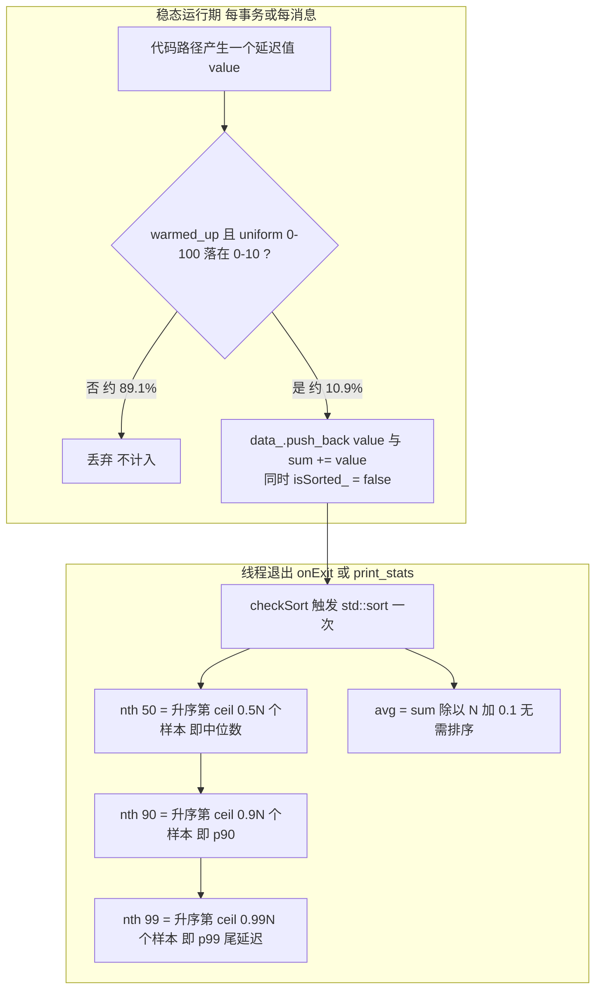

> **小结**：`Percentile` = "稳态门控 + ~10.9% 伯努利采样 + 全量留存 + 惰性排序 + nearest-rank 取分位"。
> `nth(50/90/99)` 分别是中位数 / p90 / p99（尾延迟），数值越靠后越能暴露系统在压力下的最差表现。

读出接口 `nth()` / `avg()` / `save_cdf()` 仅在**线程退出时**（`onExit` / `print_*_stats`）调用并打印。

---

## 1. 记录点全景表（流程 ⇒ 指标 ⇒ 变量 ⇒ 代码位置）

| # | 流程/子系统 | 记录的指标 | 类型 | 变量 | 写入点 | 上报点 |
|---|---|---|---|---|---|---|
| 1 | 事务执行循环 | 提交/中止计数 | atomic | `n_commit`,`n_abort_lock`,`n_abort_read_validation`,`n_abort_no_retry` | `core/Executor.h:157,176-199` | Coordinator 每秒 |
| 2 | 事务执行循环 | 端到端延迟分布 | Percentile | `percentile`,`dist_latency`,`local_latency` | `core/Executor.h:168-173` | `onExit` `Executor.h:231` |
| 3 | 事务执行循环 | commit 阶段耗时 | Percentile | `commit_latency` | `core/Executor.h:151` | `onExit` |
| 4 | 事务内部拆解 | stall/local/remote/commit_* | ScopedTimer⇒Percentile | `*_txn_*_time_pct`（18 个） | 见 §3 | `onExit` `Executor.h:241-258` |
| 5 | 网络大小 | 累计字节 | atomic | `n_network_size` | `core/Executor.h:152` | Coordinator 每秒 |
| 6 | Pasha 访问分类 | 本地/CXL本地/远程/带请求远程 | atomic | `n_local_access`,`n_local_cxl_access`,`n_remote_access`,`n_remote_access_with_req` | `TwoPLPashaExecutor.h:96,112-114,124,161` | Coordinator 每秒 |
| 7 | 数据迁移 | 迁入/迁出次数 | atomic | `num_data_move_in/out` | `TwoPLPashaHelper.h:1602,1814` | Coordinator 每秒 |
| 8 | 入站分发器 | 收消息延迟/网络量/syscall | Percentile+计数 | `socket_message_recv_latency`,`internal_message_recv_latency`,`network_size` | `Dispatcher.h:90,112,145` | `Dispatcher.h:154` |
| 9 | 出站分发器 | 发消息全链路延迟/分组大小 | Percentile+计数 | `message_send_latency`,`gen_to_sent_latency`,`sent_latency`,`network_msg_group_size` | `Dispatcher.h:303,344,345,347` | `Dispatcher.h:268` |
| 10 | 组提交日志 | 事务持久化延迟 | Percentile | `txn_latency` | `WALLogger.h:521-523` | `WALLogger.h:549` |
| 11 | 组提交日志 | 排队延迟 | Percentile | `queuing_latency` | `WALLogger.h:510` | `WALLogger.h:555` |
| 12 | 组提交日志 | 磁盘 sync 延迟/次数/字节 | Percentile+计数 | `disk_sync_latency`,`disk_sync_cnt`,`disk_sync_size` | `WALLogger.h:514-516` | `WALLogger.h:560` |
| 13 | CXL 内存分配 | 6 类内存占用 | atomic | `size_index/metadata/data/transport/misc_usage`,`size_total_hw_cc_usage` | `CXLMemory.h:66-150` | `print_stats` `:225` + 全局 gather |
| 14 | 软件缓存一致性 | 缓存命中/未命中、clflush/clwb | atomic | `num_cache_hit/miss`,`num_clflush/clwb` | `SCCManager.h:54,71` / `TwoPLPashaSCCWriteThrough.h:52,55` | `SCCManager.h:38` |
| 15 | CXL EBR 回收 | 垃圾回收量分布 | Percentile | `garbage_size`,`max_garbage_size` | `CXL_EBR.h`(add_retired) | `CXL_EBR.h:179` |
| 16 | Coordinator | 节点间往返延迟 | Percentile | `round_trip_latency` | `Coordinator.h:152` | `Coordinator.h:155` |
| 17 | 消息处理器 | 各类型消息计数/字节 | vector | `message_stats[]`,`message_sizes[]` | `core/Executor.h:335-336` | `onExit` `:262` |

---

## 2. 数据流总图（记录 ⇒ 聚合 ⇒ 上报）

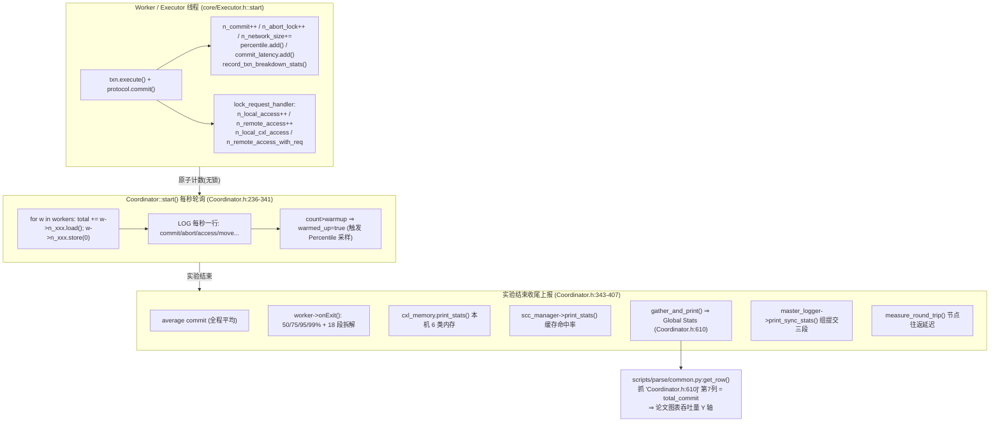

---

## 3. 事务内部 9 段时间拆解

事务延迟被切成 **9 段**，每段用 `ScopedTimer`（`common/Time.h:23-52`，RAII 析构时回调记录微秒）。
字段定义在 `TwoPLPashaTransaction.h:46-142`（`record_*` 累加 / `get_*` 读取）。

| 阶段 | 计时器埋点 | 记录函数 |
|---|---|---|
| local_work（本地读集处理） | `TwoPLPashaTransaction.h:356` | `record_local_work_time` |
| remote_work（远程读处理） | `TwoPLPashaTransaction.h:465` | `record_remote_work_time` |
| commit_prepare | `TwoPLPasha.h:351` | `record_commit_prepare_time` |
| commit local_work | `TwoPLPasha.h:363` | `record_local_work_time` |
| commit_persistence（WAL 落盘） | `TwoPLPasha.h:371` | `record_commit_persistence_time` |
| commit_write_back（写回数据） | `TwoPLPasha.h:524` | `record_commit_write_back_time` |
| commit_unlock（释放锁） | `TwoPLPasha.h:531` | `record_commit_unlock_time` |
| commit_work（整段提交） | `core/Executor.h:136-138` | `record_commit_work_time` |
| stall（冲突等待，仅中止时） | `core/Executor.h:140-143` | `set_stall_time` |

> 单分区与分布式事务**分两套** Percentile 记录（`local_txn_*_pct` 9 个 + `dist_txn_*_pct` 9 个，
> `Executor.h:390-395`），由 `record_txn_breakdown_stats()`（`Executor.h:406-429`）按
> `txn.is_single_partition()` 分流。这正是 Tigon 论文分析多分区事务代价构成的核心数据。

### 3.1 `ScopedTimer` 实现原理详解

§3 的全部 9 段拆解都建立在 `ScopedTimer` 这一个 30 行的小类之上（`common/Time.h:23-52`）。
它是 Tigon 时间测量的**核心机制**，本质是把 C++ 的 **RAII（Resource Acquisition Is Initialization）**
语义借用来做"作用域计时"：构造时记起点、析构时算耗时并回调。

#### 3.1.1 完整源码

```cpp
// common/Time.h:23-52
class ScopedTimer {
    public:
	ScopedTimer(std::function<void(uint64_t)> f)
		: call_on_destructor(f)               // ① 保存回调
	{
		startTime = std::chrono::steady_clock::now();  // ② 构造即打点(起点)
	}

	void reset()                                  // 复用: 重新计时
	{
		startTime = std::chrono::steady_clock::now();
		ended = false;
	}
	void end()                                    // ③ 计算耗时并回调
	{
		auto us = std::chrono::duration_cast<std::chrono::microseconds>(
				std::chrono::steady_clock::now() - startTime).count();
		call_on_destructor(us);               // 把 μs 交给回调
		ended = true;                         // 标记已结束, 防重复
	}

	~ScopedTimer()                                // ④ 析构兜底
	{
		if (!ended) {
			end();
		}
	}
	bool ended = false;
	std::chrono::steady_clock::time_point startTime;
	std::function<void(uint64_t)> call_on_destructor;
};
```

#### 3.1.2 四个设计要素逐一拆解

**① 构造即起点（`Time.h:28`）**
构造函数体内立刻调用 `steady_clock::now()` 写入 `startTime`。这意味着"计时起点 = 对象创建的那一行"，
因此调用方只要在想测量的代码块**开头**定义一个 `ScopedTimer` 局部变量即可，无需显式 start。

**② 析构即终点（`Time.h:43-48`）—— RAII 的精髓**
C++ 保证**栈上局部对象在离开作用域时自动析构**（包括正常 return、`break`、异常抛出等所有退出路径）。
`~ScopedTimer()` 中调用 `end()`，于是"计时终点 = 作用域结束的花括号 `}`"。
这把"必须手动配对 start/stop"的易错模式，转化为编译器强制保证的自动配对——**绝不会漏掉 stop**，
即便中途 `return` 或抛异常也照样记录。

**③ 回调注入 + 类型擦除（`Time.h:25,51`）**
`std::function<void(uint64_t)>` 把"耗时算出来之后干什么"完全外置给调用方。`ScopedTimer` 自己
**不知道也不关心**这个数字最终写到哪个字段——它只负责"测量 + 回调"。这就是它能服务全部 9 个阶段
（`record_commit_prepare_time` / `record_local_work_time` / …）的原因：同一个类，注入不同 lambda。
代价是 `std::function` 带来的**类型擦除开销**（可能堆分配 + 一次间接调用），见 §3.1.5。

**④ `ended` 幂等标志（`Time.h:36-49`）—— 防双重计数**
`end()` 结束后置 `ended = true`；析构时 `if (!ended)` 才再调一次。这保证：
- 若调用方**显式调用了 `end()`**（想在作用域结束**前**就定格耗时），析构时不会再记一遍；
- 若调用方**没调** `end()`，则由析构兜底记一次。
两种用法都恰好记录**一次**，避免重复累加污染统计。

#### 3.1.3 时钟选择：为什么是 `steady_clock`

`ScopedTimer` 与 `Time::now()`（`Time.h:14-18`）都用 `std::chrono::steady_clock` 而非
`system_clock`。原因是 `steady_clock` 是**单调时钟**——不受 NTP 校时、用户改系统时间、闰秒影响，
保证 `now() - startTime` 永远非负且代表真实流逝时长。这对延迟测量是必须的。
末尾 `duration_cast<microseconds>` 做**截断取整**（非四舍五入），亚微秒部分被丢弃，
所以单次极短操作可能记成 `0 μs`——在大量采样的统计语境下可接受。

#### 3.1.4 关键用法：一个计时器、两种回调（commit vs abort）

`ScopedTimer` 最精彩的用法在 `core/Executor.h:136-145`——**用闭包按运行时分支选择记录目标**：

```cpp
// core/Executor.h:135-147
bool commit;
{
    ScopedTimer t([&, this](uint64_t us) {     // 闭包按引用捕获 commit
        if (commit) {
            this->transaction->record_commit_work_time(us);   // 成功 ⇒ 记"提交工作耗时"
        } else {
            auto ltc = ... steady_clock::now() - transaction->startTime ...;
            this->transaction->set_stall_time(ltc);            // 失败 ⇒ 记"冲突 stall 耗时"
        }
    });
    commit = protocol.commit(*transaction, messages);   // ← 真正被计时的工作
}   // ← 花括号在此结束 ⇒ t 析构 ⇒ end() ⇒ 此刻才读 commit 的最终值
```

**精妙之处**：lambda **按引用捕获** `commit`，而 `commit` 的赋值发生在计时块内部
（`commit = protocol.commit(...)`）。由于回调在**析构时（花括号 `}`）**才执行，那时 `commit`
已经拿到最终结果，于是同一个计时器自动把耗时分流到 `record_commit_work_time`（成功）
或 `set_stall_time`（失败）。这是 RAII "延迟到作用域末尾执行" 语义的直接利用。

> ⚠️ 这也是一个**生命周期陷阱**：回调按引用捕获的对象（这里是 `commit`、`this->transaction`）
> 必须在 `ScopedTimer` 析构那一刻仍然有效。代码用一个内层 `{ }` 作用域把 `ScopedTimer` 的生命周期
> 限制得比 `commit` 更短，从而保证安全。

#### 3.1.5 累加语义 vs 采样语义（与 §0 两类原语的衔接）

注意区分**两层记录**：

1. `ScopedTimer` 的回调（`record_*_time`）写入的是 `TwoPLPashaTransaction` 的
   `*_time_us` 成员，用的是 **`+=` 累加**（`TwoPLPashaTransaction.h:56-58` 等）。
   因此同一事务内**多次**进入同一阶段（如 `record_local_work_time` 在 `:356` 与 `:363` 被调用两次）
   会**累计**到同一字段——衡量的是"该事务在该阶段花的总时间"。
2. 事务提交后，`record_txn_breakdown_stats()`（`Executor.h:406-429`）才把这些**单事务累计值**
   `.add()` 进 `Percentile`——此处才受 §0.2 的**预热门控 + ~10% 采样**约束。

即：**ScopedTimer→`+=` 是无条件、每事务的精确累加；Percentile 是有门控、降采样的跨事务分布**。
两者串联，既保证单事务拆解准确，又控制全局内存与开销。

#### 3.1.6 生命周期时序图

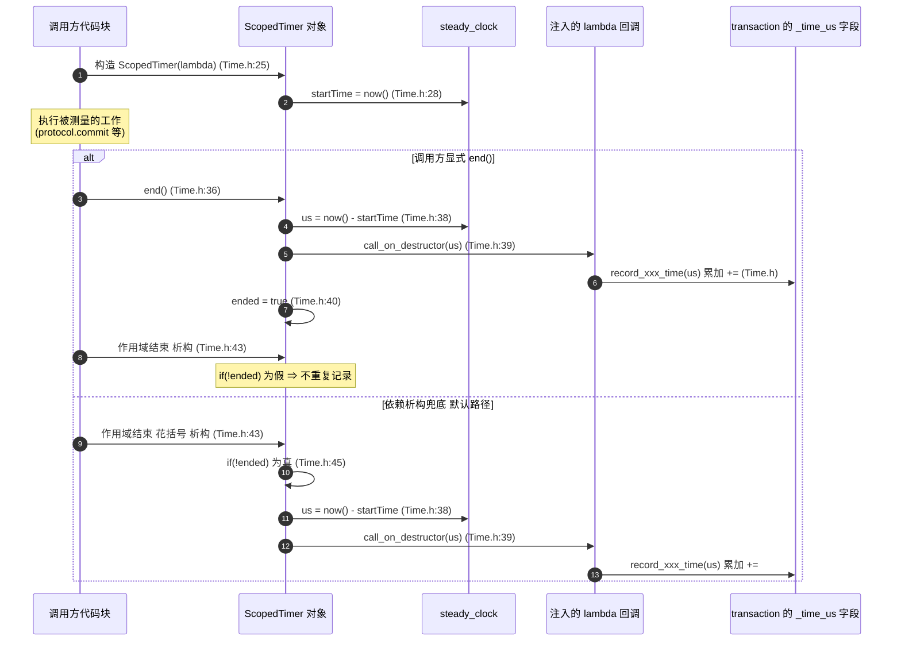

#### 3.1.7 与 `Time::now()` 的分工

同文件的 `Time::now()`（`Time.h:12-21`）返回相对**全局 `startTime`** 的纳秒数，用于需要
**绝对时间戳**的场景（如消息 `gen_time` / `send_time`、`last_sync_time`、WAL 的
`txn_start_times`）。而 `ScopedTimer` 用于**相对区间计时**。两者都基于 `steady_clock`，
但 `ScopedTimer` 自带 RAII 自动收尾，`Time::now()` 则是裸时间戳、由调用方自行相减。

---

## 4. Pasha 数据访问分类与迁移计数

`TwoPLPashaExecutor.h` 的 `lock_request_handler`（`:81`）是每次读/写访问入口，按数据位置打四类标签：

| 计数器 | 含义 | 埋点 |
|---|---|---|
| `n_local_access` | 本机拥有的分区数据访问 | `TwoPLPashaExecutor.h:96` |
| `n_local_cxl_access` | 本地访问中命中 CXL 共享区的部分（helper 内 +=） | `:112-114` 传引用 |
| `n_remote_access` | 远程分区数据访问 | `:124` |
| `n_remote_access_with_req` | 远程访问中**必须触发数据迁移**的慢路径 | `:161` |

**数据迁移计数**：`TwoPLPashaHelper.h:1602`（`num_data_move_in++`，迁入共享区）/ `:1814`
（`num_data_move_out++`，被策略淘汰迁出）。全局变量定义于 `MigrationManager.cpp:9-10`，
每秒由 Coordinator 读取清零（`Coordinator.h:302-305`）。

Coordinator 每秒打印命中率（`Coordinator.h:317-320`）：
```
local_cxl_access: X (Y%)        ← 本地数据有多少已在 CXL 缓存共享区
remote_access_with_req: X (Y%)  ← 远程访问中有多少必须触发数据迁移(慢路径)
```

---

## 5. CXL 内存占用（6 类 + 硬件一致性预算）

`CXLMemory` 在**每次分配/释放时**按 category 累加原子计数（`CXLMemory.h:116-184`），
是衡量"硬件缓存一致区预算（HW_CC_BUDGET）"的依据：

| 类别 | 含义 | 是否计入 `total_hw_cc_usage` |
|---|---|---|
| `INDEX_USAGE` | B+树索引 | 是 |
| `METADATA_USAGE` | 行元数据(锁/版本/SCC位) | 是（LRU 策略额外 +24B，`CXLMemory.h:126`）|
| `DATA_USAGE` | 实际数据 | **仅当 `enable_scc==false`**（`CXLMemory.h:133`）|
| `TRANSPORT_USAGE` | CXL ringbuffer 传输区 | 否 |
| `MISC_USAGE` | EBR/epoch 等杂项 | 是 |

`get_stats()`（`:203`）读出，`print_stats()`（`:225`）打印本机，再经 `gather_and_print` 汇总成 Global Stats。

---

## 6. 软件缓存一致性命中率（SCC）

`WriteThrough` 协议下，`prepare_read` 判断当前主机的 SCC 位：

```cpp
// TwoPLPashaSCCWriteThrough.h:47-56
if (smeta->is_bit_set(cur_host_bit_index) == false) {
    clflush(scc_data, size);          // 本地缓存失效，需刷
    num_cache_miss.fetch_add(1);      // 未命中
} else {
    num_cache_hit.fetch_add(1);       // 命中：可直接读本地缓存
}
```

`clflush`/`clwb` 本身也各自计数（`SCCManager.h:54,71`）。`print_stats()`（`:38-45`）输出命中率
——这是论文 Figure 8（不同软件缓存一致协议对比）的原始数据。

---

## 7. 详细时序图

### 7.1 事务执行主循环与延迟拆解

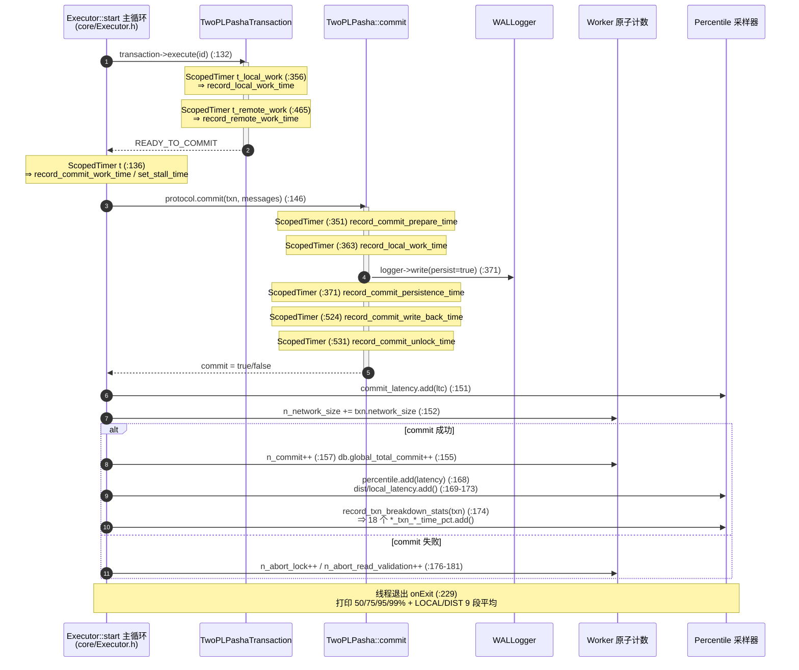

### 7.2 Pasha 数据访问分类（本地 / 远程 / 迁移）

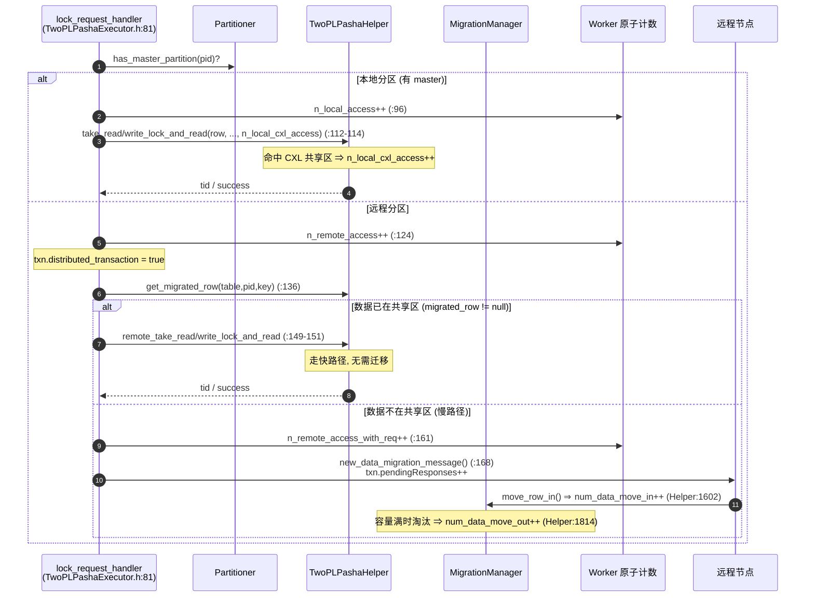

### 7.3 网络消息收发延迟（入站 / 出站分发器）

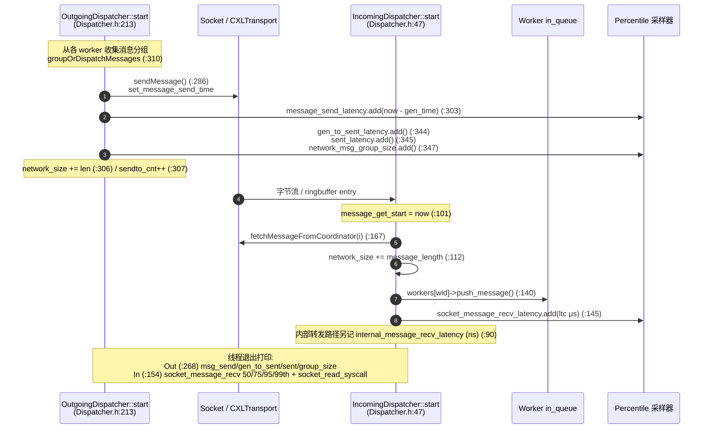

### 7.4 组提交 WAL 持久化（三段延迟）

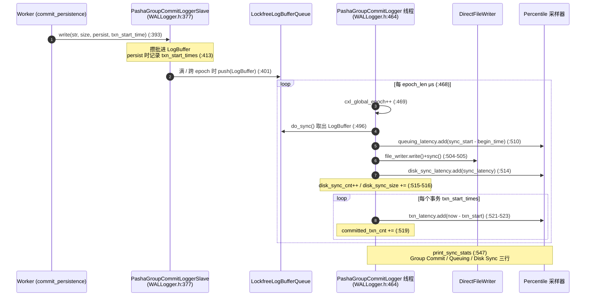

### 7.5 跨节点统计汇总 (Global Stats)

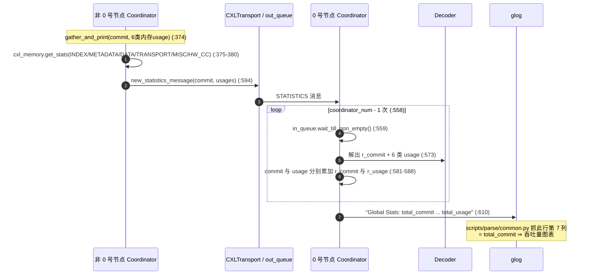

### 7.6 节点往返延迟测量 (round-trip)

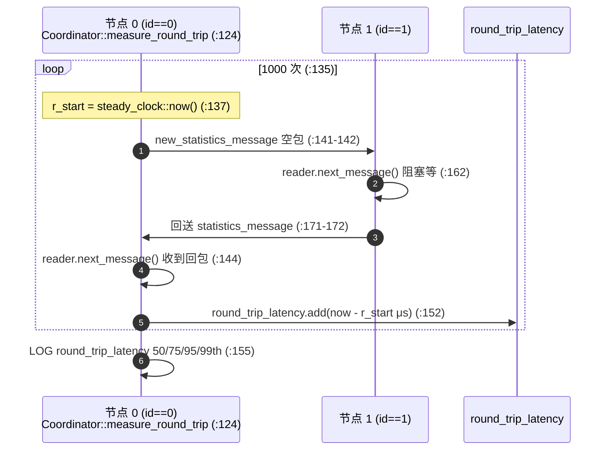

> 注意：`measure_round_trip()` 在 `start()` 开头被注释掉（`:184`），实际在收尾阶段调用（`:404`），
> 故 round-trip 仅在实验结束后测量，不污染主测量窗口。

### 7.7 SCC 读写与缓存命中

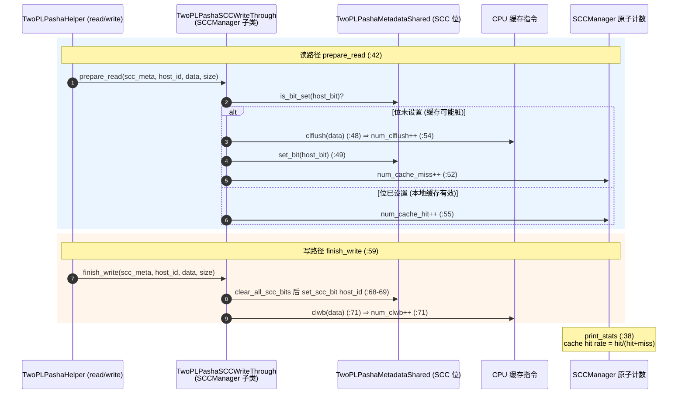

### 7.8 每秒统计轮询与预热门控

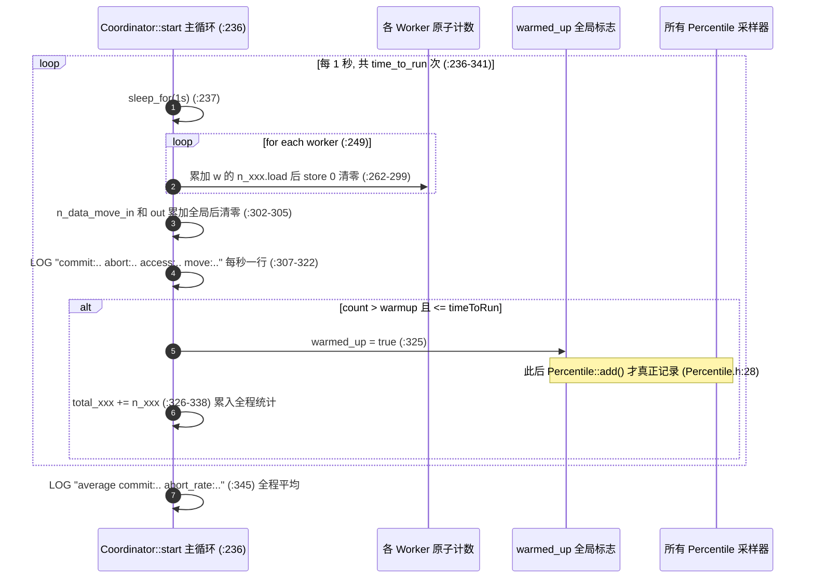

---

## 8. 实验日志行 ↔ 代码映射

以 README Hello-World 输出为例：

| 日志行 | 产生代码 | 数据来源 |
|---|---|---|
| `Coordinator.h:610] Global Stats: total_commit...` | `Coordinator.h:610` | 跨节点 gather |
| `Dispatcher.h:154] Incoming Dispatcher exits...socket_message_recv_latency(50th)` | `Dispatcher.h:154` | `socket_message_recv_latency` |
| `WALLogger.h:539] Group Commit Stats: 45391 us (50%)` | `WALLogger.h:549` | `txn_latency` |
| `WALLogger.h:545] Queuing Stats` | `WALLogger.h:555` | `queuing_latency` |
| `WALLogger.h:550] Disk Sync Stats...disk_sync_cnt` | `WALLogger.h:560` | `disk_sync_latency/cnt/size` |
| `Coordinator.h:155] round_trip_latency 58 (50th)` | `Coordinator.h:155` | `round_trip_latency` |
| `Database.h:736] TPC-C consistency check passed!` | `Executor.h:267` 触发的正确性校验 | `db.global_total_commit`（`Executor.h:155`）|

`scripts/parse/common.py:get_row()` 仅抓 `Coordinator.h:610]` 行第 7 列 `total_commit` 作为吞吐量绘图。

---

## 9. 设计要点总结

1. **分层记录**：原子计数（吞吐/计次，每秒拉取清零）＋ Percentile 降采样（延迟分布，仅退出时打印），
   互不阻塞主路径。
2. **预热门控 + ~10% 采样**（`Percentile.h:28`）：保证统计只覆盖稳态、且内存可控。
3. **事务延迟 9 段拆解 × 单分区/分布式两套**：精确定位跨主机事务开销在哪一阶段
   （prepare/persist/writeback/unlock/stall…）。
4. **Pasha 专属四类访问 + 迁移计数 + SCC 命中率 + CXL 6 类内存**：构成论文 Figure 4/5/7/8 的全部原始指标，
   最终都收口到 `Coordinator.h:610` 的 `Global Stats`，由 `scripts/parse/*` 提取绘图。
5. **测量自身代价被刻意压低**：计数用 relaxed atomic、延迟用 RAII `ScopedTimer`、网络延迟仅采样、
   `model_cxl_search_overhead`（`TwoPLPashaExecutor.h:103`）还能在不真正搬数据时**模拟** CXL 搜索开销做敏感性分析。
